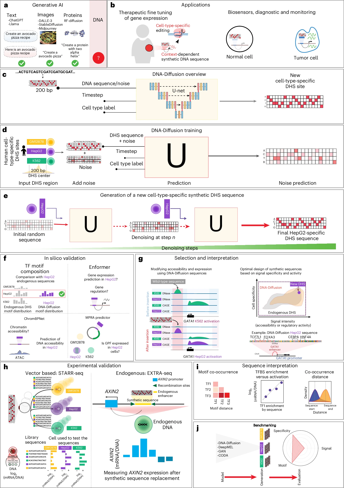
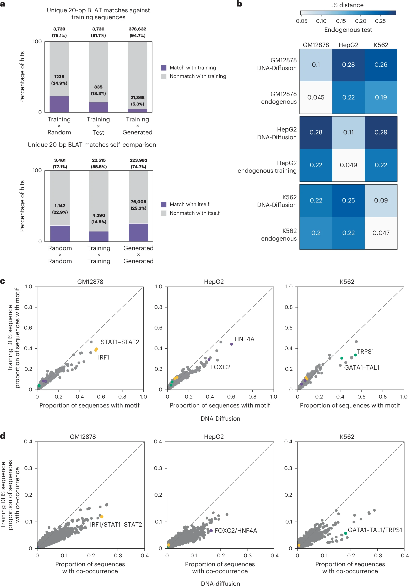
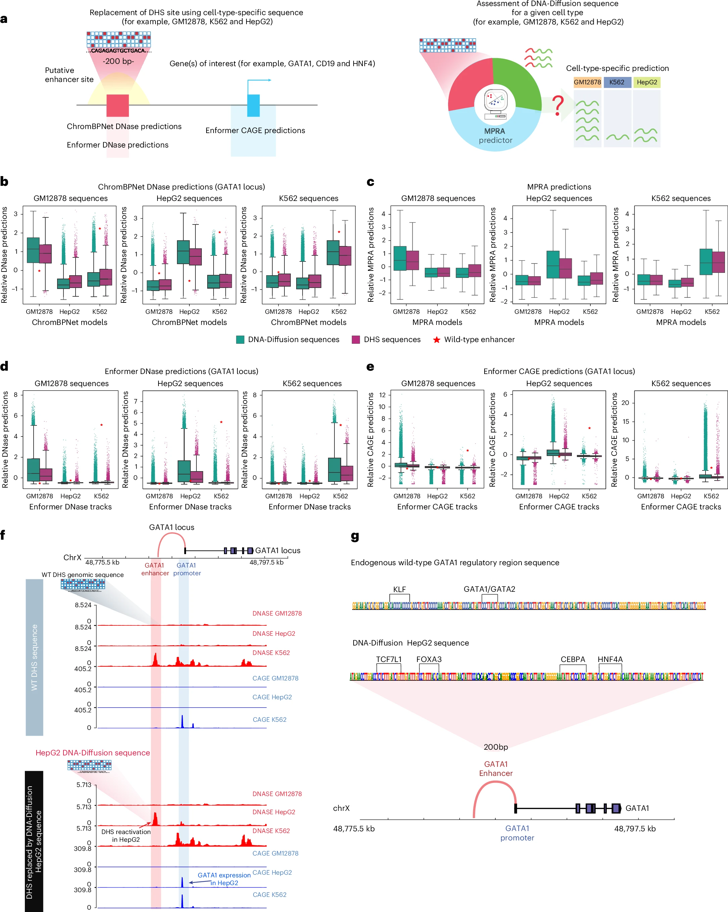
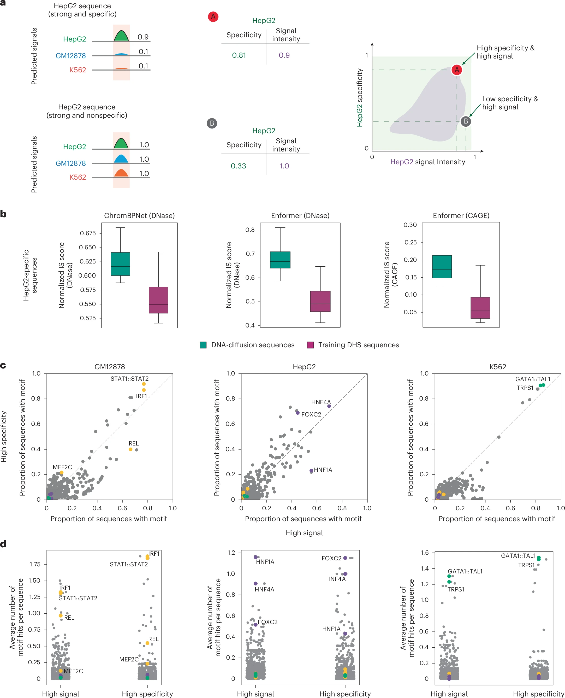
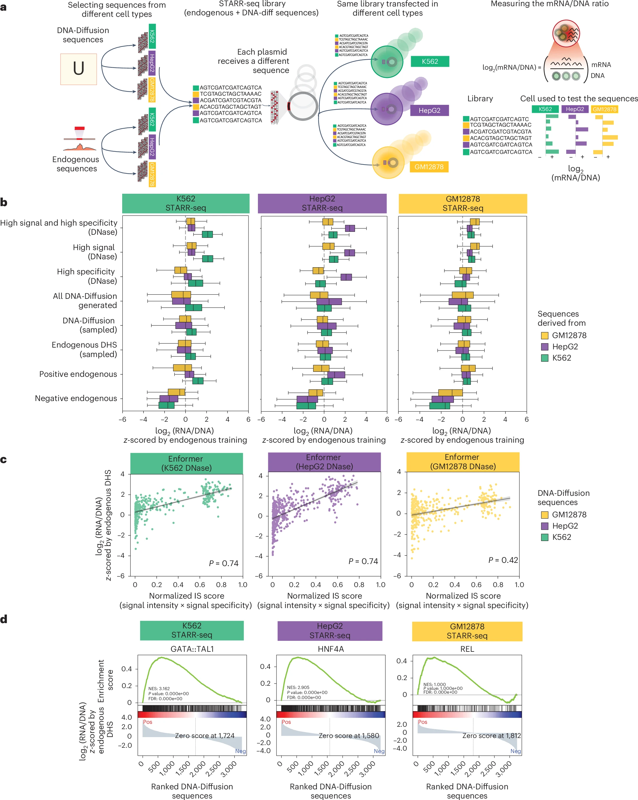
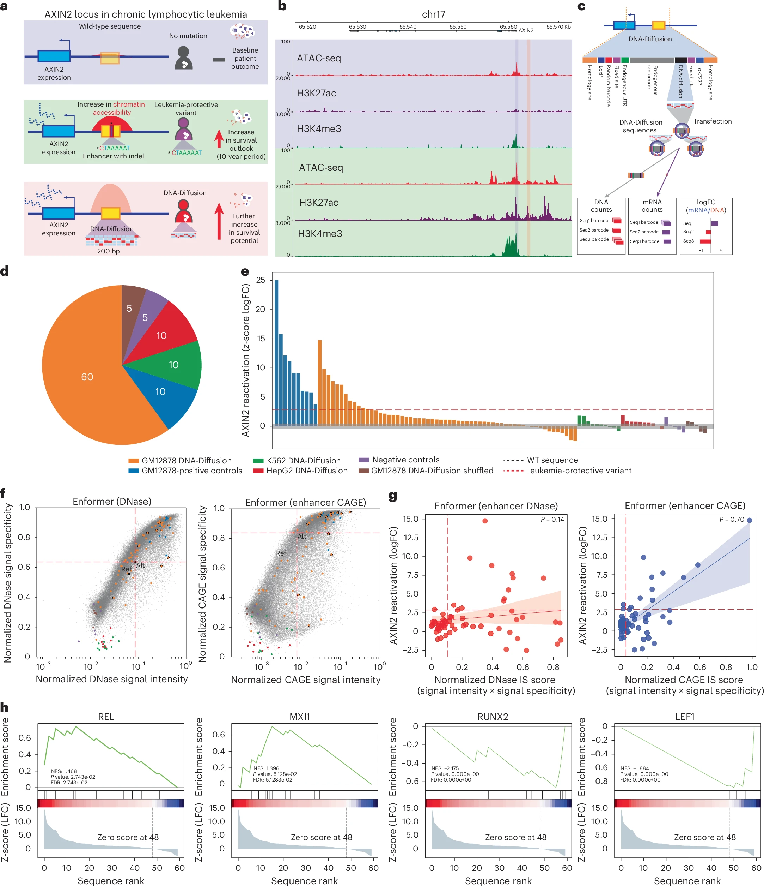
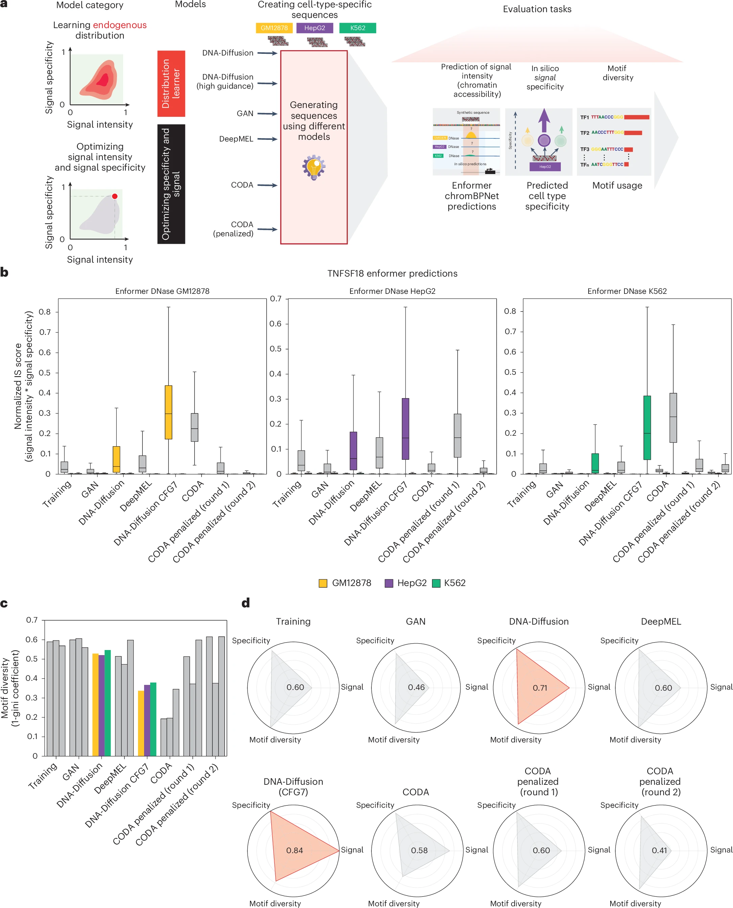

# DNA-Diffusion

## Paper Info

- **Title**: Designing synthetic regulatory elements using the generative AI framework DNA-Diffusion
- **Authors**: Lucas Ferreira DaSilva, Simon Senan, Judith F. Kribelbauer-Swietek, Zain Munir Patel, Lithin Karmel Louis, et al.
- **Venue**: Nature Genetics 2026, Volume 58
- **DOI**: [10.1038/s41588-025-02441-6](https://doi.org/10.1038/s41588-025-02441-6)
- **Paper**: [paper.pdf](./paper.pdf)
- **Code**: [pinellolab/DNA-Diffusion](https://github.com/pinellolab/DNA-Diffusion)

## Motivation

这篇论文瞄准的是一个很现实的问题：
如何设计既短小、又强、还具有细胞类型特异性的调控元件。

传统做法通常有两类限制：

- 要么依赖人工规则或 motif 拼装，难以覆盖真实调控语法；
- 要么直接优化某个 predictor 的分数，虽然可能把活性拉高，
  但容易牺牲特异性、序列多样性，甚至脱离天然分布。

更关键的是，很多方法只在 episomal assay 上验证，
并没有证明设计序列能在**内源基因组上下文**里真正起作用。

一句话总结：
`DNA-Diffusion` 想把“按细胞类型条件生成调控元件”做成一个可控生成问题，
并且把验证推进到内源位点层面。

## Method

作者的方法可以分成四个部分：

1. **训练数据与任务定义**
   - 从 DHS 数据中抽取 **200 bp** 的开放染色质片段。
   - 先聚焦 3 个细胞类型：`GM12878`、`K562`、`HepG2`。
   - 采用按染色体划分的数据集：
     - `chromosome 1` 作为独立测试集
     - `chromosome 2` 作为验证集
     - 其余染色体用于训练

2. **条件扩散生成模型**
   - 用改造后的 `DDPM` 在 DNA 序列空间中生成序列。
   - 输入表示是 `(1, 4, 200)` 的 DNA tensor，本质上是适配核苷酸的一种 one-hot 风格编码。
   - 主干网络是 `U-Net`，同时注入 `cell-type label` 和 `diffusion timestep`。
   - 采样时从高斯噪声开始，经过 **50 steps** 反向去噪得到新序列。

3. **可控生成：classifier-free guidance**
   - 训练时随机 mask 一部分条件标签，为 CFG 做准备。
   - 生成时通过 `guidance scale` 调节“更像天然分布”还是“更偏向高活性/高特异性”。
   - 这使模型既能当 distribution learner，也能在高 guidance 下表现出 optimizer 的特性。

4. **生成后筛选与多层验证**
   - 每个细胞类型生成 **100,000** 条序列，共 **300,000** 条候选。
   - 用 `ChromBPNet`、`Enformer` 和 MPRA predictor 做 in silico 评估。
   - 定义 `signal intensity`、`signal specificity` 和二者乘积 `IS score`。
   - 最后通过 `STARR-seq` 和 `EXTRA-seq` 做实验验证。

它的关键设计不只是“用 diffusion 生成 DNA”，
而是把**细胞类型条件控制、可调 guidance、实验闭环验证**三件事串起来。

## Main Figures

### Fig. 1：整篇论文的工作流总览

- 这张图把整篇论文压缩成一条完整流水线：
  `DHS 数据 -> 条件扩散生成 -> in silico 评估 -> STARR-seq -> AXIN2 内源验证 -> benchmarking`
- 图里最关键的不是 U-Net 本身，而是作者把**生成、筛选、解释、实验验证**放进了同一个框架。
- 对读者来说，这张图最值得记住的一点是：
  `DNA-Diffusion` 不是“只会吐序列的模型”，而是一个面向调控元件工程化设计的完整系统。

### Fig. 2：证明模型没有背训练集，同时学到了 motif grammar

- 这张图先回答一个基础问题：生成序列是不是只是训练集拷贝。
- 序列比对结果显示：
  - 只有 **4.7%** 的生成序列能与训练集找到 `>=20 bp` 匹配
  - 阈值升到 `>=30 bp` 后只剩 **0.6%**
- 同时 motif 分析又显示模型保留并强化了关键细胞类型语法：
  - `HNF4A` 在 HepG2 中约 **47% vs 29%**
  - `IRF1` 在 GM12878 中约 **55% vs 38%**
  - `GATA1-TAL1` 在 K562 中约 **41% vs 31%**
- 我的理解是：
  这张图在证明一种很难同时成立的性质，
  即“**不是记忆训练样本**，但**又保留了有用的调控规则**”。

### Fig. 3：in silico replacement 证明生成序列具有目标细胞特异活性

- 这张图把生成序列插入到 `GATA1 / HNF4A / CD19` 等基因相关 enhancer 区域，
  再用 `ChromBPNet`、`Enformer` 和 MPRA predictor 评估效果。
- 代表性结果是：
  - 在 `GATA1` 位点，K562 特异序列的预测 DNase 中位数达到 **1.12**
  - 对照训练序列为 **0.92**
  - 在非目标细胞中的预测活性较低：
    `GM12878 = -0.62`，`HepG2 = -0.74`
- 图中还有一个很关键的信号：
  某些生成序列在 in silico 上甚至超过了天然 wild-type enhancer。
- 这说明论文的目标不是“复现天然序列”，
  而是寻找**比天然序列更适合目标任务**的合成 regulatory element。

### Fig. 4：作者如何定义并筛选“高活性 + 高特异性”序列

- 这张图引入了全文后面反复使用的两个核心量：
  - `signal intensity`
  - `signal specificity`
- 作者把两者相乘得到 `IS score`，并把最优区域定义为二维空间右上角。
- 图 4 的意义不只是给一个评分公式，
  而是在说明为什么不能只看“活性强不强”：
  很强但跨细胞类型都强的序列，对真实应用并不一定是好设计。
- 同时，图里还显示高 signal 和高 specificity 对应的 motif 组成并不完全一样。
  这说明“更强”和“更专一”背后不是同一套序列语法，
  也是后面要引入 CFG 和多目标筛选的原因。

### Fig. 5：STARR-seq 实验把 in silico 结果落到真实 reporter assay

- 作者构建了一个 **5,850** 元件的 `STARR-seq` 文库，
  在 `K562 / HepG2 / GM12878` 三个细胞系中统一测量活性。
- 图中最重要的结论有三点：
  - `high signal + high specificity` 的 DNA-Diffusion 序列整体优于随机抽样序列
  - 也优于天然 DHS 控制和强阳性对照
  - 与 Enformer DNase 预测有较强相关：
    `K562 = 0.74`，`HepG2 = 0.74`，`GM12878 = 0.42`
- GSEA 进一步表明高活性序列确实富集了目标细胞该有的 TF motif：
  `GATA1-TAL1`、`HNF4A`、`REL` 等都出现了。
- 这张图的重要性在于：
  它把“模型觉得好”推进到了“实验上也真的更强”。

### Fig. 6：AXIN2 内源位点验证是整篇论文最硬的一步

- 这张图测试的是：设计出的序列能不能在真正的基因组环境里调控目标基因。
- 作者选择了白血病保护相关基因 `AXIN2`，并用 `EXTRA-seq` 在 MEC-1 细胞里做内源验证。
- 实验库一共 **100** 条序列，其中 **60** 条来自 `GM12878` 特异 DNA-Diffusion 设计。
- 结果显示：
  - 多条设计序列对 `AXIN2` 的激活效果超过天然保护性变体
  - 一些序列达到了与外部强阳性对照相近的水平
  - 非 B 细胞方向的 `K562 / HepG2` 设计没有显著活性
- 另外，图 6 还告诉我们一个实际经验：
  预测 `AXIN2` 激活时，`Enformer CAGE` 比纯 accessibility 更有用，
  相关性达到 **Spearman rho = 0.70**。
- 如果只看一张图来判断这篇论文是否“真有工程价值”，我会看这张。

### Fig. 7：和现有方法相比，DNA-Diffusion 的强项是可调和平衡

- 这张图把 `DNA-Diffusion`、`GAN`、`DeepMEL`、`CODA` 放到统一框架里比较：
  `signal intensity`、`signal specificity`、`motif diversity`
- 结论不是某个方法在所有维度都绝对第一，而是不同方法各自偏向不同目标：
  - `CODA` 更像强优化器，活性高，但 diversity 下降很明显
  - 标准 `DNA-Diffusion` 更平衡：
    `IS = 0.04`，`diversity = 0.53`
  - `CFG = 7` 时，DNA-Diffusion 可以把 `IS` 提升到 **0.215**，
    但多样性降到 **0.36**
- 用雷达图面积做总体评价时：
  - 标准 `DNA-Diffusion` 的 area score 为 **0.71**
  - `DNA-Diffusion + CFG7` 为 **0.84**
- 这说明它最有价值的地方不是单次固定输出，
  而是可以沿着“更像天然分布”到“更像优化器”的连续区间调节。

## Key Insights

### 关键结果 1：模型学到的是调控语法，不是训练集记忆

- 与训练集做序列比对时，生成序列中只有 **4.7%** 能找到至少一个 `>=20 bp` 的匹配片段。
- 如果把阈值提高到 `>=30 bp`，这一比例进一步降到 **0.6%**。

这基本说明 DNA-Diffusion 不是在“复制训练样本”。

但与此同时，它又保留了正确的细胞类型语法：

- `HepG2` 生成序列中 `HNF4A` motif 出现比例约 **47%**，高于训练序列的 **29%**
- `GM12878` 中 `IRF1` 约 **55% vs 38%**
- `K562` 中 `GATA1-TAL1` 约 **41% vs 31%**
- `IRF1-STAT1::STAT2` 这类 motif 共现关系也能被保留并放大

所以这篇工作的一个核心结论是：
模型学会了“哪些 motif 和 motif 组合能定义细胞类型特异性”，
而不是背下具体序列。

### 关键结果 2：CFG 给了一个很实用的可控旋钮

- 论文明确展示，`classifier-free guidance` 可以直接调节细胞类型特异 motif 的富集程度。
- `CFG = 0` 时，生成分布更接近天然训练集。
- 更高 guidance 会进一步强化关键 motif，使序列更偏向高活性和高特异性的设计目标。

这点很重要，因为它把 diffusion 从“只能采样”的模型，
变成了可以在“天然性”和“功能最优化”之间连续调节的生成器。

### 关键结果 3：in silico 层面，生成序列能比天然序列更强也更专一

- 在 `GATA1` 调控位点的替换实验里，
  `K562` 特异生成序列的预测 DNase 强度中位数达到 **1.12**，
  高于训练集序列的 **0.92**。
- 同时，它在非目标细胞中的预测活性较低：
  - `GM12878`: **-0.62**
  - `HepG2`: **-0.74**

这表明 DNA-Diffusion 生成的不是“普遍都强”的 enhancer，
而是更接近真正可用的**目标细胞高活性、非目标细胞低活性**方案。

### 关键结果 4：STARR-seq 证明这些序列不只是 predictor 幻觉

- 作者构建了一个 **5,850** 元件的 `STARR-seq` 文库，
  在 `K562 / HepG2 / GM12878` 三个细胞系中做验证。
- 结果显示，被筛为“高 signal + 高 specificity”的 DNA-Diffusion 序列，
  整体上超过了强阳性对照和天然 DHS 控制序列。
- `STARR-seq` 活性与 in silico 预测也有较强相关性：
  - `K562` 和 `HepG2` 中，和 Enformer DNase 的 Pearson 相关都达到 **0.74**
  - `GM12878` 为 **0.42**

论文还用 GSEA 证明高活性序列富集了符合细胞身份的 TF motif：
`GATA1-TAL1` 对应 K562，`HNF4A` 对应 HepG2，`REL` 对应 GM12878。

### 关键结果 5：真正拉开层次的是 AXIN2 内源位点验证

- 作者没有停在报告体系，而是用 `EXTRA-seq` 直接测试生成序列在内源位点上的效果。
- 目标基因是白血病保护相关基因 `AXIN2`。
- 在 MEC-1 B 细胞白血病细胞系中，测试库包含 **100** 条序列，
  其中 **60** 条是 `GM12878` 特异 DNA-Diffusion 设计。
- 多条生成序列对 `AXIN2` 的激活效果超过了天然保护性变体，
  且达到与外部强阳性对照可比的水平。
- 与之相对，`K562` 和 `HepG2` 方向生成的序列在该场景中没有显著活性，
  进一步证明了细胞类型特异性。
- 在这些指标中，`Enformer CAGE` 对最终 AXIN2 激活的预测相关性最高，
  `Spearman rho = 0.70`。

我认为这是全文最关键的部分，
因为它把“设计合成 enhancer”从体外报告实验推进到了疾病相关内源位点。

### 关键结果 6：与 GAN、DeepMEL、CODA 相比，DNA-Diffusion 的优势是平衡

- 论文用三维指标统一比较不同方法：
  `signal intensity`、`signal specificity`、`motif diversity`
- 标准设置下的 DNA-Diffusion（中等 guidance）给出的是比较平衡的结果：
  - `IS score = 0.04`
  - `motif diversity = 0.53`
- 对比：
  - `GAN`: `IS = 0.006`, `diversity = 0.59`
  - `DeepMEL`: `IS = 0.041`, `diversity = 0.58`
  - endogenous elements: `IS = 0.03`, `diversity = 0.58`
- 当 `CFG = 7` 时，DNA-Diffusion 可以把 `IS score` 拉到 **0.215**，
  超过所有基线，但多样性降到 **0.36**。
- 用三维雷达图面积做总体评价时：
  - 标准 DNA-Diffusion 的 area score 为 **0.71**
  - `DNA-Diffusion + CFG7` 达到 **0.84**

这部分结论很清楚：
它不是在每个单独指标都绝对碾压，
而是在“强度、特异性、多样性”三者之间给出了最可控的折中。

### 我的结论

如果只用一句话评价这篇论文：

> DNA-Diffusion 的真正贡献，不是“又一个能生成 enhancer 的模型”，而是把细胞类型特异调控元件设计推进成了一个可控、可筛选、可做内源验证的工程流程。

在 AI4S 语境下，这种“生成模型 + 机制解释 + 内源验证”的闭环非常有代表性。

## Limitations & Future Work

这篇论文已经很完整，但边界也很明确：

- **模型本身学的是 accessibility，不是最终表达**：
  这也是为什么作者还需要 Enformer、MPRA predictor 等 oracle 做二次筛选。
- **标签仍较粗糙**：
  当前主要依赖二值化 DHS 峰，未来如果引入连续活性、时序或条件扰动信息，生成目标会更细。
- **细胞类型覆盖有限**：
  主实验只在 `GM12878 / K562 / HepG2` 三类细胞上展开，泛化到更多组织与疾病场景还需要验证。
- **内源验证仍是单位点为主**：
  `AXIN2` 证明了概念成立，但距离真正的通用治疗设计平台还有距离。

我认为后续最值得继续的方向是：

1. 让生成目标从“开放染色质”进一步走向“真实表达调控”。
2. 扩展到更多细胞类型、更多长度尺度和更多疾病相关位点。
3. 把实验反馈重新喂回模型，做真正的 active learning 闭环设计。

## Notes

- 当前目录主图为 [1.png](./1.png) 到 [7.png](./7.png)，对应论文主文 Fig. 1 到 Fig. 7。
- 当前主文 PDF 为 [paper.pdf](./paper.pdf)。
