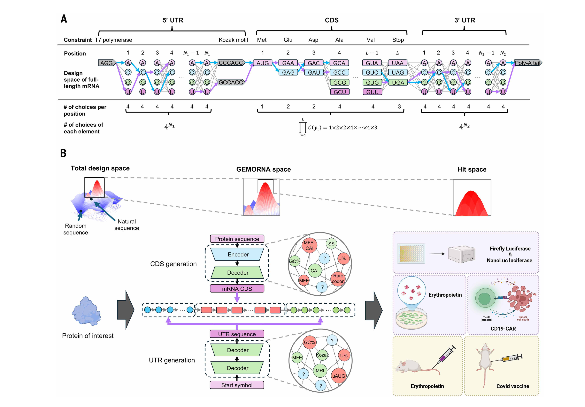
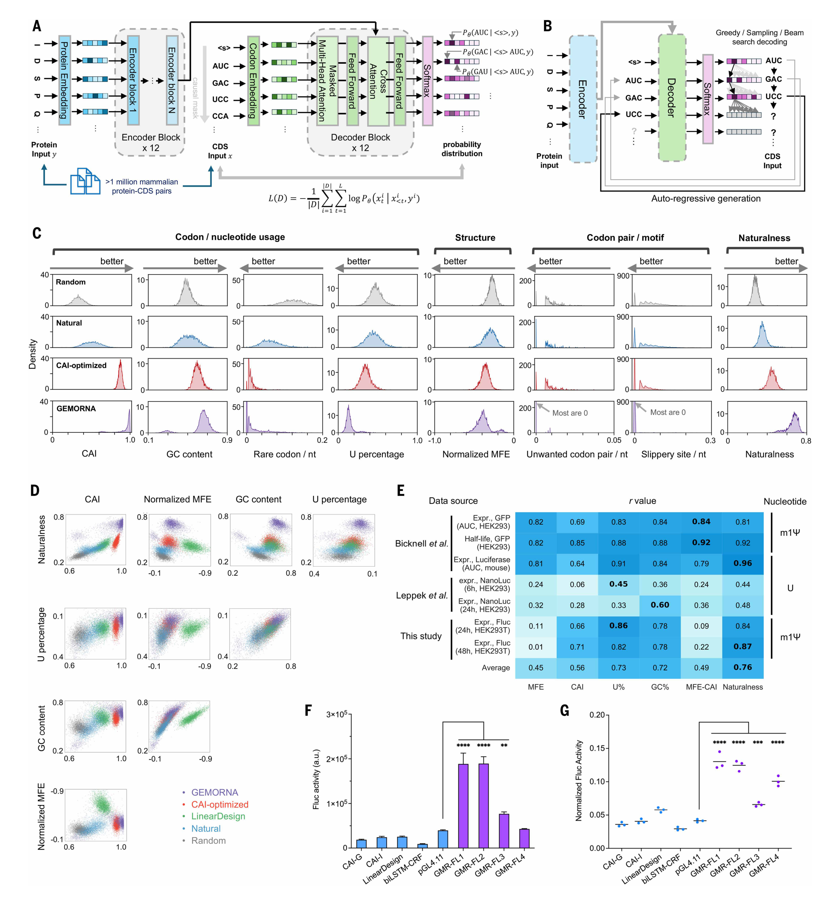
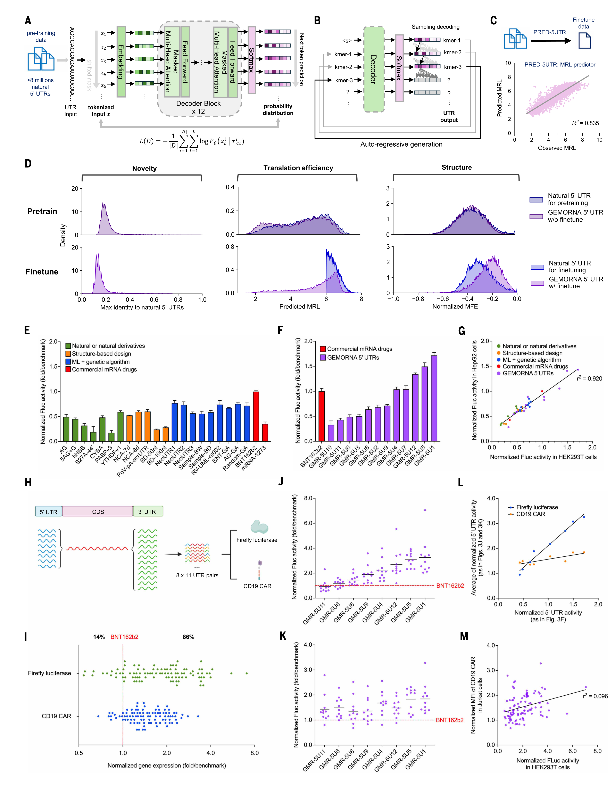
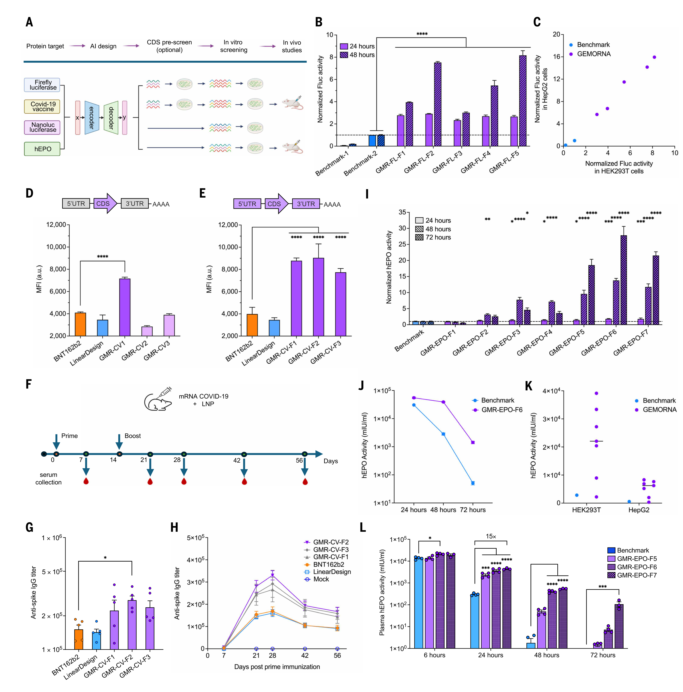
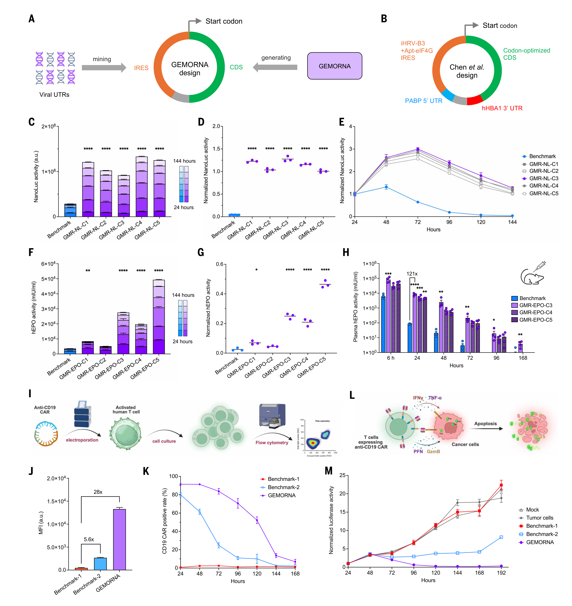

# GEMORNA

## Paper Info

- **Title**: Deep generative models design mRNA sequences with enhanced translational capacity and stability
- **Authors**: He Zhang, Hailong Liu, Yushan Xu, Haoran Huang, Yiming Liu, Jia Wang, Yan Qin, Haiyan Wang, Lili Ma, Zhiyuan Xun, Xuzhuang Hou, Timothy K. Lu, Jicong Cao
- **Venue**: Science, **390**, eadr8470
- **Date**: 2025-11-06
- **DOI**: [10.1126/science.adr8470](https://doi.org/10.1126/science.adr8470)
- **Paper**: [paper.pdf](./paper.pdf)
- **Supplementary**: [supplementary_materials.pdf](./supplementary_materials.pdf)

## TL;DR

本文提出 `GEMORNA`，面向治疗相关 RNA 序列的生成与优化任务。给定目标蛋白，方法分别对编码区和非翻译区进行生成式设计，随后将设计结果组装为完整 mRNA，并进一步扩展到 `circRNA` 场景。与仅依赖少量启发式指标的传统优化方法相比，该工作更强调从天然高性能序列中学习整体分布特征，再通过体外和体内实验对候选序列进行筛选与验证。

从任务划分上看，`GEMORNA-CDS` 负责在蛋白序列固定的条件下生成满足氨基酸约束的 `CDS`；`GEMORNA-UTR` 负责生成性能较优的 `5'UTR` 和 `3'UTR`。论文在 `luciferase`、`COVID-19 vaccine antigen`、`EPO`、`CD19 CAR` 以及 `circRNA` 等任务上给出了实验结果，说明该方法并非仅停留在序列层面的打分或建模，而是进入了面向 RNA 药物设计的候选序列生成与实验评估流程。

## 任务背景

治疗性 mRNA 的基本思路是将人工设计的 RNA 分子递送至细胞内，利用细胞翻译机制产生目标蛋白。其结构通常可概括为：

```text
5' cap | 5'UTR | CDS | 3'UTR | poly(A)
```

其中，`CDS` 直接决定蛋白的氨基酸序列，`5'UTR` 主要影响翻译起始效率，`3'UTR` 与 RNA 稳定性、持续时间及调控过程密切相关。对于同一个目标蛋白，往往存在大量可行的 RNA 编码方案，而不同方案在表达水平、稳定性和免疫原性等方面可能表现出显著差异。因此，该问题的核心并不是预测蛋白结构或功能，而是如何在满足生物学约束的前提下，设计更适用于治疗场景的 RNA 序列。

从优化空间看，`CDS` 具有多重同义密码子可选，`5'UTR` 和 `3'UTR` 也存在大量设计自由度。这意味着 RNA 序列设计本质上是一个高维组合优化问题。论文试图回答的问题是：能否利用生成模型直接提出高质量候选序列，而不局限于对 `CAI`、`GC content` 或 `MFE` 等单一指标进行手工调节。

## 研究内容

论文将整体问题划分为三个层次。

1. `CDS` 设计：输入目标蛋白序列，输出能够编码同一蛋白、但更有利于高表达的编码序列。
2. `UTR` 设计：生成新的 `5'UTR` 和 `3'UTR`，以改善翻译效率和稳定性。
3. Full-length mRNA 设计：将 `5'UTR + CDS + 3'UTR` 组合为完整 mRNA，并通过实验评估表达量、持续时间以及治疗相关表型。

在此基础上，作者进一步将该框架扩展至 `circRNA`。这一扩展说明其目标不仅是针对线性 mRNA 做局部优化，而是尝试建立可迁移到不同 RNA 分子形式的生成式设计范式。

## 方法概述

### 1. GEMORNA-CDS

`GEMORNA-CDS` 的任务是在目标蛋白固定的条件下生成满足氨基酸约束的密码子序列。由于输入是蛋白序列、输出是与之对应的编码序列，该问题可以自然地表述为条件序列生成任务。论文采用 `Transformer encoder-decoder` 结构，其中 `encoder` 编码蛋白序列，`decoder` 在给定蛋白约束的前提下生成 `CDS`。这一建模方式的关键在于：模型不是无条件地产生 RNA 序列，而是在严格保持蛋白产物不变的条件下搜索更优编码方案。

### 2. GEMORNA-UTR

`UTR` 设计与 `CDS` 设计有所不同。`UTR` 不直接编码蛋白，也不存在唯一正确答案，因此更适合建模为开放式的调控元件生成问题。论文采用 `decoder-only` 自回归模型，先在大规模天然 `UTR` 数据上进行预训练，再向高性能 `UTR` 分布微调。

为支持 `UTR` 生成与筛选，作者还引入了两个预测器。`PRED-5UTR` 用于预测 `MRL`，近似反映翻译起始相关能力；`PRED-3UTR` 用于评估稳定性。生成模型与预测器的结合，使得 `UTR` 设计不再依赖人工枚举，而是能够在生成和筛选之间形成闭环。

### 3. 训练规模

根据主文与补充材料，训练数据规模大致如下：

- `GEMORNA-CDS`: 超过 **100 万** 条天然 protein-CDS 配对，覆盖 **115** 个哺乳动物物种
- `GEMORNA-UTR` 预训练：约 **800 万** 条 `5'UTR` 和 **200 万** 条 `3'UTR`
- `GEMORNA-UTR` 微调：约 **80 万** 条 `5'UTR` 和 **20 万** 条 `3'UTR`

这一数据规模表明，作者的目标并非在少量实验数据上直接拟合性能标签，而是先从较大规模天然序列中学习分布特征，再结合下游性能信息进行定向优化。

### 4. 方法设计的核心思想

传统 RNA 序列优化方法通常围绕少数显式指标展开，例如 `CAI`、`GC content`、`U percentage` 和 `MFE`。这类方法的局限在于，真实影响表达与稳定性的因素往往具有较强的耦合性，难以用少数人工规则充分描述。`GEMORNA` 的设计思路是直接学习高性能序列的整体分布，并在此基础上生成候选序列。

论文进一步提出 `naturalness score` 作为辅助评价指标。就其作用而言，可以将其理解为模型对序列是否接近哺乳动物偏好高质量编码模式的估计。该指标并不等同于单一物理或生化量，但在文中与表达和稳定性表现呈现出较强相关性。

## Main Figures

下列 5 张图片为从主文 PDF 中裁切得到的无图注版本。

### Fig. 1



Fig. 1 主要用于界定问题空间。图 `A` 表明，同一目标蛋白对应大量可能的 mRNA 设计；图 `B` 说明 `GEMORNA` 的目标不是穷举全部候选序列，而是将原本极大的搜索空间压缩为更可能具有高性能的候选集合，再交由实验验证。换言之，该方法关注的是高质量候选分布的学习，而非暴力搜索。

### Fig. 2



Fig. 2 对应 `CDS` 设计结果。`A-B` 展示 `GEMORNA-CDS` 的训练和推理流程；`C-D` 比较随机序列、天然序列、CAI 优化序列以及 `LinearDesign` 等方法在多个指标上的分布；`E` 给出指标与实验结果之间的相关性；`F-G` 则展示仅替换 `CDS` 时的表达和稳定性实验。

该图说明两点。其一，在蛋白不变的前提下，仅改变 `CDS` 即可显著影响表达效果。其二，`GEMORNA` 生成的 `CDS` 不仅在常见统计指标上表现较优，也更接近实验所验证的高性能序列特征。文中还指出，`naturalness score` 与表达量和稳定性之间具有较高相关性。

### Fig. 3



Fig. 3 展示 `UTR` 设计结果。`A-B` 为 `GEMORNA-UTR` 的训练与推理结构；`C` 说明利用预测器筛选高质量 `UTR` 进行微调；`D` 给出生成 `UTR` 的 `novelty`、`MRL` 和 `MFE` 分布；`E-F` 比较生成的 `5'UTR` 与基准方案；`G` 展示不同细胞系之间结果的一致性；`H-M` 为 `5'UTR` 与 `3'UTR` 的组合实验。

从该图可以得到三个重要结论。第一，生成的 `UTR` 与天然 `UTR` 相似度较低，但仍可获得更强功能，说明模型并非简单复现训练集。第二，`5'UTR` 对表达调控的影响较为显著。第三，最优 `UTR` 组合明显依赖目标蛋白，缺乏可直接迁移到所有任务的“通用最优方案”。文中给出的跨蛋白目标相关性较低，`r^2 = 0.096`，这一结果进一步支持 `UTR` 设计具有明显的 `target-dependent` 特征。

### Fig. 4



Fig. 4 对应 full-length mRNA 设计。`A` 概述验证对象，`B-C` 为 `Fluc` 完整 mRNA 的表达结果，`D-H` 为 `COVID-19 vaccine antigen` 相关表达和小鼠免疫结果，`I-L` 为 `EPO` 完整 mRNA 的体外与体内结果。

这一部分的意义在于，前述 `CDS` 与 `UTR` 层面的优化并未在 full-length 组装后失效，而是能够继续体现在完整 mRNA 分子的实验表现中。文中较为醒目的结果包括：`Fluc` 完整 mRNA 最高可达 **41-fold** 提升；`GMR-FL-F5` 在 HepG2 中相对 `Benchmark-FL2` 达到 **15.9-fold**；COVID-19 mRNA vaccine 在小鼠中诱导的抗体滴度高于 `BNT162b2` 和 `LinearDesign`；`EPO` full-length 设计在小鼠中也呈现更强且更持久的表达。

### Fig. 5



Fig. 5 展示 `circRNA` 与 `CAR-T` 场景下的扩展结果。`A-B` 为 circRNA 设计拓扑，`C-E` 为 `NanoLuc circRNA` 的表达与持久性实验，`F-H` 为 `EPO circRNA` 的体外和体内结果，`I-M` 为 `CD19 CAR circRNA` 的表达、持续时间与杀伤功能实验。

这一结果表明，`GEMORNA` 不仅适用于线性 mRNA，也能够迁移到设计约束更复杂的 `circRNA`。文中给出的代表性数字包括：`EPO circRNA` 体外累计表达提升 **13.8-fold**；`144 h / 24 h` 表达比最高达到 **46.5%**，而 benchmark 为 **2.5%**；小鼠体内 `EPO circRNA` 最强结果达到 **121-fold**；`CD19 CAR circRNA` 在 24 小时表达水平上，相对两个对照分别达到 **28-fold** 和 **5.6-fold**。

## 主要结果汇总

### CDS 设计

- `GEMORNA` 生成的 `CDS` 在 `CAI`、`GC`、rare codon rate 和 `U percentage` 等指标上整体优于对照序列
- 与传统 codon optimization 相比，`GEMORNA` 更有能力规避不良 codon pair、`slippery site` 等潜在问题
- 在 luciferase 实验中，仅替换 `CDS` 即可带来显著表达差异

### UTR 设计

- 生成的 `UTR` 与天然序列相似度较低，说明模型并非简单复制训练数据
- 在主文实验中，部分 `GEMORNA 5'UTR` 的表现达到或超过 `BNT162b2`
- 超过 **80%** 的 `UTR` 组合优于基准组合

### Full-length mRNA

- 在 `Fluc`、`COVID-19 vaccine antigen` 和 `EPO` 等任务上均表现出优势
- 结果说明该方法并非仅在单一 reporter gene 上有效
- 设计与筛选流程已经接近真实 RNA 药物开发中的候选序列优化逻辑

### circRNA

- `circRNA` 场景下的表达持续性更强
- 体内优势较线性 mRNA 更为明显
- 在 `CAR-T` 功能实验中，不仅提高表达，还增强了细胞杀伤能力

## Supplementary Materials

补充材料见 [supplementary_materials.pdf](./supplementary_materials.pdf)。其主要作用是对主文中的关键结论进行方法和结果层面的补充说明。

### Supplementary Text

补充文字主要包括以下内容：

1. full-length mRNA 设计空间的数学表述
2. `GEMORNA-CDS` 与 `GEMORNA-UTR` 的训练目标
3. 不同解码策略导致不同序列风格的原因分析

### Figs. S1-S15

可按主题阅读：

- `Fig. S1-S5`: `CDS` 部分的补充结果
- `Fig. S6-S8`: `UTR` 与预测器部分的补充结果
- `Fig. S9-S10`: full-length mRNA 的额外验证
- `Fig. S11-S15`: `circRNA` 与 `CAR-T` 的扩展验证

其中较关键的补充点包括：

- `S2`: 不同解码策略会影响 `CAI`、`MFE`、`naturalness` 等分布
- `S3`: `GEMORNA` 倾向于规避更不稳定的 codon
- `S6`: `PRED-5UTR` 与已有方法的预测效果比较
- `S8`: 将稳定 `motif` 强行加入 `3'UTR` 并不一定持续提升表达
- `S9`: COVID vaccine 在更低剂量 `1 µg` 条件下的结果
- `S10`: full-length mRNA 任务扩展到 `NanoLuc`
- `S14-S15`: `CAR-T` 表达与杀伤功能的更细致验证

### Tables and Data

- `Table S1`: 主文所有线性 mRNA 构建的 `5'UTR / CDS / 3'UTR` 组合
- `Table S2`: 所有 `circRNA` 构建的组件组合
- `Data S1-S4`: 序列、可视化原始数据、相关性数据及 `5'UTR in silico` 数据说明

这些材料对于复核论文中的命名方式、构建方案和对照关系具有直接帮助。

## 讨论与评述

### 主要贡献

本文最重要的贡献不在于单个任务上的最高数值，而在于研究范式的推进。与以往侧重序列打分或局部指标优化的方法相比，该工作将生成模型用于候选序列提出，并通过实验筛选进一步验证，从而形成了“生成 - 筛选 - 实验评估”的连续流程。

此外，论文并未将问题局限于单一模块，而是将 `CDS`、`UTR`、full-length mRNA 和 `circRNA` 串联起来考察。这一设计使得方法评价更接近实际应用场景，也提高了结论的外部有效性。

### 方法优势

该工作的优势在于，它没有将 RNA 设计简单等同为单指标优化问题。真实影响表达和稳定性的因素往往相互耦合，其中相当一部分难以直接写成显式规则。`GEMORNA` 尝试通过大规模数据学习这些潜在规律，再将学习到的分布用于候选序列生成。就论文展示的结果看，这一思路在多个应用任务中具有较好的经验支持。

### 任务覆盖范围的意义

作者设置 `Fluc`、`NanoLuc`、`COVID-19 spike`、`EPO` 和 `CD19 CAR` 等不同任务，目的在于检验方法是否能够跨越报告基因、疫苗抗原、治疗蛋白和细胞治疗等不同应用场景。就研究设计而言，这比仅在单一数据集或单一报告系统中证明有效更有说服力。

### 局限性

论文仍存在若干值得注意的限制。

- 模型整体仍偏黑箱，机制解释相对有限
- 部分实验样本量较小，常见设置为 `n = 3` 的体外实验和 `n = 4` 或 `n = 5` 的小鼠实验
- 最优 `UTR` 组合明显依赖目标蛋白，说明通用最优设计尚未形成
- 若要进一步走向更强的工程化应用，仍需要更系统的高通量实验闭环

### 总体评价

总体而言，`GEMORNA` 的意义不只是提出一个新的 RNA 序列生成模型，而是展示了生成式方法在 mRNA 和 `circRNA` 设计中的实际工程潜力。论文通过多种体外与体内实验，将“生成模型能否实质性支持 RNA 药物设计”这一问题推进到了更具说服力的阶段。

## Notes

- 本目录下主图无图注版本位于 [figures](./figures/)
- 当前主文配图包括 `fig1.png` 至 `fig5.png`
- 补充材料统一命名为 [supplementary_materials.pdf](./supplementary_materials.pdf)
