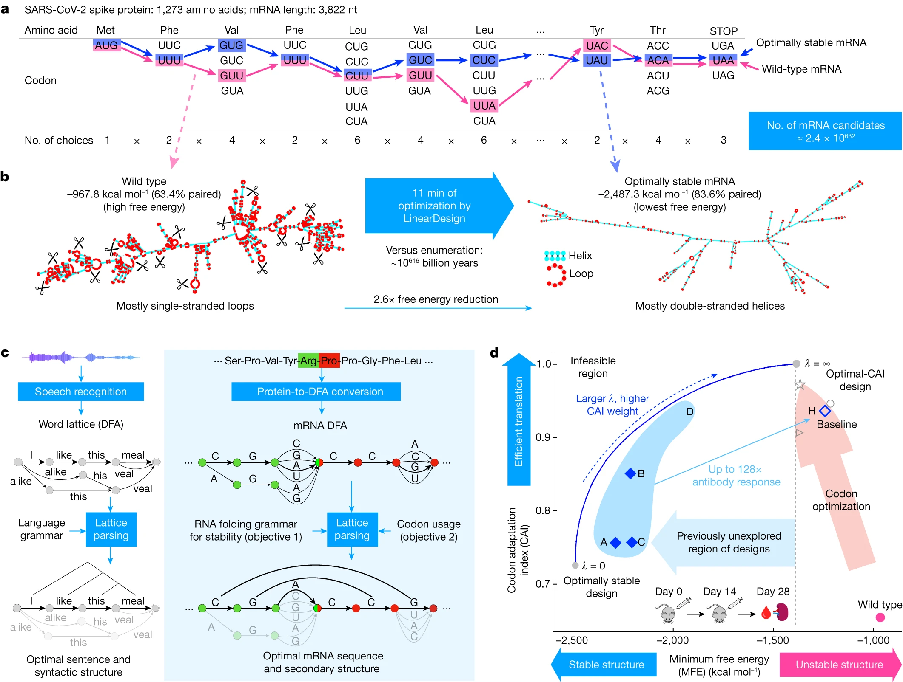
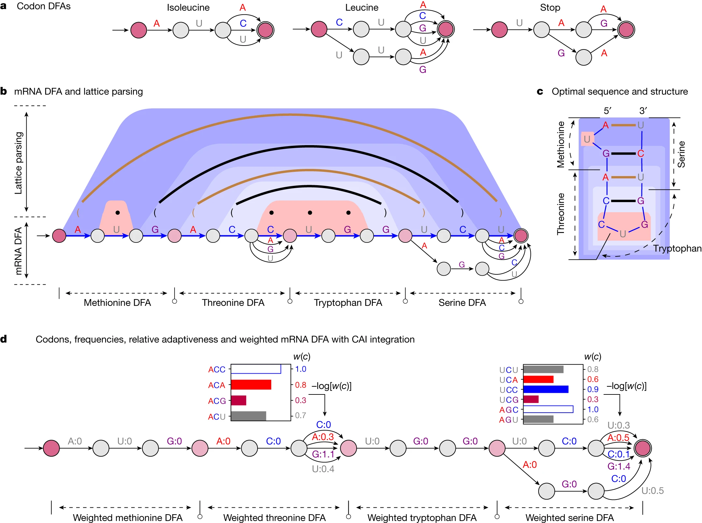
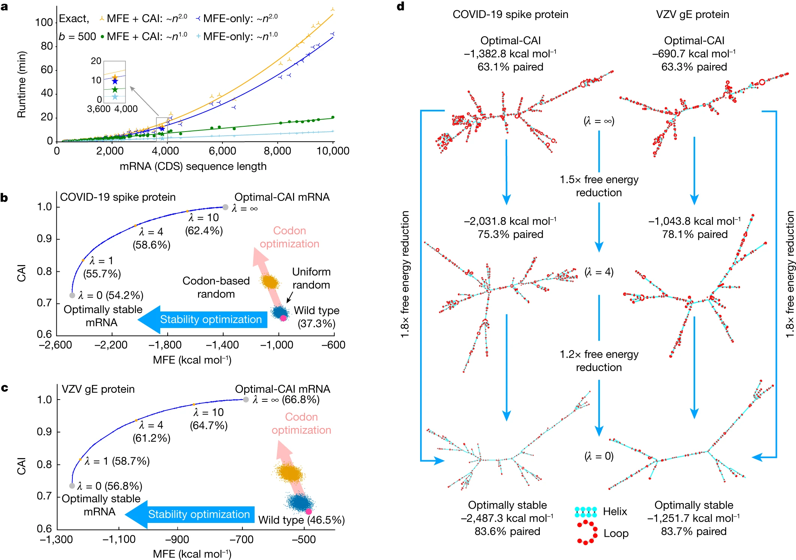
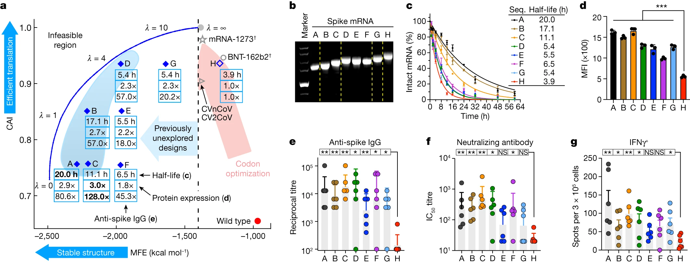
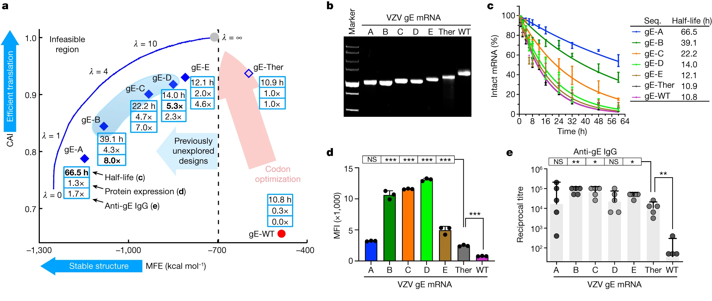

# LinearDesign

## Paper Info

- **Title**: Algorithm for optimized mRNA design improves stability and immunogenicity
- **Authors**: He Zhang, Liang Zhang, Ang Lin, Congcong Xu, Ziyu Li, Kaibo Liu, Boxiang Liu, Xiaopin Ma, Fanfan Zhao, Huiling Jiang, Chunxiu Chen, Haifa Shen, Hangwen Li, David H. Mathews, Yujian Zhang, Liang Huang
- **Venue**: Nature 2023, Volume 621
- **DOI**: [10.1038/s41586-023-06127-z](https://doi.org/10.1038/s41586-023-06127-z)
- **Paper**: [paper.pdf](./paper.pdf)
- **Code**: [LinearDesignSoftware/LinearDesign](https://github.com/LinearDesignSoftware/LinearDesign)

## Motivation

这篇论文要解决的是 mRNA 疫苗和治疗性 mRNA 设计里的核心组合优化问题：
给定目标蛋白，如何选择一条既编码同一个蛋白、又更稳定、更高表达的 mRNA CDS 序列。

传统 codon optimization 主要优化密码子使用偏好，例如 `CAI`，
但它并不能系统探索高二级结构稳定性的区域。
问题难点在于同义密码子导致搜索空间爆炸：
以 SARS-CoV-2 spike protein 为例，长度为 1,273 个氨基酸，
候选 mRNA 数量约 **2.4 x 10^632**。

一句话总结：
`LinearDesign` 把 mRNA CDS 设计转化成计算语言学中的 lattice parsing 问题，
从而在巨大同义编码空间中高效寻找兼顾 `MFE` 和 `CAI` 的序列。

## Method

作者的方法有三个关键设计：

1. **用 DFA 表示同义密码子空间**
   - 每个氨基酸对应一个 codon DFA。
   - 将所有 codon DFA 串联后得到整条蛋白的 mRNA DFA。
   - DFA 的每条 start-end path 对应一条可行 CDS 序列。

2. **用 lattice parsing 同时折叠所有候选序列**
   - RNA folding 可以写成类似 context-free grammar 的解析问题。
   - 单条序列 folding 是普通 parsing。
   - DFA 上的所有候选序列 folding 则变成 lattice parsing。

3. **用 weighted DFA 联合优化稳定性和密码子偏好**
   - 稳定性目标使用 `MFE`。
   - 密码子偏好用 `CAI`，并将 `log CAI` 分解到单个 codon 上。
   - 联合目标大致为：

```text
MFE - lambda * |protein| * log(CAI)
```

`lambda = 0` 时只优化稳定性，`lambda = infinity` 时退化为只优化 CAI。
通过调节 `lambda`，可以在稳定性和翻译效率之间形成一条可选边界。

## Main Figures

主图的阅读顺序是：
Fig. 1 说明问题和核心类比，Fig. 2 展开算法机制，
Fig. 3 证明算法能高效搜索并改变设计空间，
Fig. 4 用 SARS-CoV-2 spike 做完整实验验证，
Fig. 5 用 VZV gE 验证方法不是 spike-specific。

### Fig. 1：问题设定与算法直觉



#### Fig. 1a：为什么 mRNA 设计空间会爆炸

这一幅用 SARS-CoV-2 spike protein 举例说明搜索空间有多大。
同一个氨基酸可以由多个同义密码子编码，
所以一条蛋白序列对应大量可能的 mRNA CDS。

图中每一列是一个氨基酸的可选 codon，
每条从左到右的完整路径都是一条能编码同一个 spike protein 的 mRNA。
spike protein 有 1,273 个氨基酸，对应约 `2.4 x 10^632` 条候选 mRNA。
这说明问题不是“从几个候选里挑一个”，而是在指数级空间里搜索。

#### Fig. 1b：野生型序列和最稳定设计的结构差异

左边是 wild-type spike mRNA，
MFE 为 `-967.8 kcal/mol`，碱基配对比例为 `63.4%`。
右边是 LinearDesign 找到的最稳定设计，
MFE 为 `-2487.3 kcal/mol`，碱基配对比例为 `83.6%`。

MFE 越低，预测二级结构越稳定。
图中红色 loop 表示更容易暴露、也更容易被降解的单链区域；
蓝色 helix 表示双链配对区域。
作者想表达的是：优化二级结构后，mRNA 更紧凑、双链区域更多，
理论上更不容易降解。

图中还强调了计算效率：
LinearDesign 对 spike 的优化约 11 分钟完成；
如果直接枚举所有候选序列，计算上完全不可行。

#### Fig. 1c：从 NLP 的 word lattice 到 mRNA DFA

这一幅是全文最关键的类比。
左边是语音识别中的 word lattice：
同一段语音可能对应多句候选句子，例如 `I like this meal`、
`alike this meal`、`I like his veal` 等。
这些候选句子共享很多片段，可以压缩成一个 lattice。

右边把这个思想搬到 mRNA 设计：
每个氨基酸的同义 codon 选择构成一个小 DFA，
整条蛋白序列的候选 mRNA 被压缩进一个 mRNA DFA。
NLP 中 lattice parsing 的目标是从 word lattice 中找最合理的句子；
LinearDesign 中 lattice parsing 的目标是从 mRNA DFA 中找最优 mRNA 及其二级结构。

#### Fig. 1d：MFE-CAI 二维设计空间

横轴是 `MFE`，越往左表示结构越稳定；
纵轴是 `CAI`，越往上表示 codon 使用越接近高表达偏好。

传统 codon optimization 主要沿纵轴往上走，
提高 CAI，但很难进入左侧的高稳定区域。
LinearDesign 通过调节 `lambda` 扫出一条蓝色可行边界：
`lambda = 0` 偏向最低 MFE，
`lambda = infinity` 偏向最高 CAI，
中间值则给出稳定性和 codon optimality 的折中。

图中的 A-D 是作者选择进入湿实验的 LinearDesign 候选，
H 是 codon-optimized benchmark。
这个 panel 的核心信息是：
LinearDesign 不是只改 codon，也不是只追求稳定性，
而是在 `MFE-CAI` 空间里系统选择实验候选。

### Fig. 2：DFA 和 lattice parsing 如何落到 mRNA 设计



#### Fig. 2a：每个氨基酸对应一个 codon DFA

这一幅展示 codon DFA 的基本构造。
例如异亮氨酸、亮氨酸和终止密码子各自有多个合法 codon。
DFA 的边标记为 `A/C/G/U`，
从起点走到终点读出的三个核苷酸就是一个合法 codon。

关键点是：
一个小 DFA 可以紧凑表示一个氨基酸的所有同义 codon，
而不需要把它们当成互不相关的字符串逐个处理。

#### Fig. 2b：把 codon DFA 串成 mRNA DFA，并在上面做 folding

底部是整条 mRNA DFA：
每个氨基酸的小 DFA 被串联起来，
所以从最左起点走到最右终点的任意路径都是一条合法 mRNA CDS。
蓝色路径表示算法最终选中的最优 mRNA。

顶部是 lattice parsing 过程。
弧线表示碱基配对，括号表示 dot-bracket 结构，
梯形阴影表示动态规划把大结构分解成子结构。

这幅图强调：
LinearDesign 不是“先枚举每条 mRNA，再分别 RNAfold”，
而是在整个 mRNA DFA 上一次性做 folding 和搜索。
因此它能在不枚举候选序列的情况下，找到全局最优或近似最优设计。

#### Fig. 2c：算法输出的是序列加结构

这一幅把 Fig. 2b 中选中的蓝色路径画成一条具体 mRNA 序列，
并同时展示对应的二级结构。
所以 LinearDesign 的输出不只是“哪条 mRNA 最好”，
还包括“这条 mRNA 为什么稳定”，即它的预测配对结构。

#### Fig. 2d：用 weighted DFA 把 CAI 加进优化目标

上半部分列出 threonine 和 serine 的 codon 频率。
每个 codon 有一个 relative adaptiveness `w(c)`：
某个氨基酸最常用 codon 的 `w(c) = 1`，
其他 codon 的 `w(c)` 是相对频率。

下半部分把 `-log w(c)` 写成 DFA 边权。
高频 codon 的代价低，低频 codon 的代价高。
这样一来，lattice parsing 不只计算 RNA folding energy，
还能同时累加 codon 使用代价。

这就是联合优化 `MFE` 和 `CAI` 的关键：
MFE 来自 RNA folding grammar，
CAI 通过 weighted DFA 的边权进入同一个动态规划框架。

### Fig. 3：MFE-CAI 设计边界与计算效率



#### Fig. 3a：运行时间随序列长度的变化

横轴是 mRNA CDS 长度，纵轴是运行时间。
作者比较了 exact search 和 beam search，
也比较了 MFE-only 与 MFE+CAI 两种目标。

结果是：
exact search 在实际长度范围内近似二次复杂度 `~n^2`；
beam search 近似线性 `~n`。
加入 CAI 后只比 MFE-only 慢约 15%。

这说明算法不是只能处理小规模示例，
而是能处理几千 nt 的真实 CDS。
对 spike 这种长序列，beam search 能显著加速，
并且论文报告近似误差较小。

#### Fig. 3b：SARS-CoV-2 spike 的 MFE-CAI 空间

横轴是 `MFE`，越左越稳定；
纵轴是 `CAI`，越高越接近 codon optimality。
蓝色曲线是通过不同 `lambda` 扫出来的最优边界。

`lambda = infinity` 对应 optimal-CAI，
也就是几乎只关心 codon 使用；
`lambda = 0` 对应 optimally stable mRNA，
也就是只关心结构稳定性。
中间的 `lambda = 1/4/10` 是不同折中点。

粉色箭头表示传统 codon optimization。
它能提升 CAI，也因为人类偏好 GC-rich codon 而稍微改善 MFE，
但方向和真正的稳定性优化大体是正交的。
因此传统方法很难到达左侧低 MFE 区域。

#### Fig. 3c：VZV gE 的 MFE-CAI 空间

这一幅和 Fig. 3b 相同，但目标蛋白换成 VZV gE。
作者展示同样的现象仍然存在：
codon optimization 主要提高 CAI，
LinearDesign 能系统进入更稳定的低 MFE 区域。

这个 panel 的作用是算法层面的泛化验证：
方法并不是只对 SARS-CoV-2 spike 的序列结构偶然有效。

#### Fig. 3d：不同 lambda 对应的二级结构形态

这一幅直接画出 spike 和 VZV gE 的代表性结构。

上排是 `lambda = infinity`，即 optimal-CAI：
MFE 较高，配对比例约 60% 多，结构相对松散。
中排是 `lambda = 4`：
MFE 明显降低，配对比例上升到约 75%-78%，是稳定性和 CAI 的折中。
下排是 `lambda = 0`：
MFE 最低，配对比例约 83%，结构最紧凑。

这张图把 Fig. 3b/c 的坐标点变成了直观结构：
越偏稳定性优化，mRNA 越双链化、越紧凑。

### Fig. 4：COVID-19 spike mRNA 实验验证



#### Fig. 4a：把 spike 实验候选放回 MFE-CAI 空间

这一幅是 Fig. 4 的总览图。
A-G 是 LinearDesign 设计出的 spike mRNA，
H 是 codon-optimized benchmark。
图里还标注了 mRNA-1273、BNT-162b2 和 CureVac 相关序列的位置，
但这些商业疫苗序列使用修饰核苷酸，
图中的 MFE 仍按标准能量模型计算，因此只能作为参考。

每个实验候选旁边标了三个结果：
半衰期、蛋白表达相对 H 的倍数、anti-spike IgG 相对 H 的倍数。
A-D 靠近低 MFE 的 LinearDesign 边界，
后续实验中也表现出更强稳定性和免疫反应。

这个 panel 的作用是把算法设计空间和湿实验结果放在同一张图上：
它不是孤立比较几个序列，
而是在说明哪些 `MFE-CAI` 区域更值得实验验证。

#### Fig. 4b：非变性胶验证 mRNA 结构紧凑性

作者用 non-denaturing agarose gel 观察 mRNA 迁移率。
在分子量接近的情况下，
更紧凑的 RNA 通常迁移更快。

结果显示：
A 的 MFE 最低，迁移最快；
H 的 MFE 最高，迁移最慢；
其他序列大体按 MFE 排列。

这不是直接测降解，
而是先用物理形态证明：
LinearDesign 预测的低 MFE 序列确实更紧凑。

#### Fig. 4c：体外化学稳定性

作者把 A-H mRNA 放在 `10 mM Mg2+` 缓冲液、`37 °C` 条件下，
随时间测 intact mRNA 的比例。

序列 A 的半衰期是 `20.0 h`，
benchmark H 是 `3.9 h`。
低 MFE 序列降解更慢，
说明结构稳定性确实对应更高的体外化学稳定性。

#### Fig. 4d：HEK293 细胞中的蛋白表达

作者将 mRNA 转染进 HEK293 细胞，
48 小时后用流式检测 spike 蛋白表达，
读数是 MFI。

A-G 全部高于 H。
其中 A 相对 H 约 `2.9x`，
D 和 G 的 CAI 与 H 接近，但 MFE 更低，
表达约为 H 的 `2.3x`。

这说明表达提升不只是 codon optimality 的结果。
在 CAI 相近时，降低 MFE、提高结构稳定性也能增强表达。

#### Fig. 4e：小鼠 anti-spike IgG

C57BL/6 小鼠接受两针 mRNA 免疫，
两针间隔两周，
随后测 anti-spike IgG endpoint titre。

A-D 相对 H 的 binding antibody 水平提升 `57x` 到 `128x`。
这是全文最强的生物学证据之一：
LinearDesign 设计出的 CDS 不只是体外更稳定，
还能显著提高体内抗体诱导。

#### Fig. 4f：中和抗体

这一幅测的是 against wild-type SARS-CoV-2 的 neutralizing antibody。
相比 binding IgG，中和抗体更接近功能性免疫效果。

A-D 相对 H 的中和抗体提升约 `9x` 到 `20x`。
这说明低 MFE 与合适 CAI 的设计不仅提高总抗体，
也提高了能阻断病毒相关相互作用的抗体反应。

#### Fig. 4g：T cell response

作者用 ELISpot 测 IFNγ-secreting T cells，
反映 spike-specific 细胞免疫反应。

LinearDesign 序列诱导更强的 T cell response，
H 的反应较弱。
这说明改造 CDS 后的影响不只体现在抗体，
也体现在细胞免疫层面。

### Fig. 5：VZV gE mRNA 的泛化验证



#### Fig. 5a：VZV gE 的 MFE-CAI 空间和实验总结

这一幅对应 Fig. 4a，但目标换成 VZV gE protein。
gE-A 到 gE-E 是 LinearDesign 设计，
gE-Ther 是用常见 codon optimization 工具 GeneOptimizer 设计的 benchmark，
gE-WT 是 wild type。

图中浅蓝色区域是作者强调的 sweet spot：
MFE 和 CAI 都处在有利区间。
一个重要现象是：
gE-A 最稳定，但它并不是表达和免疫最好的序列；
表现更好的通常是 gE-B、gE-C、gE-D 或 gE-E 这类折中设计。

这个 panel 支撑一个关键结论：
最低 MFE 不等于最佳 mRNA，
实际设计需要联合优化稳定性和 codon optimality。

#### Fig. 5b：VZV gE 的非变性胶

和 Fig. 4b 类似，
作者用 non-denaturing agarose gel 验证不同 gE mRNA 的结构紧凑性。

gE-A 的 MFE 最低，迁移最快，
说明它最紧凑；
gE-Ther 和 gE-WT 迁移较慢，
对应更不稳定或更松散的结构。

这说明 LinearDesign 的结构预测和物理形态变化在另一个抗原上仍然成立。

#### Fig. 5c：VZV gE 的体外稳定性

在 `10 mM Mg2+`、`37 °C` 条件下，
gE-A 的半衰期为 `66.5 h`，
gE-Ther 为 `10.9 h`，
gE-WT 为 `10.8 h`。

这说明 LinearDesign 可以显著提高 VZV gE mRNA 的体外稳定性。
同时，gE mRNA 整体比 spike mRNA 更稳定，
论文认为这可能与 gE 序列更短有关。

#### Fig. 5d：VZV gE 的蛋白表达

作者在 HEK293 细胞中测 48 小时后的 gE 蛋白表达。
多数 LinearDesign 序列，尤其 gE-B 到 gE-E，
表达高于 gE-Ther 和 gE-WT。

但 gE-A 虽然半衰期最高、MFE 最低，
表达并不是最好。
这是全篇很重要的反例：
过度追求结构稳定性可能牺牲翻译效率，
所以不能把最低 MFE 当成唯一目标。

#### Fig. 5e：VZV gE 的小鼠抗体反应

C57BL/6 小鼠两针免疫后，
作者测 anti-gE IgG endpoint titre。
gE-B、gE-C、gE-E 显著高于 gE-Ther 或 gE-WT。

这个结果说明 LinearDesign 不只是对 SARS-CoV-2 spike 有效，
也能迁移到另一个病毒抗原。
更重要的是，它再次支持 Fig. 5a 的 sweet spot 观点：
最好的实验表现来自 MFE 和 CAI 的折中区域，
而不是某一个单目标极值。

## Key Insights

### 关键结果 1：把巨大 mRNA 设计空间变成可计算的 lattice

最重要的方法贡献是形式化。
作者没有枚举所有同义序列，而是用 DFA 紧凑表示候选空间，
再通过 lattice parsing 一次性在这个空间上求最优。

在 SARS-CoV-2 spike protein 上，
`LinearDesign` 可以在约 **11 分钟**内找到高稳定性设计；
而直接枚举在计算上完全不可行。

### 关键结果 2：稳定性优化和 codon optimization 不是一回事

Fig. 3 里很清楚地展示了 `MFE` 和 `CAI` 的二维设计空间。
传统 codon optimization 会提升 CAI，但只能轻微改善稳定性；
而 `LinearDesign` 可以直接探索以前难以到达的低 MFE 区域。

以 spike CDS 为例：

- `Optimal-CAI`: **-1382.8 kcal/mol**, paired **63.1%**
- `lambda = 4`: **-2031.8 kcal/mol**, paired **75.3%**
- `lambda = 0`: **-2487.3 kcal/mol**, paired **83.6%**

这说明 MFE 优化能把序列推向更紧凑、更双链化的结构空间。
但作者也没有简单选择最低 MFE，而是保留了与 CAI 的折中。

### 关键结果 3：COVID-19 spike mRNA 的体外和体内验证很强

作者设计了 7 条 LinearDesign spike mRNA 序列 `A-G`，
并用 codon-optimized benchmark `H` 对照。

在 10 mM Mg2+ 缓冲液中：

- `A` 的半衰期为 **20.0 h**
- `H` 的半衰期为 **3.9 h**

在 HEK293 细胞蛋白表达中：

- `A` 相对 `H` 约 **2.9x**
- `D/G` 相对 `H` 约 **2.3x**

在小鼠免疫中：

- `A-D` 相对 `H` 的 anti-spike IgG 提升 **57x 到 128x**
- 中和抗体提升 **9x 到 20x**

这部分是全文最关键的证据：
算法设计出来的序列不是只在 MFE 上好看，而是能转化为稳定性、表达和免疫原性的提升。

### 关键结果 4：与 BNT-162b2 风格序列的 head-to-head 比较

作者还构造了一个接近 BNT-162b2 CDS 的对照序列，
但统一使用相同 UTR 和天然未修饰核苷酸。
结果显示 `A` 和 `C` 在体外稳定性、HEK293 蛋白表达和小鼠抗体诱导上均显著高于该 BNT 对照。

这里要注意解释边界：
这不是直接比较商业疫苗产品本身，
因为修饰核苷酸、递送体系、UTR 和抗原设计都被控制或改变了。
但它说明 CDS 结构优化本身可以提供强信号。

### 关键结果 5：VZV gE mRNA 证明方法不只适用于 spike

作者将方法扩展到 VZV gE 蛋白，并设计 `gE-A` 到 `gE-E`。

关键结果：

- `gE-A` 半衰期 **66.5 h**，而 `gE-Ther` 为 **10.9 h**
- 多数 LinearDesign 序列在 HEK293 表达上高于 `gE-Ther` 和 `gE-WT`
- `gE-B / gE-C / gE-E` 在小鼠中诱导显著更高 anti-gE IgG

有意思的是，最低 MFE 的 `gE-A` 并不是表达最佳。
表现最好的往往是 MFE 和 CAI 同时落在有利区域的序列。

这强化了一个设计原则：
**最稳定不等于最优，联合优化比单目标极值更可靠。**

### 我的结论

如果只用一句话评价这篇论文：

> LinearDesign 的真正贡献是把 mRNA CDS 设计从经验式 codon optimization 推进成了有形式化目标、有全局搜索能力、并经过体内验证的算法设计问题。

它是 mRNA 设计领域里非常典型的“算法思想直接改变实验候选空间”的工作。

## Limitations & Future Work

- **只优化 CDS，不直接优化 UTR**：UTR 工程仍然需要单独处理，后续更适合与 UTR 设计方法组合。
- **MFE 不是全部生物学**：MFE 与稳定性相关，但细胞内降解、翻译、免疫识别还受更多因素影响。
- **需要避免过长双链结构**：过度稳定的长茎结构可能触发 innate immune response，论文也通过约束避开了这类设计。
- **未纳入修饰核苷酸能量模型**：商业 mRNA 产品常用修饰核苷酸，未来需要对应的结构能量模型支持。
- **最佳设计通常是折中点**：VZV 实验说明最低 MFE 不一定对应最佳表达，后续应纳入更多多目标评价。

后续最值得看的方向是：

1. 将 `CDS stability / CAI / UTR / modified nucleotides` 放进统一优化框架。
2. 与生成模型结合，用实验反馈进一步校正多目标权重。
3. 从疫苗抗原扩展到抗体、细胞因子、酶替代等治疗性蛋白 mRNA。

## Notes

- 当前目录主图为 [1.png](./1.png) 到 [5.png](./5.png)，对应论文主文 Fig. 1 到 Fig. 5。
- `e1.png` 到 `e8.png` 为 Extended Data figures。
- 当前主文 PDF 为 [paper.pdf](./paper.pdf)。
