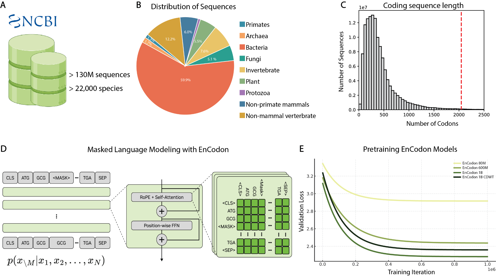
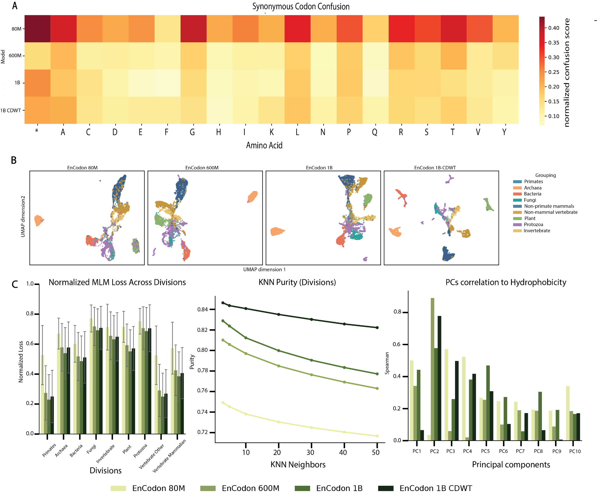
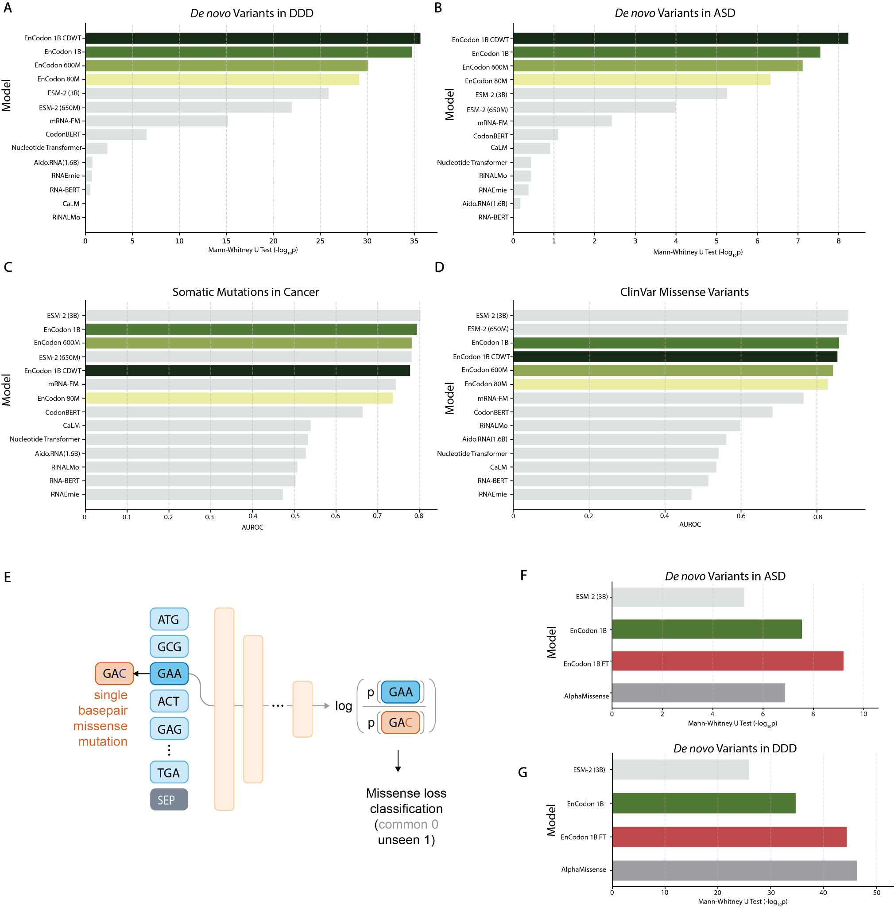
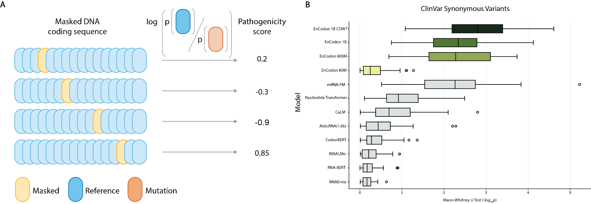
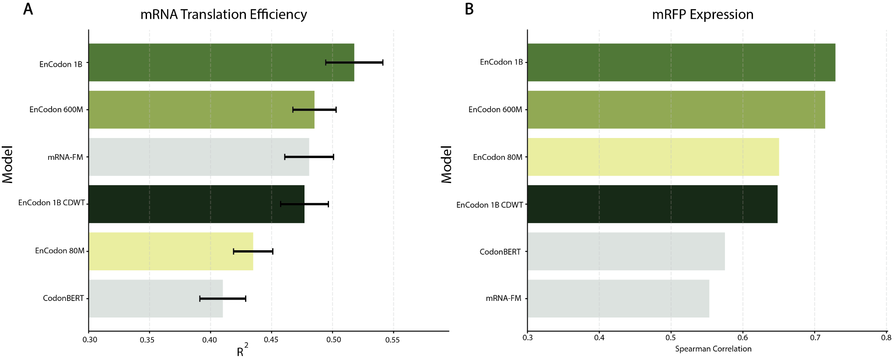

# CodonFM

## Paper Info

- **Title**: Learning the Language of Codon Translation with CodonFM
- **Authors**: Sajad Darabi, Fan Cao, Mohsen Naghipourfar, Sara Rabhi, Ankit Sethia, Kyle Gion, Jasleen Grewal, Jonathan Cohen, William J. Greenleaf, Hani Goodarzi, Laksshman Sundaram
- **Venue**: Preprint, 2025
- **Paper**: [paper.pdf](./paper.pdf)
- **Code**: [NVIDIA-Digital-Bio/CodonFM](https://github.com/NVIDIA-Digital-Bio/CodonFM)
- **Model Weights**: Hugging Face / NVIDIA NGC links are provided in the code repository.

## Motivation

这篇论文关注 **codon-level foundation model**。同一个氨基酸通常可以由多个同义密码子编码，但这些同义 codon 并不只是“等价替换”：它们会影响翻译效率、mRNA 稳定性、蛋白表达，甚至疾病相关突变效应。

传统 codon optimization 往往依赖宿主 codon bias、CAI 或少数手工规则，但真实 CDS 中的 codon 选择是上下文相关的：相邻 codon、GC content、RNA 结构、tRNA 可用性、蛋白功能约束等因素都可能交织在一起。

`CodonFM` 的核心想法是把 CDS 看成一种以 codon 为 token 的“语言”，通过大规模自监督学习捕捉同义密码子选择背后的上下文语法。论文当前主要展示的是 CodonFM 家族中的 **EnCodon** encoder 模型。

## Method: CDS as a Codon Language

Fig. 1 把论文的方法主线串在一起：先构建跨物种 CDS 语料，再把 CDS 切成 codon token，最后用 BERT-style masked language modeling 训练模型。这里最关键的不是“用了 Transformer”，而是建模单位从 nucleotide 变成了 codon，这让模型天然对齐翻译单位，也更适合学习同义 codon 的上下文选择。

训练数据来自 NCBI RefSeq / Genomes，规模超过 **130 million** 条 coding sequences，覆盖超过 **22,000 species**。Fig. 1A-B 说明数据不是只围绕人类或少数模式生物构建，而是覆盖 bacteria、archaea、fungi、plants、protozoa、primates、non-primate mammals 等主要类群。由于 codon usage bias 有明显物种差异，跨类群训练能迫使模型学习更通用的 codon grammar。出于 biosafety 考虑，作者排除了 human-affecting pathogen sequences。

Fig. 1C 展示 CDS 长度分布。横轴是 codon 数量，纵轴是序列数量；红色虚线对应模型上下文长度 **2,046 codons**。大多数天然 CDS 长度低于 1,000 codons，因此绝大多数序列可以完整放入模型上下文中，不需要严重截断。

Fig. 1D 是 EnCodon 的训练目标。每条 ORF 以 `<CLS>` 开始，以 `<SEP>` 结束，输入类似 `<CLS> ATG GCG <MASK> ... TGA <SEP>`。模型使用 Transformer encoder，根据上下文预测被 mask 的 codon。训练目标类似 masked language modeling，但 mask 单位是 codon，而不是单个碱基。

Fig. 1E 比较了 `EnCodon 80M`、`EnCodon 600M`、`EnCodon 1B` 和 `EnCodon 1B-CDWT` 的 validation loss。总体趋势是模型越大，loss 越低，说明 codon grammar 的学习具有明显 scaling behavior。`1B-CDWT` 使用 codon-frequency weighted masking，更重视低频或信息量更高的 codon，避免模型只学到高频 codon 的表面分布。

## Representation: Codon Grammar and Taxonomy

Fig. 2 主要回答一个问题：模型学到的到底是不是有生物意义的 codon grammar，而不只是简单统计频率。

Fig. 2A 的 synonymous codon confusion matrix 检查模型在预测 masked codon 时是否容易把同义 codon 混淆。随着模型从 `80M` 扩展到 `1B`，normalized confusion score 整体降低。这说明大模型不只是知道哪些 codon 编码同一个氨基酸，还能区分同义 codon 在不同上下文中的使用偏好。

Fig. 2B 将 embedding 降维到 UMAP 空间，并按系统发育类群着色。更大的模型在 embedding 空间中形成更清晰的生物分组结构，说明 EnCodon 表征中包含物种或类群相关的 codon usage 信息，而不仅是 nucleotide composition。

Fig. 2C 从三个角度补充这个结论：不同类群上的 normalized MLM loss 随模型变大而降低；KNN purity 显示 `1B-CDWT` 的邻域类群一致性最好；top principal components 与氨基酸疏水性的相关性在大模型中下降。作者的解释是，大模型不再主要依赖简单氨基酸属性，而是吸收了更复杂的 codon usage 和上下文调控信号。

## Variant Effect Prediction

### Missense Variants

Fig. 3 评估 EnCodon 对 missense variant 的建模能力。missense mutation 会改变氨基酸，因此蛋白语言模型天然有优势；如果 codon-level 模型在这里仍然有效，说明 CDS 表征中确实隐含了蛋白功能约束。

作者使用 zero-shot scoring 比较 reference codon 和 mutated codon 的 log-likelihood 差异。Fig. 3A-B 显示 EnCodon 在 DDD 和 ASD de novo mutation 数据上能较好地区分 case/control。Fig. 3C-D 使用 AUROC 评估 ClinVar missense 和 cancer hotspot，EnCodon 明显优于多个 RNA / mRNA sequence model baseline，但在部分任务上仍略低于 ESM2 这类蛋白语言模型。

Fig. 3E-G 进一步展示 fine-tuning 的结果。作者用 gnomAD missense variants fine-tune `EnCodon 1B` 得到 `EnCodon 1B-FT`，在 ASD 和 DDD 上与 AlphaMissense 等强监督模型相比也有竞争力。这说明 EnCodon 不只是 zero-shot embedding 好用，也可以作为下游 supervised variant effect prediction 的初始化模型。

### Synonymous Variants

Fig. 4 是这篇论文最有辨识度的一组结果。synonymous mutation 不改变蛋白序列，传统蛋白语言模型通常无法直接感知；如果一个模型能捕捉同义突变效应，它必须真正理解 codon choice 的上下文含义。

Fig. 4A 说明任务设置：对 ClinVar 中 pathogenic 和 benign synonymous variants 做 zero-shot 比较。Fig. 4B 进一步做了 50 次 stratified subsampling，控制 reference/alternate codon、基因位置、gene-level pLI 和 local mutation rate 等混杂因素。在这种更严格的比较下，EnCodon 仍优于 RNA 和 mRNA baseline，其中 `1B-CDWT` 表现最好。

这个结果支持论文的核心观点：CodonFM 的优势不只是能从 CDS 中间接读出蛋白功能信号，更重要的是它能捕捉不改变蛋白序列的同义突变效应。

## mRNA Design Relevance

Fig. 5 把 EnCodon 表征放到 mRNA design 相关任务里验证。Fig. 5A 使用预训练 embedding 训练 random forest regressor，预测 mammalian cell 中的 mRNA translation efficiency；EnCodon 模型整体优于 nucleotide-level baselines。Fig. 5B 评估 mRFP protein expression，指标是预测值和实验表达量之间的 Spearman correlation，`EnCodon 1B` 表现最好。

一个值得注意的细节是，`1B-CDWT` 在某些表达任务上不一定最高。论文的解释是，CDWT 表征受 GC content 等简单序列特征影响更小，而某些表达数据中这些简单特征本身贡献较大。因此，CDWT 更适合强调 biologically organized representation，但不一定在每个表达预测 benchmark 上都占优。

从应用角度看，EnCodon 可以作为 mRNA 设计 pipeline 中的打分器或表征模型，用于筛选更可能高表达或高翻译效率的 CDS。它和 `LinearDesign` 的区别是：`LinearDesign` 显式优化 `MFE + CAI`，而 `CodonFM` 学习天然 CDS 中隐含的 codon context。两者未来可以互补，一个提供可解释的物理/统计目标，一个提供从大规模进化数据中学到的隐式语法评分。

## Key Takeaways

1. **codon usage 有可学习的上下文语法**：如果同义 codon 真的是任意替换，模型在 masked codon prediction 中不应该能系统区分它们；但 confusion matrix、MLM loss 和 scaling 结果显示，模型越大，越能预测哪个同义 codon 更适合当前上下文。

2. **codon-level 模型能捕捉蛋白功能约束**：EnCodon 没有直接以 amino acid sequence 作为输入，但在 missense variant 任务上仍有强表现，说明 CDS codon pattern 与蛋白功能、进化约束和疾病变异之间存在可学习联系。

3. **同义突变是 CodonFM 最有特色的应用场景**：同义突变不改变氨基酸，蛋白模型通常难以直接处理；EnCodon 在 ClinVar synonymous variant 任务上表现突出，说明它能捕捉 codon choice 对临床变异效应的潜在影响。

4. **mRNA 设计是自然下游方向**：translation efficiency 和 mRFP expression 结果说明 EnCodon embedding 对表达和翻译相关任务有直接价值，可作为 codon optimization 或 mRNA design 的候选 scoring layer。

## Limitations & Future Work

- **主要是计算验证**：论文结果以 benchmark 和 embedding analysis 为主，还需要更多 wet-lab perturbation 验证。
- **synonymous variant 数据有限**：有实验或临床标注的同义突变数量少，统计结果需要谨慎解释。
- **当前模型没有显式加入细胞上下文**：例如 cell-type-specific tRNA abundance、RNA modification、RBP binding 和 ribosome profiling context。
- **没有显式建模 RNA 二级结构动力学**：模型可能隐式捕捉部分结构相关信号，但没有像 LinearDesign 那样直接优化 MFE。
- **当前重点是 encoder 表征模型**：论文主要展示 EnCodon 系列，更强的生成式 codon design 还需要后续架构和实验闭环。

## Assets

- 主文 PDF: [paper.pdf](./paper.pdf)
- 主图目录: [figures](./figures/)
- 图像由 `pdfimages` 从 PDF 内嵌图片抽取，README 中的解释已按论文逻辑融入对应章节。
