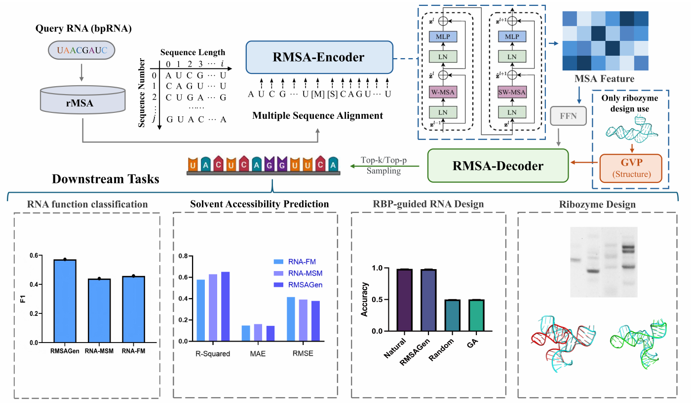
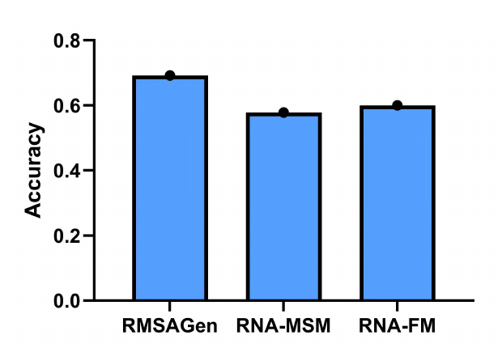
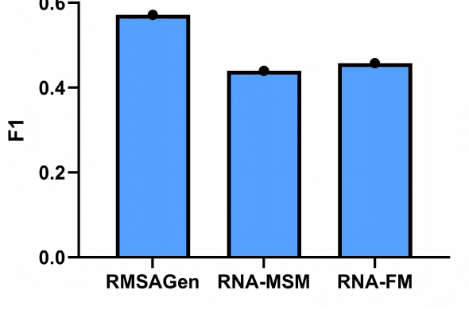
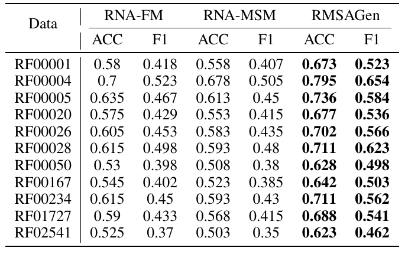
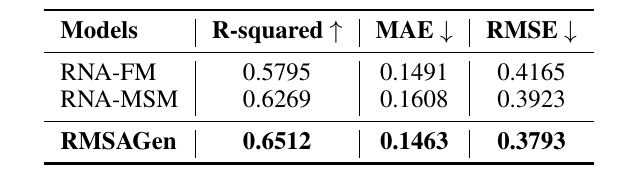
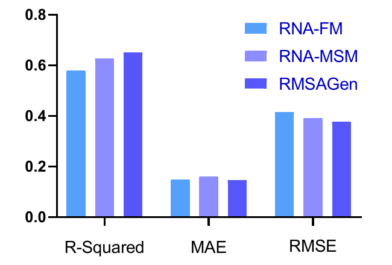
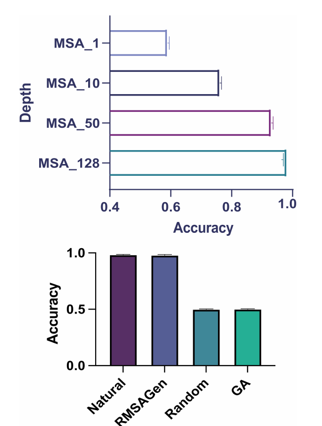
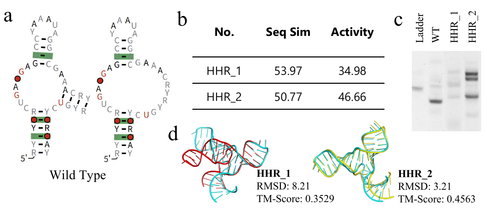

# RMSAGen

## Paper Info

- **Title**: RMSAGen: Integrating Multiple Sequence Alignment for Function RNA Design
- **Authors**: Jiyue Jiang, Yanyu Chen, Qingchuan Zhang, Jiayi Li, Xiangyu Shi, Chang Zhou, Ziqian Lin, Jiuming Wang, Dongchen He, Liang Hong, Qintong Li, Pengan Chen, Jiayang Chen, Xinrui Zhang, Jiao Yuan, Tianqing Zhang, Yu Li
- **Venue**: AAAI 2026
- **Paper**: [paper.pdf](./paper.pdf)

## Motivation

RNA 设计比蛋白设计更难的一个原因是：
RNA 构象更灵活，实验数据更少，单条序列本身往往不足以稳定描述功能。
在蛋白结构预测中，`MSA` 已经被证明非常关键；
RNA 结构预测和功能注释也常常受益于多序列比对中的保守信息。

但此前大多数 RNA MSA 工作主要用于 characterization，
比如结构预测、家族分类或功能注释，
还没有系统回答一个问题：

> RNA MSA 能不能直接帮助功能 RNA 的生成式设计？

一句话总结：
`RMSAGen` 把 MSA 中的进化保守信息接入 RNA 生成模型，
用于 RBP-binding RNA 和 hammerhead ribozyme 等功能 RNA 设计。

## Method

`RMSAGen` 由两个主要模块组成：

1. **RMSA-Encoder**
   - 输入 RNA MSA。
   - 使用 12 层 Transformer 编码 MSA 特征。
   - 通过 MLM 预训练学习 MSA 表示。
   - 为了避免直接拼接 MSA 带来的 `O((MN)^2)` 复杂度，模型采用 2D positional embedding，并分别在 row / column 方向计算 attention。

2. **RMSA-Decoder**
   - 使用 encoder-decoder 架构生成 RNA 序列。
   - decoder 为 24 层模型，自回归生成 aligned sequence。
   - RMSA-Encoder 输出经 FFN 后作为生成条件。

3. **Ribozyme 结构融合**
   - 对 hammerhead ribozyme 设计，额外引入结构特征。
   - 使用 `P / C1 / C3` 原子坐标构建点云和拓扑图。
   - 通过 4 层 `GVP` 图网络编码结构，再与 decoder hidden state 融合。

4. **采样策略**
   - 使用 top-k / top-p sampling，而不是 beam search。
   - 论文最终设置为 `top-k = 1000`、`top-p = 0.7`、`temperature = 1.0`。
   - 这样做是为了保留生物序列生成中的多样性。

### Figure 1: RMSAGen 整体框架

这张图把论文的主线压在一张架构图里：左侧先从 query RNA 构建 RNA MSA，核心不是只看单条序列，而是把同源序列中的保守模式作为条件信息。中间的 `RMSA-Encoder` 对 MSA 做表征学习，右侧的 `RMSA-decoder` 在这些 MSA feature 条件下生成 RNA 序列。为了避免把 MSA 直接摊平成长序列后带来的高复杂度，模型在 row / column 方向分别做注意力。右侧虚线框里的 `GVP` 是 ribozyme design 才额外使用的结构分支，用三维结构信息辅助生成。底部四个 downstream tasks 对应论文的验证路线：RNA family classification、solvent accessibility prediction、RBP-guided RNA design 和 ribozyme design。

## Key Insights

### 关键结果 1：MSA encoder 学到了比单序列模型更强的 RNA 家族表征

在 11 类 RNA family classification 上，
`RMSAGen` 的 encoder 明显优于 `RNA-FM` 和 `RNA-MSM`。

#### Figure 2: RNA family classification 的 Accuracy

这张柱状图比较 `RMSAGen`、`RNA-MSM`、`RNA-FM` 在 11 类 RNA family classification 上的平均 Accuracy。`RMSAGen` 最高，说明 MSA encoder 学到的不是简单的序列语言模型特征，而是能帮助区分 RNA family 的进化保守信息。它和 Figure 3 是一组结果：Figure 2 看准确率，Figure 3 看 F1。

#### Figure 3: RNA family classification 的 F1

F1 对类别不均衡更敏感，因此比 Accuracy 更能反映模型是否只是偏向大类。这里 `RMSAGen` 依然明显高于 `RNA-MSM` 和 `RNA-FM`，说明 MSA 表征在多个 RNA family 上都更稳，而不是只靠少数容易分类的类别拉高平均值。

#### Table 1: 11 类 RNA family 的分类细节

表格给出了每个 Rfam 类别上的 ACC 和 F1。最右侧 `RMSAGen` 的结果大多加粗，表示在对应类别上最好。这个表比 Figure 2/3 更细：它说明 RMSAGen 的优势不是只体现在平均指标上，而是在多数具体 RNA family 上都成立，尤其是 `RF00004` 上 ACC 和 F1 的提升比较明显。

平均结果为：

- `RNA-FM`: ACC **0.600**, F1 **0.458**
- `RNA-MSM`: ACC **0.578**, F1 **0.440**
- `RMSAGen`: ACC **0.692**, F1 **0.572**

其中 `U2 spliceosomal RNA (RF00004)` 上表现尤其明显：

- ACC **0.795**
- F1 **0.654**

这说明 MSA 中的保守模式确实能帮助模型区分 RNA 家族，
而不只是增加输入长度。

### 关键结果 2：MSA 表征也能改善结构相关预测

在 RNA solvent accessibility prediction 上，
`RMSAGen` 同样取得最优结果：

#### Table 2: RNA solvent accessibility prediction

这里评估的是 RNA 碱基的溶剂可及性预测。`R-squared` 越高越好，`MAE` 和 `RMSE` 越低越好。`RMSAGen` 在三个指标上整体最优，说明 MSA encoder 不只学到家族分类信号，也能捕捉和结构暴露程度相关的信息。这一点对后面的功能 RNA 设计很重要，因为功能往往和结构约束绑定。

#### Figure 4: solvent accessibility 的可视化对比

这张图是 Table 2 的柱状图版本。左侧 `R-squared` 中 `RMSAGen` 最高，表示预测解释能力最强；中间 `MAE` 中 `RMSAGen` 最低，表示平均误差最低；右侧 `RMSE` 中 `RMSAGen` 也最低，表示大误差更少。图的作用是把结构相关任务上的优势直观展示出来。

- `R-squared`: **0.6512**
- `MAE`: **0.1463**
- `RMSE`: **0.3793**

这说明 RMSA-Encoder 不只捕获序列家族标签，
也捕获了和结构暴露程度相关的信息。
这对后续生成任务很关键，因为功能 RNA 的设计往往受结构约束。

### 关键结果 3：RBP-guided RNA design 中，MSA 深度越大效果越好

在 RNAcompete 数据集上，作者用 RMSAGen 设计能够结合目标 RNA-binding protein 的序列。

#### Figure 5: RBP-guided RNA design 与 MSA depth

上半部分比较不同 MSA depth 下的设计效果：`MSA_1 -> MSA_10 -> MSA_50 -> MSA_128` 逐渐增加时，性能也逐步提升。这直接支持论文的核心判断：MSA 里的进化信息越充分，对 RNA 设计越有帮助。下半部分把 `Natural`、`RMSAGen`、`Random`、`GA` 放在一起比较，`RMSAGen` 明显接近 natural 序列，并优于 random / genetic algorithm 这类基线，说明它探索到的序列更符合目标 RBP binding 需求。

论文给出的两个重要现象是：

- RMSAGen 生成序列的 AUPRC 分布与 `Random` 和 `GA` 的相关性较低，说明它探索的是不同的序列空间。
- 当输入 MSA depth 从 `1 -> 10 -> 50 -> 128` 增加时，设计序列的 AUC 稳定提升。

这支持了全文最核心的判断：
**MSA 不是额外装饰，而是能实际提升功能 RNA 设计质量的信息源。**

### 关键结果 4：hammerhead ribozyme 设计进入了生物实验验证

作者进一步设计 hammerhead ribozyme，并加入结构特征辅助生成。

#### Figure 6: hammerhead ribozyme 设计与实验验证

这是全文最关键的功能验证图。`a` 展示 wild type 和设计序列的二级结构对齐，说明生成序列能维持目标 hammerhead ribozyme 的结构骨架。`b` 给出两个设计序列 `HHR_1`、`HHR_2` 的序列相似度和活性数值。`c` 是凝胶电泳实验，`HHR_1` 和 `HHR_2` 出现 cleavage products，说明它们不是只在计算指标上好看，而是有可检测的催化活性。`d` 展示三维结构对齐和 RMSD / TM-score，进一步说明生成结构和 wild type 结构在空间上接近。

计算结果：

- RNAfold 预测的二级结构与 wild type 相似度达到 **1.00**
- AlphaFold3 预测三维结构与 wild type 平均 RMSD 为 **5.71 Å**
- 生成序列与 wild type 的平均序列相似度为 **52.37%**

生物实验中，两个设计序列 `HHR_1` 和 `HHR_2` 在胶电泳中出现 cleavage products，
说明它们具有催化活性。

论文报告：

- `HHR_1`: sequence similarity **53.97**, activity **34.98**
- `HHR_2`: sequence similarity **50.77**, activity **46.66**

这部分是全文最有说服力的地方：
RMSAGen 不只是设计“看起来像”的 RNA，而是能产生活性可检测的功能序列。

### 我的结论

如果只用一句话评价这篇论文：

> RMSAGen 的价值在于把 RNA MSA 从“辅助理解结构和功能”的输入，推进成了“直接指导功能 RNA 生成”的条件信息。

它给 RNA 设计提供了一条和单序列语言模型不同的路线：
不只学习单条 RNA 的语法，而是利用进化保守性缩小功能空间。

## Limitations & Future Work

- **依赖高质量 MSA**：对缺少同源序列、保守性弱或人工新功能 RNA，MSA 信息可能不足。
- **RBP design 主要是计算验证**：RBP-binding 部分还需要更大规模 wet-lab 验证。
- **ribozyme 实验规模较小**：生物验证集中在 hammerhead ribozyme 的少量设计序列上。
- **长序列和复杂 RNA machinery 仍未充分覆盖**：论文也提到未来要扩展到更长、更复杂的 RNA。
- **结构 oracle 仍有误差**：RNAfold、AlphaFold3 等预测工具会影响设计评估与筛选。

后续值得继续的方向是：

1. 将 RMSAGen 扩展到更长 RNA 和 RNA-protein complex co-design。
2. 把化学修饰、细胞内稳定性和递送场景纳入生成目标。
3. 引入 wet-lab feedback loop，让 MSA 条件生成从离线设计走向主动学习闭环。
