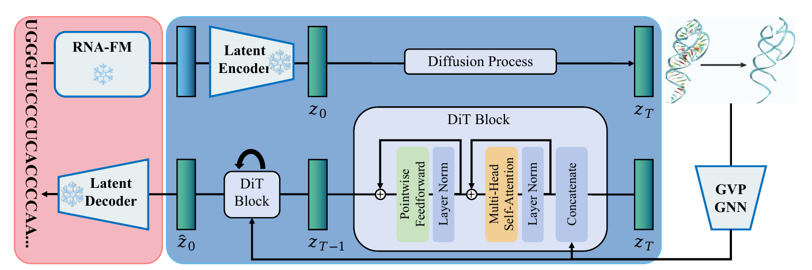
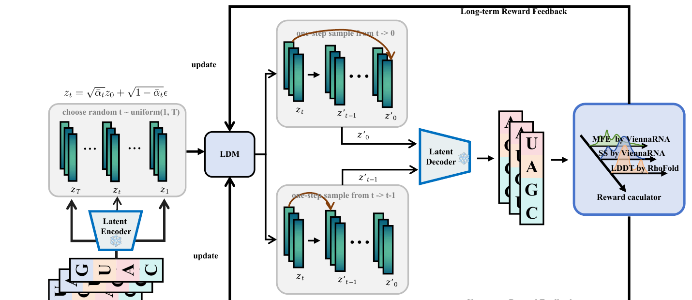
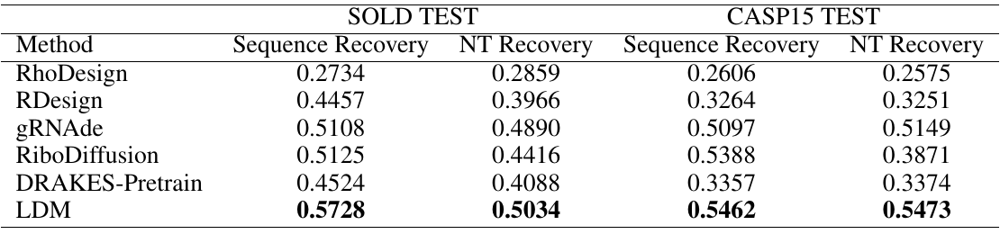
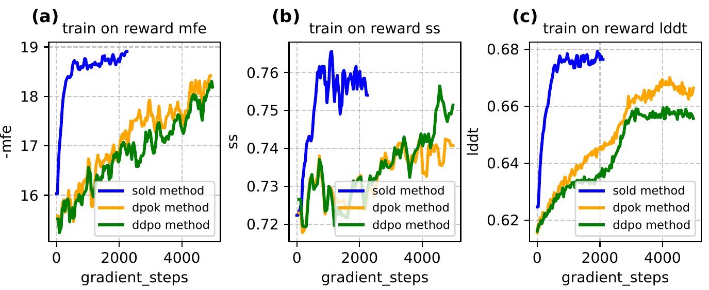
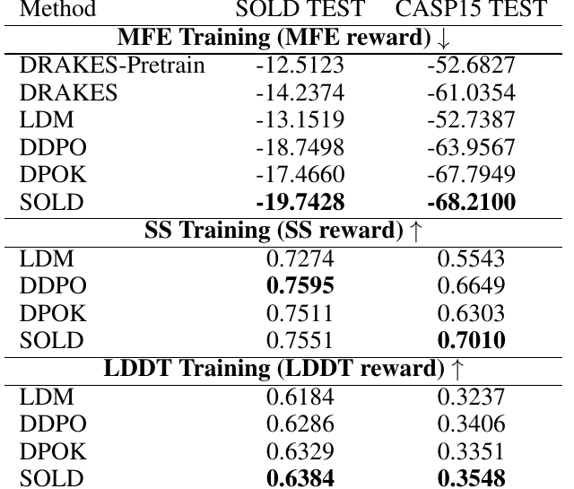
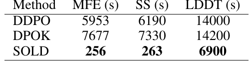
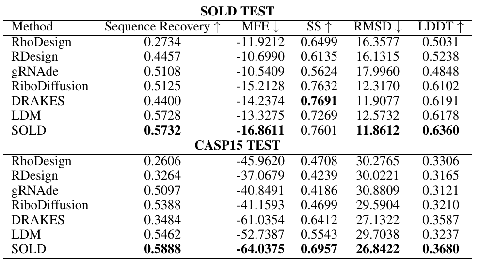
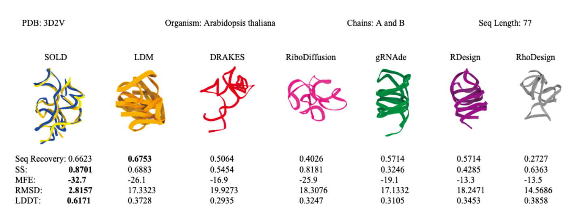

# SOLD

## Paper Info

- **Title**: Structure-based RNA Design by Step-wise Optimization of Latent Diffusion Model
- **Authors**: Qi Si, Xuyang Liu, Penglei Wang, Xin Guo, Yuan Qi, Yuan Cheng
- **Venue**: AAAI 2026
- **Paper**: [paper.pdf](./paper.pdf)
- **Code**: [darkflash03/SOLD](https://github.com/darkflash03/SOLD)

## Motivation

这篇论文关注的是 RNA inverse folding：
给定目标 3D 结构，设计一条能折叠成该结构的 RNA 序列。

很多已有方法主要优化 `sequence recovery`，
也就是生成序列和天然序列有多像。
但 RNA 设计真正关心的不只是序列像不像，
还包括二级结构一致性、最小自由能、三维结构相似性等结构目标。

问题在于这些目标通常不可微或难以直接优化：

- `SS`: secondary structure consistency
- `MFE`: minimum free energy
- `LDDT`: local distance difference test

一句话总结：
`SOLD` 用 latent diffusion 做 RNA 结构条件生成，
再用 step-wise reinforcement learning 直接优化这些结构指标。

## Method

方法可以分为两层：

### 1. Latent Diffusion Model

`SOLD` 首先训练一个 RNA inverse folding 的 LDM。

- 使用预训练 `RNA-FM` 将 RNA 序列映射为 `(L, 640)` embedding。
- 通过 MLP encoder 压缩到 latent space。
- 去噪网络结合 `GVP-GNN` 和 `DiT`，用 RNA backbone 几何信息作为条件。
- MLP decoder 将 denoised latent 还原为四种碱基的概率分布。
- 训练目标结合 latent MSE 和 sequence cross-entropy。

这个 LDM 的作用是先建立一个强生成基座，
让模型能从 3D backbone 条件中恢复合理 RNA 序列。

### 2. Step-wise RL Optimization

传统 diffusion RL 往往需要采样完整反向轨迹，代价高。
`SOLD` 的核心改动是 step-wise optimization：

- 随机选择一个 diffusion timestep。
- 从该 timestep 直接做单步预测，得到 denoised latent 或中间 latent。
- 解码成序列后，用外部工具评估 reward。
- reward 包括 `MFE`、`SS`、`LDDT`。
- 通过 PPO 风格 clipped objective 更新策略。

这样可以直接优化不可微结构指标，
同时避免每次都跑完整 diffusion trajectory。

## Main Figures and Tables

> 下列图表由 PDF 页面重新裁剪得到，只保留图表主体，未包含原论文图注文字。

### Figure 1: latent diffusion inverse folding 框架

这张图描述 SOLD 的生成模型底座。左侧先用 `RNA-FM` 把 RNA 序列编码成 embedding，再通过 latent encoder 压缩到 latent space。中间的 diffusion process 在 latent space 中加噪和去噪，去噪网络由 `DiT Block` 和结构条件共同驱动。右侧 `GVP-GNN` 负责把 RNA backbone 的三维几何信息编码进模型，最后 latent decoder 输出 A/U/G/C 的碱基概率。核心思想是：不要直接在 one-hot 序列空间扩散，而是在 RNA-FM 提供的连续 latent space 里做结构条件生成。

### Figure 2: SOLD 的 step-wise reward optimization

这张图是 SOLD 区别于普通 diffusion RL 的关键。传统做法往往要完整跑完一条反向 denoising trajectory 后再算 reward，成本很高；SOLD 随机选择一个 timestep，在该步附近做 one-step sample，解码成序列后直接交给 reward calculator。右侧 reward 包括 `MFE by ViennaRNA`、`SS by ViennaRNA`、`LDDT by RhoFold`。图里的 long-term reward feedback 和 short-term reward feedback 表示模型会同时利用最终去噪结果和中间去噪结果的奖励信号，从而降低优化成本。

### Table 1: RL fine-tuning 前的 LDM 生成底座

这张表比较不同 RNA inverse folding 方法的 `Sequence Recovery` 和 `NT Recovery`。`LDM` 在 `SOLD TEST` 和 `CASP15 TEST` 上都取得最高或接近最高的恢复率，说明作者先训练出的 latent diffusion backbone 已经是一个强基线。后续 SOLD 的 RL 优化不是从弱模型开始补救，而是在一个已有较强序列恢复能力的生成模型上继续优化结构目标。

### Figure 3: 三个单目标 reward 的训练曲线

三张子图分别对应 `MFE`、`SS`、`LDDT` 作为 reward 时的训练过程。蓝色是 SOLD，橙色是 DPOK，绿色是 DDPO。可以看到 SOLD 通常更快达到高 reward 区间，尤其在 MFE 和 LDDT 上收敛更明显。这个图支持 step-wise 优化的实用价值：它不只是省时间，也能给出稳定的优化信号。

### Table 2: single-objective reward 对比

表格把单目标优化结果拆成三组：`MFE Training`、`SS Training` 和 `LDDT Training`。MFE 旁边是向下箭头，表示越低越好；SS 和 LDDT 是向上箭头，表示越高越好。SOLD 在多数组合上达到最好或接近最好的结果，尤其在 CASP15 TEST 的 SS 和 LDDT 上体现出优势。这说明 SOLD 能直接优化不可微的结构指标，而不是只追求序列恢复率。

### Table 3: 单 epoch 训练时间

这张表说明 step-wise optimization 的效率收益。MFE 和 SS 任务上，SOLD 的单 epoch 时间只有几百秒，而 DDPO / DPOK 是几千秒。LDDT 仍然比较慢，因为它依赖结构预测和评估，但 SOLD 仍明显快于完整轨迹式 RL。也就是说，SOLD 的主要工程价值是减少 reward optimization 的采样成本。

### Table 4: multi-objective optimization 对比

真实 RNA 设计通常不会只关心一个指标，所以这张表同时比较 `Sequence Recovery`、`MFE`、`SS`、`RMSD`、`LDDT`。SOLD 在 `SOLD TEST` 和 `CASP15 TEST` 上都取得比较均衡的结果：序列恢复率保持较高，同时 MFE、SS、RMSD、LDDT 也有提升。这个表的意义是证明 SOLD 可以做多目标折中，而不是只把单个 reward 刷高。

### Figure 4: PDB 3D2V case study

这张图用 `PDB: 3D2V` 做具体结构案例。上方给出 organism、chain 和序列长度；中间比较 SOLD、LDM、DRAKES、RiboDiffusion、gRNAde、RDesign、RhoDesign 的设计结构；下方列出每个方法的 sequence recovery、SS、MFE、RMSD、LDDT。SOLD 的结构和目标结构叠合得更近，指标也更均衡，说明它的 reward 优化确实能反映到具体三维结构设计上，而不只是表格平均数上的提升。

## Key Insights

### 关键结果 1：RNA-FM latent space 让 LDM 成为强生成基座

在 RL fine-tuning 之前，论文先比较 LDM 的 sequence recovery。

`SOLD TEST` 上：

- `LDM` sequence recovery: **0.5728**
- `LDM` NT recovery: **0.5034**

`CASP15 TEST` 上：

- `LDM` sequence recovery: **0.5462**
- `LDM` NT recovery: **0.5473**

这些结果高于 `RhoDesign`、`RDesign`、`gRNAde`、`RiboDiffusion` 和 `DRAKES-Pretrain`。
说明把 RNA-FM embedding 放进 latent diffusion，比直接在 one-hot 序列空间扩散更有利于恢复结构相关序列模式。

### 关键结果 2：单目标 RL 能直接优化 MFE、SS 和 LDDT

在单目标优化中，SOLD 对三个指标都能提升 LDM baseline。

代表性结果：

- `MFE reward`
  - SOLD TEST: **-19.7428**
  - CASP15 TEST: **-68.2100**
- `SS reward`
  - SOLD TEST: **0.7551**
  - CASP15 TEST: **0.7010**
- `LDDT reward`
  - SOLD TEST: **0.6384**
  - CASP15 TEST: **0.3548**

相比 DDPO / DPOK，SOLD 的表现整体相当或更好，
尤其在 CASP15 的 SS 与 LDDT 上体现出优势。

### 关键结果 3：step-wise 优化显著降低训练代价

论文报告的单 epoch 平均训练时间显示：

- `MFE`: SOLD **256 s**，DDPO **5953 s**，DPOK **7677 s**
- `SS`: SOLD **263 s**，DDPO **6190 s**，DPOK **7330 s**
- `LDDT`: SOLD **6900 s**，DDPO **14000 s**，DPOK **14200 s**

MFE 和 SS 上加速非常明显。
LDDT 仍然较慢，主要瓶颈来自结构预测和评估，
但 SOLD 仍比完整轨迹式方法更省。

### 关键结果 4：多目标优化更接近真实 RNA 设计需求

真实 RNA 设计不能只看单个指标。
论文用 equal weighting 同时优化 `SS / MFE / LDDT`，
并比较 sequence recovery、MFE、SS、RMSD、LDDT。

`SOLD TEST` 上：

- sequence recovery: **0.5732**
- MFE: **-16.8611**
- SS: **0.7601**
- RMSD: **11.8612**
- LDDT: **0.6360**

`CASP15 TEST` 上：

- sequence recovery: **0.5888**
- MFE: **-64.0375**
- SS: **0.6957**
- RMSD: **26.8422**
- LDDT: **0.3680**

它不是在每个单独指标上都绝对第一，
但整体上比 LDM baseline 和多数 SOTA 方法更平衡。
这比只追求 sequence recovery 更接近真实 inverse folding 的需求。

### 关键结果 5：case study 证明结构约束不是纯表格收益

论文用 `PDB: 3D2V` 做了一个 TPP-specific riboswitch 的设计案例。
结果显示 SOLD 设计出的序列能折叠到目标结构附近，
而其他方法产生的构象明显偏离目标。

这个例子说明 step-wise RL 优化的收益不仅反映在平均指标上，
也能在具体结构设计任务中产生可见差异。

### 我的结论

如果只用一句话评价这篇论文：

> SOLD 的贡献在于把 RNA inverse folding 从“生成像天然序列的 RNA”推进到“直接优化结构目标的生成策略”。

它的关键不是又做了一个 diffusion model，
而是把不可微结构指标作为 reward 接入了 RNA 设计流程。

## Limitations & Future Work

- **reward 质量受工具限制**：ViennaRNA 和 RhoFold 本身有近似误差，会影响优化方向。
- **没有 wet-lab 验证**：论文证明了计算指标和 case study，但还没有实验证明设计 RNA 的真实功能。
- **结构数据规模有限**：预训练和 RL 数据来自清洗后的结构库，RNA 结构数据仍远少于蛋白。
- **多目标权重仍较简单**：equal weighting 证明了可行性，但实际应用中不同 RNA 类型需要更细权重。
- **LDDT 优化仍然较慢**：结构预测评估是主要计算瓶颈。

后续值得继续的方向是：

1. 使用更准确、更快的结构评估器替换 reward oracle。
2. 针对 riboswitch、aptamer、ribozyme 等具体 RNA 类型设计任务专门调权。
3. 加入实验反馈，验证 RL 优化的结构指标是否真正转化为功能提升。
