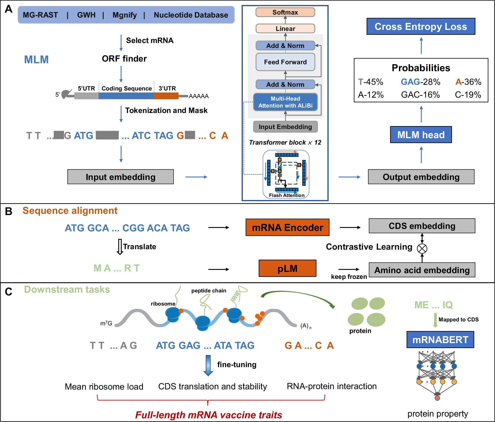
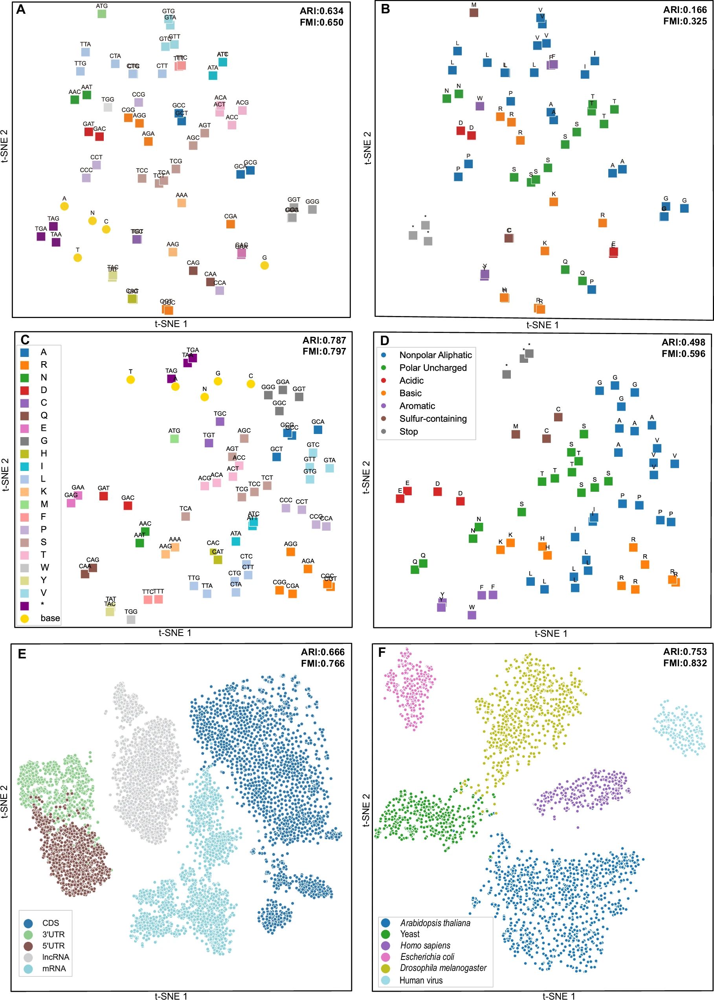
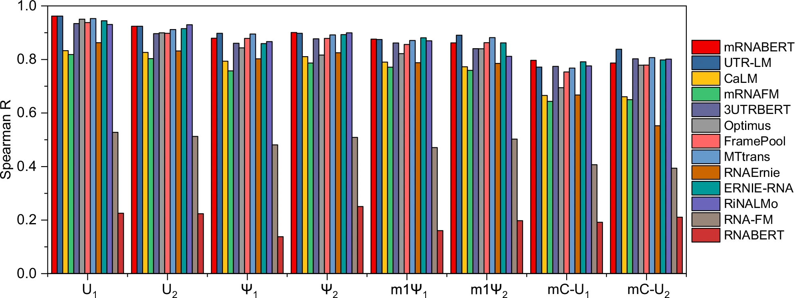
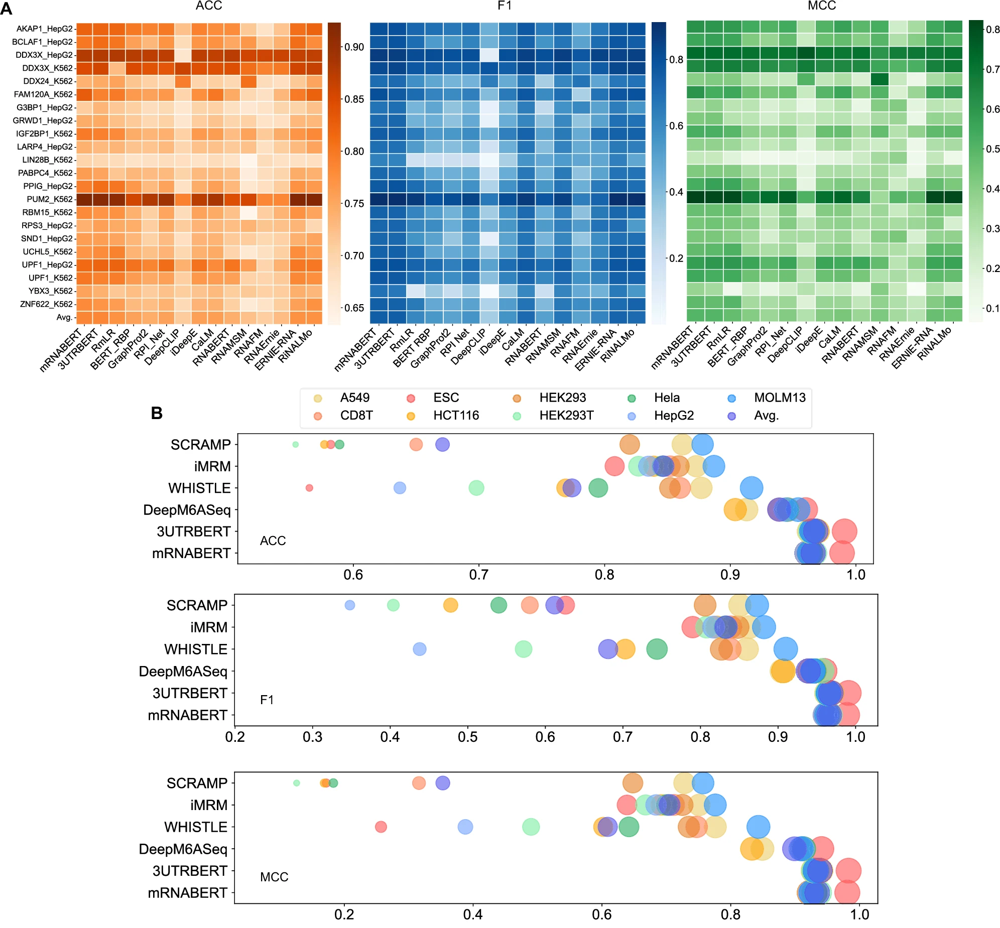
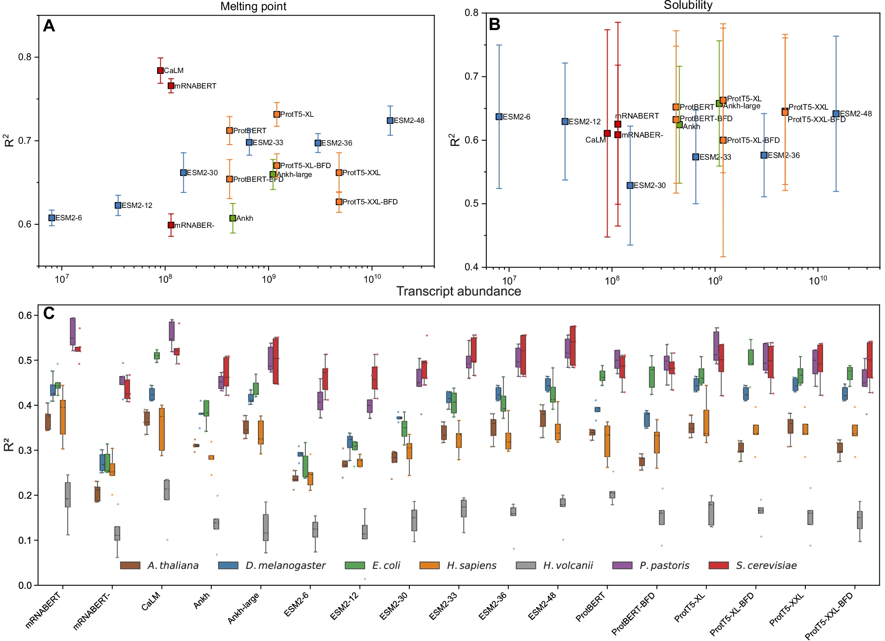
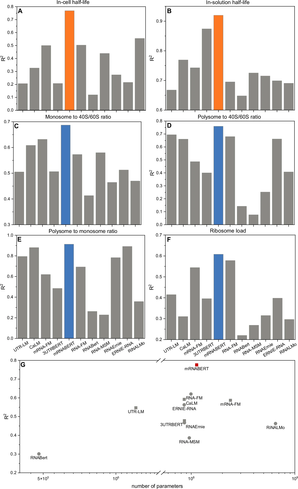

# mRNABERT

## Paper Info

- **Title**: mRNABERT: advancing mRNA sequence design with a universal language model and comprehensive dataset
- **Authors**: Ying Xiong, Aowen Wang, Yu Kang, Chao Shen, Chang-Yu Hsieh, Tingjun Hou
- **Venue**: Nature Communications (2025)
- **DOI**: [10.1038/s41467-025-65340-8](https://doi.org/10.1038/s41467-025-65340-8)
- **Paper**: [mRNA-BERT.pdf](./mRNA-BERT.pdf)

## 一句话总结

mRNABERT 试图做一件以前的 RNA 模型很少真正做到的事：不用把 5'UTR、CDS、3'UTR 分开各自建模，而是把完整 mRNA 当成一个整体来学习，并且进一步借助蛋白语言模型把中心法则中的跨模态信息也拉进来。

## 这篇文章到底做了什么

作者先自己整理出约 1800 万条高质量、非冗余 mRNA 序列作为预训练语料，再在这个基础上做了三层关键设计：

1. **双重分词**：UTR 仍按单核苷酸切分，CDS 按密码子切分，尽量同时保住 UTR 的单碱基分辨率和 CDS 的翻译语义。
2. **长序列建模**：模型主体是 12 层、hidden size 768 的 BERT 编码器，用 ALiBi 代替传统位置编码，并引入 Flash Attention 提高长序列训练效率。
3. **跨模态对比学习**：在 MLM 预训练后，再拿 50 万条 CDS 及其翻译得到的蛋白序列，和冻结的 ProtT5-XL 表征做对比学习，把核酸和蛋白语义投到同一个空间。

我读完整篇之后，认为这篇论文最有价值的地方不只是“多做了一个 RNA 大模型”，而是把 **全长 mRNA 建模、跨区域统一表示、以及蛋白语义对齐** 这三件事真正拼在了一起。

## 图 1：mRNABERT 的整体设计与应用全景图

- **数据层面**：作者从 NCBI nt、MG-RAST、GWH、MGnify 等来源收集约 3600 万条序列，经过 ORF finder、40% CDS 长度过滤、去冗余和长度控制后，得到约 1800 万条预训练样本。
- **编码层面**：UTR 走 nucleotide token，CDS 走 codon token。这个设计的核心不是“更复杂”，而是避免两种传统方案各自的硬伤：纯字符模型不够高效，纯密码子模型会丢 UTR 的精细信息。
- **模型层面**：主体是 12 层 Transformer encoder。训练阶段主要先做 MLM，mask ratio 为 15%，训练长度默认限制在 1022 tokens。
- **跨模态层面**：第二阶段选取 50 万条 CDS，把翻译后的氨基酸序列输入冻结的 ProtT5-XL，分别得到核酸和蛋白 embedding，再投影到 256 维共享空间做对比学习。
- **应用层面**：这不是只为某一个局部任务做的模型。文章把它统一拿去做 5'UTR、CDS、3'UTR、蛋白属性、全长 mRNA 属性预测，主张它是一个真正的 all-in-one mRNA foundation model。

## 图 2：大模型学到了什么？（特征降维可视化）

- 这张图最重要的不是“降维很好看”，而是它在回答一个核心问题：模型到底有没有学到生物学语义，而不是只记住 token 共现频率。
- **A/B 对比 C/D** 体现了对比学习的作用。没有 contrastive learning 时，同义密码子和氨基酸性质的聚类都比较散；加入后，同义密码子明显靠拢。
- 作者给出了量化指标：按氨基酸性质聚类时，ARI 从 **0.166 提升到 0.498**，FMI 从 **0.325 提升到 0.596**。这说明蛋白语义注入后，latent space 真的变得更“懂翻译”。
- **E 图** 说明模型不仅能区分 CDS、5'UTR、3'UTR，还能把 lncRNA 和 mRNA 分开。虽然模型预训练重点是 mRNA，但它学到的是比“片段分类器”更抽象的序列语义。
- **F 图** 则更像进化层面的 sanity check。作者随机取人、果蝇、植物、细菌、酵母、病毒等物种的完整 mRNA，结果同源序列会按物种自然聚类，说明 embedding 里保留了跨物种的进化信息。

## 图 3：5'UTR 考试成绩（翻译起始效率）

- 这里评估的是 8 个 5'UTR MPRA 数据集上的平均核糖体负载（MRL）预测，指标用 Spearman 相关系数。
- mRNABERT 在最大的两个随机 UTR 数据集 **U1 / U2** 上拿到了文章特别强调的结果：**0.962** 和 **0.924**，都是该任务上的最强结果。
- 在剩下 6 个数据集里，mRNABERT 还拿下了 3 个第一。总体上，它和专门为 5'UTR 设计的 UTR-LM 基本打平，都是 **8 个任务里 4 个第一**。
- 这部分结果很关键，因为它说明 mRNABERT 不是靠牺牲局部任务性能来换“全能”；至少在 5'UTR 这个强基线很多的场景里，它依然能达到最顶尖水平。

## 图 4：3'UTR 考试成绩（转录后调控与修饰）

- **RBP 结合位点预测（A）**：作者在 22 个 RNA-binding proteins 上做了系统比较。mRNABERT 的平均表现为 **ACC 0.786 / F1 0.751 / MCC 0.501**。
- 这个成绩和最强专门模型 3UTRBERT 几乎持平。后者平均是 **ACC 0.785 / F1 0.751 / MCC 0.503**。更细看时，mRNABERT 在 **22 个 RBP 里的 13 个** 上取得最好结果。
- **m6A 位点预测（B）**：这一部分作者没有把结论写得过满。原文说得很清楚，mRNABERT 在 9 个细胞系里表现 **稳定第二**，紧跟 3UTRBERT，但超过了其他方法。
- 所以如果严格评价，这张图传达的信息不是“mRNABERT 在 3'UTR 所有任务上绝对第一”，而是：**即使不是专门只在 3'UTR 上预训练的模型，它也能在转录后调控任务上逼近甚至部分超过专用模型。**

## 图 5：跨模态降维打击（蛋白质属性预测）

- 这一节是整篇文章最有意思的地方之一：作者直接拿 mRNA 模型去做蛋白相关任务，检验跨模态对比学习到底有没有带来真正可迁移的语义。
- **蛋白熔点预测（A）**：加入对比学习后，mRNABERT 的 R² 从 **0.60 提升到 0.77**，只略低于 CaLM 的 **0.78**，但已经超过不少更大的纯蛋白模型，文中点名 ProtT5-XL 最好也只有 **0.73**。
- **蛋白溶解度预测（B）**：mRNABERT 达到 **R² = 0.63**，超过 CaLM 的 **0.61**，也明显优于没有做对比学习的版本，只略落后于最大的一些蛋白模型（约 **0.66**）。
- **7 个物种的转录本丰度预测（C）**：mRNABERT 在 7 个物种里有 5 个优于 CaLM。以 **Homo sapiens** 为例，mRNABERT 的 R² 为 **0.38**，高于 CaLM 的 **0.35**。
- 这张图真正说明的不是“mRNA 模型能替代蛋白模型”，而是：**把编码序列和蛋白序列对齐之后，mRNA embedding 的信息密度显著提高，足以外溢到部分蛋白工程任务。**

## 图 6：终极考验（全长 mRNA 序列综合属性）

- 这是全文最重要的一张图，因为它最接近真实设计场景。输入不再是局部片段，而是完整的 **[5'UTR] + [CDS] + [3'UTR]**。
- 作者使用的是 PERSIST-seq 数据，共 **233 条完整 mRNA**，其中包含 **112 个不同 5'/3'UTR 组合** 和 **121 个 CDS 变体**，评估 6 个任务：
  - 细胞内半衰期
  - 溶液中半衰期
  - monosome to 40S/60S ratio
  - polysome to 40S/60S ratio
  - polysome to monosome ratio
  - ribosome load
- 原文结论非常强：mRNABERT 在这 6 个全长任务上**全部领先**，显著超过只在 5'UTR、CDS 或 3'UTR 上预训练的专门模型，也超过各类 ncRNA foundation models。
- 作者进一步做了超长序列测试。对长度远超训练阶段 1022 tokens 的人和鼠全长 mRNA，mRNABERT 在 **3066 tokens** 设置下达到：
  - **Human**: R² = **0.669**, Spearman R = **0.814**
  - **Mouse**: R² = **0.649**, Spearman R = **0.812**
- 这部分结果支撑了作者的核心论点：**双重分词负责“看全信息”，ALiBi 负责“撑长上下文”**，两者一起才让模型在真实全长 mRNA 场景里建立明显优势。

## 正文里另外几个值得记住的点

### 1. CDS 任务不只是“还行”，而是真的强

正文 Table 1 里，mRNABERT 在 6 个 CDS 相关任务上都达到了最好或并列最好，包括：

- mRFP expression: **0.89**
- Fungal expression: **0.89**
- E. coli proteins: **0.58**
- mRNA stability: **0.56**
- Tc-riboswitch: **0.58**
- SARS-CoV-2 vaccine degradation: **0.89**

这说明它并没有因为照顾 UTR 和全长任务而削弱 CDS 建模能力。

### 2. 文章并不是每一项都“全胜”

这是我觉得这篇论文写得比较诚实的地方：

- 5'UTR 任务上，它和 UTR-LM 基本打平，不是单方面碾压。
- 3'UTR 的 m6A 任务上，它稳定第二，落后于专门在 3'UTR 上长期预训练的 3UTRBERT。
- splice site 任务上，它在补充实验里是第二，第一是 ERNIE-RNA。

这反而让“全长 mRNA 场景下明显领先”这个结论更可信，因为作者没有把所有局部任务都硬写成第一。

### 3. 这篇文章最像是在回答一个工程问题

很多以前的模型其实都在回答局部问题：

- 5'UTR 模型更擅长翻译起始
- CDS 模型更擅长密码子和蛋白表达
- 3'UTR 模型更擅长转录后调控

mRNABERT 真正想解决的是：**如果我要设计一条真实可用的完整 mRNA，我能不能只用一个统一模型来评价和优化它？**  
从这篇文章给出的实验来看，答案至少第一次变得相当接近“可以”。

## 局限性与未来方向

作者在讨论部分提了几个我认为非常关键的限制：

- **结构信息没有显式进入模型**：当前主要还是从序列里间接学习结构效应，未来可以把二级结构或其他生物物理特征显式作为多模态输入。
- **超长序列仍然受 Transformer 复杂度限制**：ALiBi 让它能外推更长上下文，但并没有从根本上解决长序列计算成本问题。作者明确提到后续可以考虑 sparse attention 或 state space models。
- **数据预处理还有提升空间**：尤其是更复杂的 genomic feature、转录本边界和功能注释整合方式，都会影响 foundation model 的上限。
- **真实设计闭环仍不完整**：文章强在预测，但离“自动生成并实验验证最优 mRNA”还有一段距离。

## 我的阅读结论

如果只看一句话，我会这样评价这篇论文：

> mRNABERT 的最大贡献，不是单纯把 RNA 模型做得更大，而是首次较完整地证明了“全长 mRNA 统一建模”在方法上可行、在结果上有明显收益、在工程上值得继续投入。

如果后面要继续做这条线，我认为最值得追的三个方向是：

1. 把序列模型和 RNA 二级结构、修饰、RBP 实验数据真正做成多模态模型。
2. 把当前“预测器”进一步推进到生成式设计闭环。
3. 在更大规模、真实治疗场景的数据上验证全长 mRNA 优势是否还能稳定保持。
