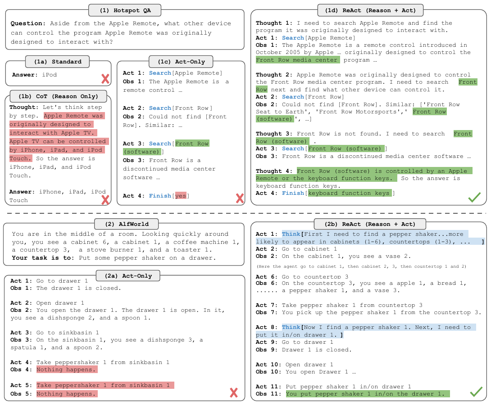
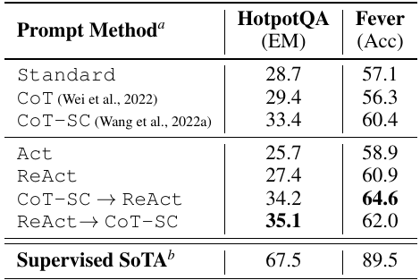
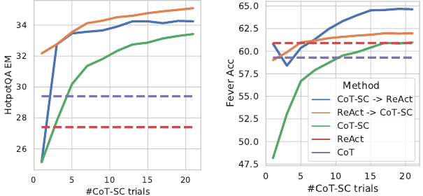
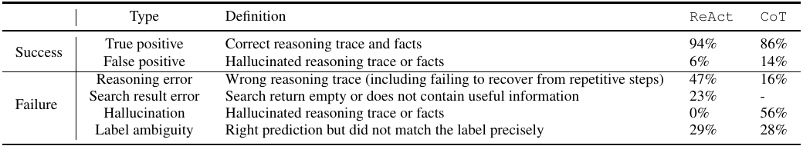
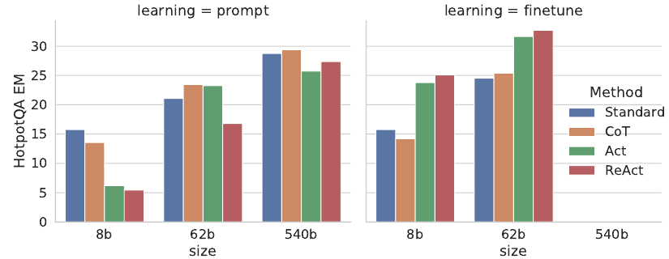
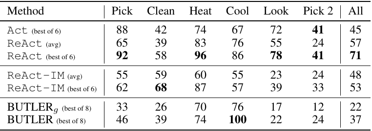
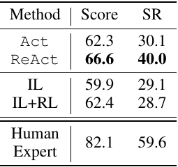
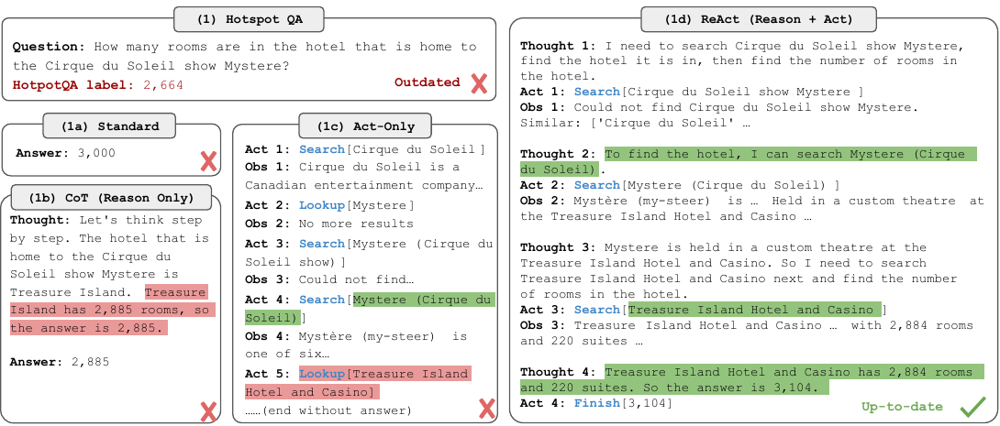
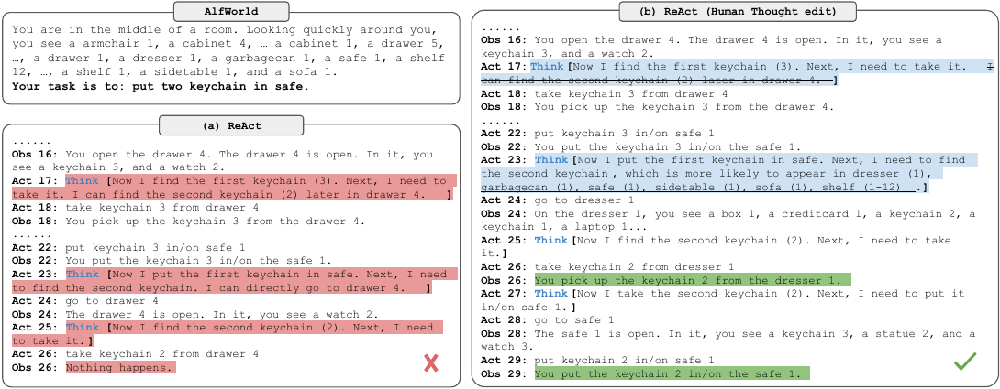

# ReAct

## Paper Info

- **Title**: ReAct: Synergizing Reasoning and Acting in Language Models
- **Authors**: Shunyu Yao, Jeffrey Zhao, Dian Yu, Nan Du, Izhak Shafran, Karthik Narasimhan, Yuan Cao
- **Venue**: ICLR 2023
- **ArXiv**: [2210.03629](https://arxiv.org/abs/2210.03629)
- **Project / Code**: [react-lm.github.io](https://react-lm.github.io/)
- **Paper**: [paper.pdf](./paper.pdf)

## Abstract

这篇论文提出 **ReAct**，核心思想是让语言模型在同一条轨迹里交替生成：

```text
Thought -> Act -> Observation -> Thought -> Act -> Observation -> ...
```

`Thought` 是模型的语言化推理轨迹，用来分解目标、维护计划、整理观察结果、修正错误；
`Act` 是面向外部环境的动作，例如搜索 Wikipedia、lookup 页面内容、在文本游戏里移动或操作物体、在 WebShop 中搜索和选择商品；
`Observation` 是环境返回的信息，再进入下一步推理。

一句话总结：
ReAct 把 CoT 的“只在模型内部想”改成了“边想边查、边查边改计划”，让推理和外部行动形成闭环。

## Motivation

ReAct 之前，LLM 的两类能力通常是分开研究的：

- **Reasoning**：典型代表是 Chain-of-Thought。模型可以写出多步推理，但推理完全依赖参数内部知识，容易事实幻觉，也不能主动获取新信息。
- **Acting**：典型代表是让语言模型生成 action plan 或 API call。模型可以和环境交互，但如果没有显式推理，往往缺少目标分解、状态跟踪和异常处理能力。

论文想解决的问题是：

> 能不能让语言模型同时具备语言化推理和环境交互能力，让两者互相增强？

这个问题在 agent 研究里非常关键。
如果一个 agent 只能“想”，它无法更新世界知识；
如果它只能“做”，它又很难解释自己为什么这么做，也很难处理长程任务。
ReAct 的意义就在于把这两条能力合成一个简单但通用的 prompting 范式。

## Method

### 1. 整体范式

ReAct 把 agent 的动作空间从原来的环境动作 `A` 扩展为：

```text
A_hat = A ∪ L
```

其中 `L` 是自然语言空间。属于 `L` 的动作不会改变外部环境，论文把它称为 `Thought` 或 reasoning trace。
它的作用是更新 agent 的内部上下文，让下一步行动更有依据。



图 1 很清楚地展示了 ReAct 和三种基线的区别：

- **Standard**：直接回答，没有中间推理，也没有外部交互。
- **CoT / Reason-only**：有推理，但不查外部信息，容易把错误事实一路传播下去。
- **Act-only**：能搜索或操作环境，但缺少目标分解和状态跟踪，容易走偏或重复动作。
- **ReAct**：推理决定下一步查什么或做什么，观察结果又反过来修正推理。

我的理解是：
ReAct 的核心不是某个复杂算法，而是把 `Thought` 作为一种可插入动作，让模型能在行动轨迹中显式维护 working memory。

### 2. Knowledge-Intensive Reasoning

论文先在 HotpotQA 和 FEVER 上测试知识密集型推理。
这两个任务都要求模型利用外部事实：

- **HotpotQA**：多跳问答，需要跨多个 Wikipedia 页面综合信息。
- **FEVER**：事实验证，需要判断 claim 是 `SUPPORTS`、`REFUTES` 还是 `NOT ENOUGH INFO`。

作者给模型一个非常简单的 Wikipedia API：

```text
search[entity]   -> 返回对应页面前 5 句，或者返回相似实体
lookup[string]   -> 在当前页面中查找包含 string 的下一句
finish[answer]   -> 给出最终答案
```

这个检索接口很弱，远不如专门的 neural retriever。
作者这么设计是为了逼模型用语言推理来决定“应该搜什么”，而不是把问题交给强检索器解决。

### 3. Prompting 与 Hybrid Strategy

在 HotpotQA / FEVER 中，ReAct 使用少量人工写好的轨迹作为 few-shot examples：

- HotpotQA 使用 6 个示例。
- FEVER 使用 3 个示例。
- 每条轨迹包含密集的 `Thought -> Act -> Obs` 步骤。

论文还提出两种 ReAct + CoT-SC 的混合策略：

- **ReAct -> CoT-SC**：如果 ReAct 在限定步数内没有完成，就回退到 CoT self-consistency。
- **CoT-SC -> ReAct**：如果 CoT-SC 多次采样没有形成稳定多数答案，说明内部知识不够可靠，就切到 ReAct 查外部信息。

这点很重要：
论文并没有把 ReAct 说成对 CoT 的单纯替代，而是把二者看作互补能力。

### 4. Finetuning

由于大规模人工标注 ReAct 轨迹成本高，作者还尝试了 bootstrap：

1. 先用 ReAct 生成轨迹。
2. 选出最终答案正确的 3,000 条轨迹。
3. 用这些轨迹微调 PaLM-8B / PaLM-62B。

这部分实验说明：
ReAct prompting 对较小模型可能太难，但 ReAct-style data 是很有价值的监督信号。

### 5. Decision Making Tasks

论文还测试了两个交互式决策任务：

- **ALFWorld**：文本版 household environment，agent 需要完成诸如拿取、清洗、加热、放置物体等长程任务。
- **WebShop**：模拟在线购物网站，agent 需要根据用户要求搜索商品、选择属性并购买。

和知识任务不同，这里的 `Thought` 不需要每一步都有。
作者让模型在关键节点稀疏地产生推理，例如：

- 分解目标。
- 判断下一个子目标。
- 追踪当前进度。
- 用常识判断某个物体可能在哪里。
- 根据商品标题、选项和用户要求决定是否购买。

## Key Insights

### 关键结果 1：ReAct 把“推理”和“工具使用”统一成一条轨迹

ReAct 的范式贡献大于具体分数。
它给后续 tool-using agent 一个非常清楚的结构：

```text
模型不是先完整想完再调用工具，
也不是只根据工具反馈机械行动，
而是在每一步把内部推理和外部观察合并进新的上下文。
```

这也是后来很多 agent 框架里 `Thought / Action / Observation` 循环的来源之一。

### 关键结果 2：外部行动能显著降低幻觉，但会引入新的失败模式

在 HotpotQA / FEVER 上，ReAct 本身不是所有指标都赢 CoT。
但它显著改变了错误类型。





PaLM-540B 的结果中：

| Method | HotpotQA EM | FEVER Acc |
|--------|-------------|-----------|
| Standard | 28.7 | 57.1 |
| CoT | 29.4 | 56.3 |
| CoT-SC | 33.4 | 60.4 |
| Act | 25.7 | 58.9 |
| ReAct | 27.4 | 60.9 |
| CoT-SC -> ReAct | 34.2 | **64.6** |
| ReAct -> CoT-SC | **35.1** | 62.0 |

ReAct 在 FEVER 上优于 CoT，因为事实验证对准确、可更新的外部知识更敏感。
但在 HotpotQA 上，ReAct 略低于 CoT，说明外部检索并不自动等于更强推理。

更关键的是人工错误分析：



- CoT 的失败中，**56%** 是 hallucination。
- ReAct 的失败中，hallucination 是 **0%**，但 reasoning error 达到 **47%**，search result error 达到 **23%**。

这说明 ReAct 把一部分“凭空编事实”的问题，转化成了“检索不到、检索错、不会根据检索结果调整计划”的问题。
这是更可诊断的错误，但仍然是错误。

### 关键结果 3：ReAct 和 CoT-SC 的组合比单独使用更稳

图 2 的趋势很有意思：
当 CoT-SC 采样次数增加时，纯 CoT-SC 会变强；
但 ReAct + CoT-SC 在少量采样时就能达到甚至超过更多 CoT-SC sample 的效果。

我的理解是：

- CoT-SC 擅长利用模型内部知识和多路径推理。
- ReAct 擅长在内部知识不确定时主动查证。
- 两者结合，相当于让模型先判断“我能不能靠自己想明白”，想不明白再去查。

这比无脑每题都检索更合理，也比完全依赖参数记忆更可靠。

### 关键结果 4：ReAct 的价值在微调后更明显



在 prompting 设置下，PaLM-8B / 62B 很难仅凭少量上下文示例学会 ReAct。
这很正常，因为 ReAct 要同时学习：

- 什么时候推理；
- 什么时候行动；
- 搜索 query 怎么写；
- 如何根据观察结果修正下一步；
- 什么时候停止。

但用 3,000 条正确 ReAct 轨迹微调后，ReAct 变成四种方法中表现最好的。
论文中特别指出：

- PaLM-8B finetuned ReAct 超过所有 PaLM-62B prompting 方法。
- PaLM-62B finetuned ReAct 超过所有 PaLM-540B prompting 方法。

这说明 ReAct 不只是一个 prompt trick。
它更像一种数据格式和行为监督方式，可以把“会查、会想、会行动”的模式教给较小模型。

### 关键结果 5：在长程交互任务中，稀疏推理比纯动作更重要





在 ALFWorld 上：

- Act best-of-6: **45%**
- ReAct average: **57%**
- ReAct best-of-6: **71%**
- BUTLER best-of-8: **37%**

在 WebShop 上：

- Act: score **62.3**, success rate **30.1**
- ReAct: score **66.6**, success rate **40.0**
- IL+RL: score **62.4**, success rate **28.7**
- Human expert: score **82.1**, success rate **59.6**

这里的重点不是 ReAct 超过人类，而是：
只加少量语言化 reasoning，就能显著提高长程任务的稳定性。

Act-only 容易出现的问题是：

- 忘记当前已经完成了什么；
- 不知道下一个子目标是什么；
- 重复搜索错误位置；
- 在 WebShop 中被噪声商品标题或选项带偏。

ReAct 的 sparse thoughts 让模型在关键节点重新组织目标，这对长 horizon 环境尤其有用。

### 关键结果 6：外部交互让知识可以更新，但答案正确性不等于数据集标签一致



附录中的例子很有启发性。
HotpotQA 的原始标签已经过时，Standard 和 CoT 给出错误或旧答案；
Act-only 虽然能查网页，但缺少推理引导；
ReAct 通过搜索、观察、改 query，最后得到更新后的房间数量。

这个例子说明：
外部工具不仅是提高 benchmark 分数的手段，也会改变“正确答案”的来源。
当世界知识持续变化时，参数记忆和静态数据集标签都可能过时。

### 关键结果 7：可解释轨迹使人工干预更自然



论文还展示了 human-in-the-loop thought editing。
人不需要重写整条 action sequence，只需要修改少数错误 thought，后续行为就会随之改变。

这点是 ReAct 相比普通 policy model 的一个实际优势：
如果模型的中间信念是自然语言，人类就能定位错误、修正错误，并观察修正如何影响后续行动。

## Limitations & Future Work

ReAct 的边界也很清楚：

- **Prompting 对复杂任务不够稳定**：小模型很难从少量示例中同时学会推理和行动。复杂 action space 需要更多 demonstrations，而上下文长度会成为限制。
- **检索质量仍是上限**：ReAct 的失败中有 23% 来自无效搜索结果。外部行动能减少幻觉，但如果 action space 太弱或 query 写不好，模型会被错误观察带偏。
- **交替结构会降低推理灵活性**：ReAct 在 HotpotQA 上 reasoning error 比 CoT 高，说明强制按 Thought-Act-Obs 走，有时会让模型陷入循环或难以重新组织推理。
- **工具接入不自动保证真实性**：模型仍可能误读观察结果、过早 finish、或者把不充分证据当成结论。
- **主要实验依赖 PaLM-540B**：主实验模型不是开放模型，论文虽然提供 prompt 和 GPT-3 附录结果，但完全复现仍受限。
- **人工轨迹标注成本高**：ReAct 的 few-shot examples 需要人写高质量 Thought/Act/Obs 轨迹。规模化需要 bootstrap、finetuning、多任务数据或更自动化的数据构造。
- **外部行动带来安全风险**：一旦 action space 从 Wikipedia/WebShop 扩展到真实网页、代码执行、金融交易、机器人操作等场景，隐私、越权和有害动作风险会明显上升。

后续值得追的方向：

1. 用更大规模、更高质量的 ReAct 轨迹做多任务训练。
2. 把 ReAct 和 RL / human feedback 结合，让模型不仅会生成轨迹，还能从长期结果中学习。
3. 改进检索和工具接口，让 action space 更强但仍可控。
4. 研究自动检测循环、无效搜索和错误观察解释的机制。
5. 在真实 agent 系统中加入权限、审计、回滚和人工确认机制。

## Notes

- 本文是 AI agent 和 tool-use 方向非常基础的一篇论文，适合放在 `Agents` 目录下。
- 论文最重要的贡献不是某个新模型，而是 `Thought / Action / Observation` 这种可复用的 agent 交互格式。
- 当前目录中的截图来自 [paper.pdf](./paper.pdf) 的关键图表裁剪。
