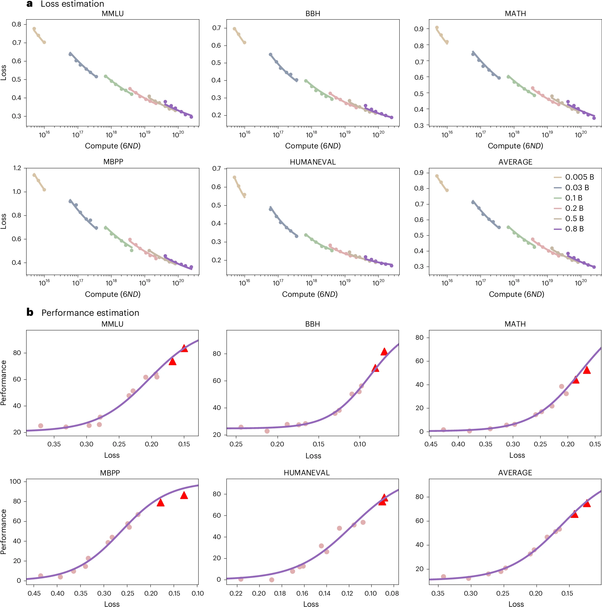
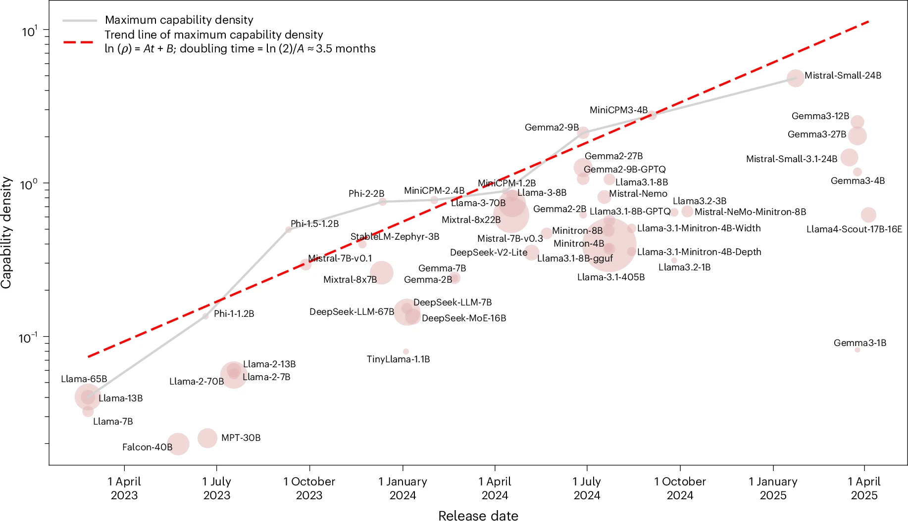
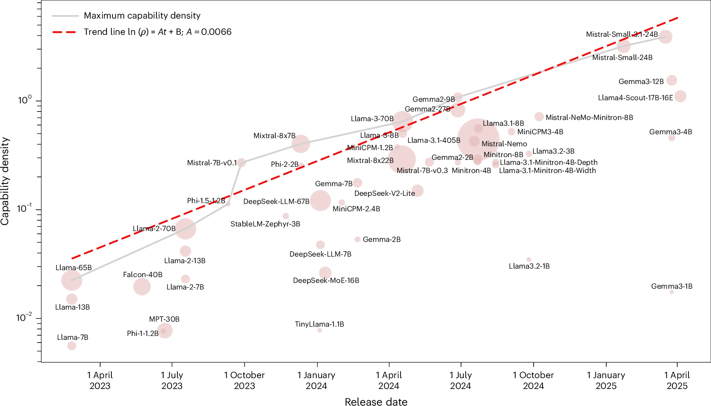
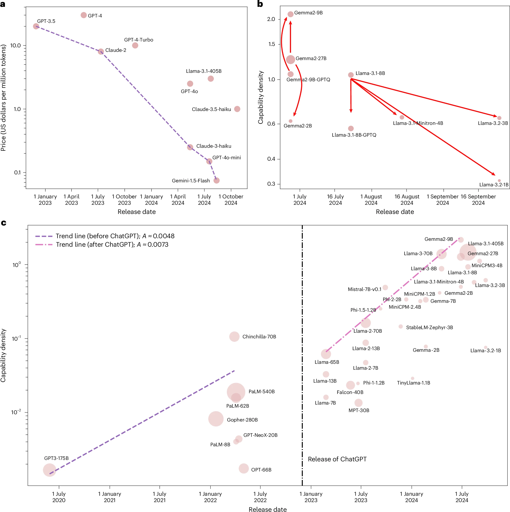

# Densing Law of LLMs

## Paper Info

- **Title**: Densing Law of LLMs
- **Authors**: Chaojun Xiao, Jie Cai, Weilin Zhao, Guoyang Zeng, Biyuan Lin, Jie Zhou, Xu Han, Zhiyuan Liu, Maosong Sun
- **Venue**: Nature Machine Intelligence 7, 1823–1833 (2025)
- **ArXiv**: [2412.04315](https://arxiv.org/abs/2412.04315)
- **DOI**: [10.1038/s42256-025-01137-0](https://doi.org/10.1038/s42256-025-01137-0)
- **Paper**: [paper.pdf](./paper.pdf)

## Motivation

LLM 的性能随参数量增长而提升，但这种 scaling 趋势正在变得越来越不可持续：
训练成本、推理开销、部署门槛都在快速上升。

现有的评估体系要么只关注"模型有多强"（effectiveness），
要么只关注"模型有多小"（efficiency），缺少一个统一框架来同时刻画两者。

一句话总结：这篇论文提出 **capability density**（能力密度）作为统一度量，
并从经验数据中发现了一条类似 Moore's Law 的规律——LLM 的能力密度大约每 3.5 个月翻倍。

## Method

### 1. 核心定义：Capability Density

作者的方法分三步：

1. **训练 reference models（标尺模型）**
   - 训练一组从 5M 到 800M 参数的模型，使用一致的数据集。
   - 在多个 benchmark 上测量这些模型的 loss，拟合出一条 scaling curve。

2. **定义 effective parameter size（等效参数量）**
   - 给定一个目标 LLM，测量其在 benchmark 上的表现。
   - 通过上述 scaling curve 反推：reference model 需要多少参数才能达到同等性能。
   - 这个反推出的参数量就是目标 LLM 的 effective parameter size。

3. **计算 capability density（能力密度）**

   ```
   ρ = effective parameter size / actual parameter size
   ```

   直觉上，ρ 衡量的是"每个参数里装了多少能力"。
   ρ > 1 说明目标模型比 reference model 更高效；ρ 越大，密度越高。

### Extended Fig. 1：Reference Model 的 Scaling Curve 与性能映射



- **上半部分 (a)**：6 个 reference model（5M 到 800M）在 MMLU、BBH、MATH、MBPP、HumanEval 及均值上的 loss vs compute（6ND）曲线。每条线对应一个模型规模，loss 随 compute 平滑下降，且不同规模的曲线整齐排列，说明 scaling law 在这组模型上成立。
- **下半部分 (b)**：从 loss 到下游 benchmark 性能的映射函数。红色三角为验证点，紫色曲线为拟合结果。这条曲线就是"标尺"——给定任意目标 LLM 的 benchmark 分数，可以反查它对应的 effective parameter size。

这张图是整个方法论的基础：没有可靠的标尺，后续所有的密度计算都无从谈起。

### 2. 评估基准

使用 5 个广泛使用的 benchmark：

- **MMLU**：知识密集型推理
- **BBH**：逻辑推理
- **MATH**：数学推理
- **HumanEval**：代码生成
- **MBPP**：代码生成

### 3. 模型覆盖

Nature MI 版本分析了自 Llama-1 发布以来的 **51** 个开源预训练 base model，
涵盖 vanilla Transformer、sparse MoE 和量化模型等不同架构。

### 4. MoE 与推理时间变体

对于 sparse MoE 等架构，参数量与计算成本的关系不再简单线性。
作者额外引入了以推理时间为基底的能力密度变体，以更准确地刻画这类模型。

## Key Insights

### 关键结果 1：Densing Law——能力密度指数增长



论文对 ρ_max（各时间点的最大能力密度）做指数拟合：

```
ln(ρ_max) = A·t + B
```

得到 **A ≈ 0.007**，对应能力密度大约每 **3.5 个月** 翻倍。

图中每个圆圈代表一个开源 base model，面积与参数量成正比，红色虚线为拟合趋势线。可以看到从 2023 年初的 Llama-7B 到 2025 年初的 Gemma3/Mistral-Small 系列，密度提升了接近两个数量级。值得注意的是，很多高密度模型（如 MiniCPM-3-4B、Gemma2-9B）的参数量远小于早期模型，但密度远高于它们。

### 关键结果 2：推理时间基底的密度变体



这张图使用推理时间（而非参数量）作为密度基底，趋势线斜率 **A = 0.0066**。整体趋势与参数量基底版本一致，但 MoE 模型（如 Mixtral-8x22B）的相对位置会发生变化——因为 MoE 的总参数量大，但推理时激活参数少。这个变体对评估真实部署成本更有意义。

### 关键结果 3：ChatGPT 之后密度增速加快 50%



这张图包含三个关键子图：

- **(a) API 价格断崖式下降**：从 GPT-3.5 到 Gemini-1.5-Flash，达到同等能力的 API 价格下降了约两个数量级，这是密度提升在商业层面的直接体现。
- **(b) 模型族内的快速密度演进**：以 Gemma2 和 Llama-3.1 为例，展示了同一模型族在几个月内密度的快速迭代。
- **(c) ChatGPT 前后的增速对比**：这是最核心的子图。蓝色虚线为 ChatGPT 之前的趋势（**A = 0.0048**），红色虚线为之后的趋势（**A = 0.0073**），增速提高了约 **50%**。这说明 ChatGPT 引发的行业竞争实质性地加速了效率改进。

### 关键结果 4：推理成本可降 266.7 倍

论文指出，对于 GPT-3.5 级别的性能，
通过密度提升，推理成本最多可以降低 **266.7 倍**。

具体案例：MiniCPM-1-2.4B（2024-02-01 发布）
在多个 benchmark 上可以达到甚至超过 Mistral-7B（2023-09-27 发布）的表现。

### 关键结果 5：与 Moore's Law 的协同效应

- 芯片算力按 Moore's Law 指数增长
- LLM 能力密度也在指数增长

两者叠加意味着：同等价格芯片上可运行的 LLM 等效参数量，
其增速快于任何一个单独因素。

### 关键结果 6：密度增长主要由数据驱动

ChatGPT 之后的开源模型在架构上大多沿用 vanilla Transformer（仅做小幅修改），
训练算法也基本一致。因此过去两年密度提升的主要驱动力是：

- **训练数据规模的扩大**
- **数据质量的提升**（包括合成数据）

### 关键结果 7：压缩 ≠ 高密度

现有的 pruning 和 distillation 方法通常**不能**产生更高密度的模型。
这说明密度提升更多来自训练阶段的改进，而非后处理压缩。

### 我的结论

> Densing Law 的核心贡献不是提出一个新模型或新训练方法，而是给 LLM 的效率演进提供了一个可量化的经验规律和统一评估框架。

它把"模型越来越强"和"模型越来越小"统一到了同一个指标下，
并用经验数据说明了这个趋势的速率和驱动因素。

## Limitations & Future Work

- **Benchmark 饱和与过拟合风险**：部分 LLM 通过合成数据对 benchmark 做了过度优化，导致分数虚高。作者计划引入新构建的数据集来缓解。
- **指数增长不可能无限持续**：能力密度受限于 scaling frontier 本身、benchmark 天花板、以及数据质量上限。
- **密度定义依赖 reference model 的选择**：不同的标尺模型可能给出不同的密度值，这个框架的鲁棒性还需要进一步验证。
- **覆盖范围有限**：当前分析主要针对开源 base model，闭源模型（GPT-4、Claude 等）未被纳入密度计算。
