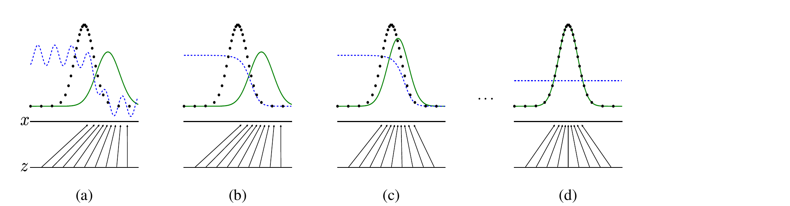
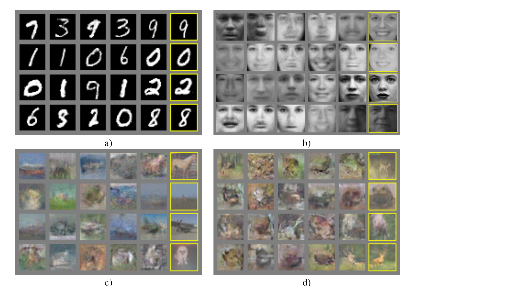
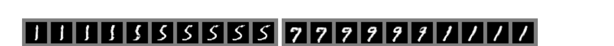

# GAN

## Paper Info

- **Title**: Generative Adversarial Nets
- **Authors**: Ian J. Goodfellow, Jean Pouget-Abadie, Mehdi Mirza, Bing Xu, David Warde-Farley, Sherjil Ozair, Aaron Courville, Yoshua Bengio
- **Venue**: NeurIPS 2014
- **ArXiv**: [1406.2661](https://arxiv.org/abs/1406.2661)
- **Paper**: [paper.pdf](./paper.pdf)

## Abstract

这篇论文提出 **Generative Adversarial Networks (GANs)**，用一个二人零和博弈来训练生成模型。

GAN 同时训练两个模型：

- **Generator `G`**：把随机噪声 `z` 映射成样本 `G(z)`，目标是生成足够像真实数据的样本。
- **Discriminator `D`**：判断输入样本来自真实数据还是生成器，输出 `D(x)`。

训练过程中，`D` 试图区分真样本和假样本，`G` 试图骗过 `D`。理想情况下，
当生成分布 `p_g` 与真实数据分布 `p_data` 一致时，判别器无法区分二者，只能输出 `1/2`。

一句话总结：GAN 把生成建模从“显式写出似然并最大化”改成了“让生成器和判别器互相竞争”。

## Motivation

2014 年以前，深度生成模型主要面临几个困难：

- 显式似然通常难以计算，需要复杂近似。
- Boltzmann machine 等方法常依赖 Markov chain，训练和采样都不够直接。
- 生成模型很难像判别模型那样充分利用反向传播和分段线性单元。

GAN 的核心动机是绕开这些困难：

- 不需要显式表示 `p_g(x)`。
- 不需要近似推断。
- 不需要 Markov chain。
- 只用反向传播就能训练，采样时只需要一次 forward pass。

## Method

### 1. 对抗建模框架

GAN 的目标函数是一个 minimax game：

```text
min_G max_D V(D, G)
  = E_{x ~ p_data} [log D(x)]
  + E_{z ~ p_z} [log(1 - D(G(z)))]
```

判别器 `D` 最大化这个目标：真实样本判为真，生成样本判为假。
生成器 `G` 最小化这个目标：让 `D(G(z))` 尽可能接近 1。



图里的黑色虚线是真实数据分布，绿色实线是生成分布，蓝色虚线是判别器。
训练过程可以理解为：先让 `D` 学会区分当前的 `p_data` 和 `p_g`，
再用 `D` 的梯度推动 `G(z)` 朝更像真实数据的区域移动。

### 2. 训练算法

论文使用交替优化：

1. 固定 `G`，训练 `D` 若干步，使其更好地区分真实样本和生成样本。
2. 固定 `D`，训练 `G` 一步，使生成样本更容易被 `D` 判为真实。
3. 重复以上过程。

论文实验中使用 `k = 1`，也就是每轮训练一次判别器，再训练一次生成器。

实际训练时，原始的 `log(1 - D(G(z)))` 容易在早期饱和：
当 `G` 很差时，`D` 能轻松拒绝生成样本，导致 `G` 的梯度很弱。
因此作者建议用非饱和目标训练生成器：

```text
maximize log D(G(z))
```

这个目标和原 minimax 目标有相同的固定点，但在训练早期梯度更强。

### 3. 理论结果

论文给出两个核心理论结论：

1. 对固定的生成器 `G`，最优判别器为：

   ```text
   D*_G(x) = p_data(x) / (p_data(x) + p_g(x))
   ```

2. 在非参数极限下，如果 `G` 和 `D` 都有足够容量，并且每一步 `D` 都能达到最优，
   那么全局最优点是：

   ```text
   p_g = p_data
   ```

这说明 GAN 的目标不是只让样本“看起来像”，而是在理论上把生成分布推向真实数据分布。

## Key Insights

### 关键结果 1：不用显式似然也能训练生成模型

GAN 最重要的突破是把生成模型训练问题改写成判别问题。
判别器提供可微的学习信号，生成器通过这个信号更新。

这带来一个重要范式变化：

- 传统生成模型：写出 `p(x)`，最大化 likelihood。
- GAN：不直接写 `p(x)`，只需要能从 `G(z)` 采样，并训练一个判别器。

### 关键结果 2：样本质量有竞争力

论文在 MNIST、Toronto Face Database 和 CIFAR-10 上训练 GAN，
并用 Parzen window 估计生成样本的测试集 log-likelihood：

| Model | MNIST | TFD |
|-------|-------|-----|
| DBN | 138 ± 2 | 1909 ± 66 |
| Stacked CAE | 121 ± 1.6 | 2110 ± 50 |
| Deep GSN | 214 ± 1.1 | 1890 ± 29 |
| Adversarial nets | **225 ± 2** | 2057 ± 26 |

作者也强调 Parzen window 估计在高维空间并不可靠。
这个实验更重要的意义是证明：即使不显式建模 likelihood，GAN 也能生成有竞争力的样本。



右侧黄色框是最近的训练样本，用来说明模型不是简单记忆训练集。

### 关键结果 3：隐空间插值是平滑的



在 `z` 空间做线性插值时，生成数字会平滑变化。
这说明生成器学到的不是离散样本查表，而是一个连续的、可插值的数据流形。

### 关键结果 4：GAN 的真正影响

GAN 的影响不只是提出了一个生成模型，而是提出了一个新的优化接口：

- 只要生成过程可微，就可以通过判别器给出的梯度训练。
- 生成器可以表示很尖锐甚至退化的分布，而不需要 Markov chain 混合。
- 判别器学到的特征也可以服务于半监督学习等任务。

### 我的结论

如果只用一句话评价这篇论文：

> GAN 的核心贡献是把“学习数据分布”变成了“生成器和判别器之间的博弈”，从而绕开显式似然和复杂推断。

它打开了之后十多年生成模型研究的一条主线：用可学习的评价器来提供生成信号。
虽然今天扩散模型和自回归模型在很多任务上更主流，但 GAN 在高保真图像生成、
对抗训练思想和隐空间建模上的影响仍然非常基础。

## Limitations & Future Work

- **训练不稳定**：`G` 和 `D` 必须保持同步，任一方过强都会破坏训练。
- **可能模式坍塌**：论文已经提到 `G` 可能把过多 `z` 映射到相同或相近的 `x`，导致样本多样性不足。
- **没有显式 likelihood**：难以直接评估 `p_g(x)`，也难以和 likelihood-based 模型公平比较。
- **理论假设过强**：收敛证明依赖无限容量和最优判别器，实际神经网络训练并不满足这些条件。
- **离散数据困难**：GAN 需要通过生成样本对 `G` 反传梯度，对离散输出不自然。
- **早期样本质量有限**：论文中的 CIFAR-10 样本还很模糊，说明框架潜力大，但工程和架构仍不成熟。

论文提出的自然扩展包括 conditional GAN、学习反向映射 `x -> z`、半监督学习、
以及改进 `G` / `D` 的协调训练效率。
