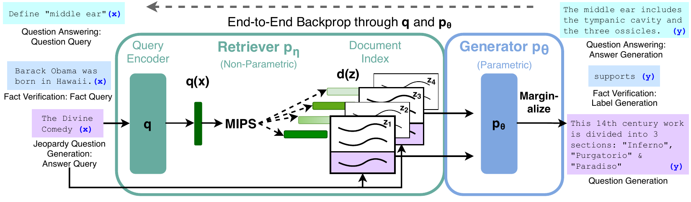
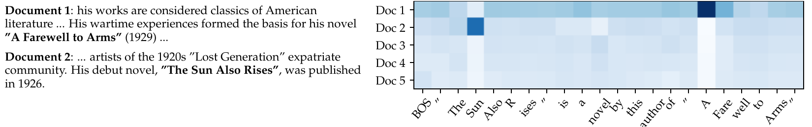
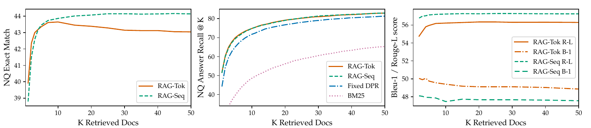

# RAG

## Paper Info

- **Title**: Retrieval-Augmented Generation for Knowledge-Intensive NLP Tasks
- **Authors**: Patrick Lewis, Ethan Perez, Aleksandra Piktus, Fabio Petroni, Vladimir Karpukhin, Naman Goyal, Heinrich Küttler, Mike Lewis, Wen-tau Yih, Tim Rocktäschel, Sebastian Riedel, Douwe Kiela
- **Venue**: NeurIPS 2020
- **ArXiv**: [2005.11401](https://arxiv.org/abs/2005.11401)
- **Paper**: [paper.pdf](./paper.pdf)

## Abstract

这篇论文提出 **Retrieval-Augmented Generation (RAG)**：把预训练 seq2seq 模型的参数化记忆
与外部可检索的非参数化记忆结合起来，用于知识密集型 NLP 任务。

具体来说，RAG 用 **BART-large** 作为生成器，用 **DPR + Wikipedia dense index** 作为检索器。
给定输入 `x`，模型先检索若干篇相关文档 `z`，再把 `x` 和 `z` 拼接后交给生成器生成答案 `y`。
关键点是：文档 `z` 被当作 latent variable，训练时对 top-k 文档上的生成概率做边缘化，
因此只需要输入/输出监督，不需要人工标注“应该检索哪篇文档”。

一句话总结：RAG 把“知识全部压进模型参数里”改成了“模型参数负责语言与推理，外部索引负责可更新知识”。

## Motivation

大规模预训练语言模型可以在参数里存储很多事实知识，但这种参数化记忆有几个明显问题：

- **难更新**：世界知识变化后，模型通常需要继续训练或重新训练。
- **难溯源**：模型回答时很难说明依据来自哪里。
- **容易幻觉**：参数里记住的知识不完整、不精确，生成时可能编造事实。
- **知识密集任务不够强**：在开放域问答、事实验证等任务上，纯参数模型往往落后于带检索的任务专用系统。

已有 REALM、ORQA 等方法证明了“检索 + 预训练模型”对抽取式问答有效，
但它们主要面向 extractive QA。RAG 的目标更通用：把检索能力接到 seq2seq 生成模型上，
让同一个框架可以做问答、摘要式回答、事实验证、问题生成等多种任务。

## Method

### 1. 整体框架

RAG 由两个组件组成：



1. **Retriever `pη(z|x)`**
   - 基于 DPR 的 bi-encoder。
   - Query encoder 把输入 `x` 编成向量。
   - Document encoder 把 Wikipedia passage 编成向量并建立 dense index。
   - 通过 MIPS / FAISS 从索引中取 top-k 文档。

2. **Generator `pθ(y_i|x,z,y_<i)`**
   - 使用 BART-large。
   - 将输入 `x` 和检索文档 `z` 拼接后送入 encoder-decoder。
   - 自回归生成目标序列 `y`。

检索器的打分形式是：

```text
pη(z|x) ∝ exp(d(z)^T q(x))
d(z) = BERT_d(z)
q(x) = BERT_q(x)
```

其中 `BERT_d` 对文档建索引，训练时保持固定；`BERT_q` 和 BART 生成器一起微调。

### 2. 非参数化记忆

论文使用 **2018 年 12 月 Wikipedia dump** 作为外部知识源：

- 将 Wikipedia 文章切成互不重叠的 **100-word chunks**。
- 共得到约 **21M** 个文档块。
- 用 DPR document encoder 预先编码文档。
- 用 FAISS 的 HNSW 近似索引做快速 MIPS 检索。

这部分就是 RAG 的 non-parametric memory。它和模型参数分离，所以可以被替换、扩展或更新。

### 3. RAG-Sequence

RAG-Sequence 假设同一篇检索文档负责生成完整输出序列。
模型先取 top-k 文档，然后对每篇文档条件下的整句生成概率做加权求和：

```text
p_RAG-Sequence(y|x)
  ≈ Σ_z pη(z|x) pθ(y|x,z)
  = Σ_z pη(z|x) Π_i pθ(y_i|x,z,y_<i)
```

直觉上，RAG-Sequence 更像“先选一篇主要证据，再围绕它写完整答案”。
它适合答案主要依赖单个 passage 的任务，例如开放域短问答。

### 4. RAG-Token

RAG-Token 允许每个 token 依赖不同的检索文档。
它在每一步生成 token 时都对 top-k 文档做边缘化：

```text
p_RAG-Token(y|x)
  ≈ Π_i Σ_z pη(z|x) pθ(y_i|x,z,y_<i)
```

直觉上，RAG-Token 更像“边写边从不同资料里取信息”。
它在需要组合多个事实的生成任务上可能更灵活，例如 Jeopardy question generation。



### 5. 训练目标

训练数据只有输入/输出对 `(x_j, y_j)`，没有 gold evidence。
模型最小化目标序列的负边缘似然：

```text
L = -Σ_j log p(y_j|x_j)
```

这使得检索器可以通过最终生成损失学习“哪些文档对完成任务有用”。
训练时更新 query encoder 和 BART generator，文档 encoder 与索引保持固定，
避免训练过程中反复重建整个 Wikipedia 索引。

### 6. 解码

- **RAG-Token** 可以看作普通自回归生成器，只是每步 token 概率已经对文档做了边缘化，
  所以可以直接接标准 beam search。
- **RAG-Sequence** 的整句概率不是标准逐 token 分解形式，因此论文对每篇 top-k 文档分别 beam search，
  再对候选序列做边缘化重打分。作者称完整重打分为 **Thorough Decoding**，
  省略部分额外 forward pass 的近似版本为 **Fast Decoding**。

## Key Insights

### 关键结果 1：开放域问答达到当时 SOTA

在 Natural Questions、TriviaQA、WebQuestions、CuratedTrec 上，
RAG 在多个测试集上超过纯参数化模型和传统 retrieve-and-extract 系统。

| Model | NQ | TQA | TQA-Wiki | WQ | CT |
|-------|----|-----|----------|----|----|
| T5-11B | 34.5 | - | 50.1 | 37.4 | - |
| T5-11B + SSM | 36.6 | - | 60.5 | 44.7 | - |
| REALM | 40.4 | - | - | 40.7 | 46.8 |
| DPR | 41.5 | 57.9 | - | 41.1 | 50.6 |
| RAG-Token | 44.1 | 55.2 | 66.1 | **45.5** | 50.0 |
| RAG-Sequence | **44.5** | **56.8** | **68.0** | 45.2 | **52.2** |

最值得注意的是，RAG 不需要 DPR QA 系统里的 cross-encoder reranker 和 extractive reader。
它直接生成答案，但在抽取式问答任务上仍然可以超过抽取式系统。

论文还指出：即使正确答案没有出现在任何 top-k 检索文档中，
RAG 在 NQ 上仍有 **11.8%** 的准确率。这说明生成器的参数化知识和检索证据可以互补。

### 关键结果 2：生成任务更具体、更事实

在 MS-MARCO NLG 和 Jeopardy question generation 中，RAG 相比 BART 更少幻觉，
回答也更具体。

| Model | Jeopardy B-1 | Jeopardy Q-BLEU-1 | MS-MARCO Rouge-L | MS-MARCO B-1 | FEVER-3 | FEVER-2 |
|-------|--------------|-------------------|------------------|--------------|---------|---------|
| SotA | - | - | 49.8* | 49.9* | 76.8 | 92.2* |
| BART | 15.1 | 19.7 | 38.2 | 41.6 | 64.0 | 81.1 |
| RAG-Token | **17.3** | **22.2** | 40.1 | 41.5 | 72.5 | 89.5 |
| RAG-Sequence | 14.7 | 21.4 | **40.8** | **44.2** | 同上 | 同上 |

`*` 表示使用 gold context / evidence 的系统。FEVER 是分类任务，输出长度为 1，
因此 RAG-Sequence 和 RAG-Token 在该任务上等价。

### 关键结果 3：人类评估明显偏好 RAG

Jeopardy question generation 的人工评估中，评审比较 BART 与 RAG-Token 的输出：

| Judgement | Factuality | Specificity |
|-----------|------------|-------------|
| BART better | 7.1% | 16.8% |
| RAG better | **42.7%** | **37.4%** |
| Both good | 11.7% | 11.8% |
| Both poor | 17.7% | 6.9% |
| No majority | 20.8% | 20.1% |

这组结果很关键：自动指标只能说明 RAG 在 benchmark 上更好，
人工评估说明外部知识确实改善了生成文本的事实性和具体性。

### 关键结果 4：RAG 的生成更多样

论文用 distinct tri-gram ratio 衡量生成多样性：

| Model | MS-MARCO | Jeopardy QGen |
|-------|----------|---------------|
| Gold | 89.6% | 90.0% |
| BART | 70.7% | 32.4% |
| RAG-Token | 77.8% | 46.8% |
| RAG-Sequence | **83.5%** | **53.8%** |

RAG-Sequence 和 RAG-Token 都比 BART 多样，而且没有使用专门的 diversity-promoting decoding。
这说明检索到的外部文档天然给生成器提供了更多可用信息源。

### 关键结果 5：检索器学习是有价值的

论文做了检索消融：

- 冻结 retriever 会降低大多数任务性能。
- 用 BM25 替换 dense retriever 会明显伤害开放域 QA。
- 但在 FEVER 上，BM25 反而最好，可能因为 FEVER claim 高度实体中心，词面重叠很强。

例如在 dev set 上，RAG-Sequence 的开放域 QA 分数从 BM25 版本的
`31.8 / 44.1 / 36.6 / 33.8` 提升到 dense learned retrieval 的
`44.0 / 55.8 / 44.9 / 53.4`（NQ / TQA / WQ / CT）。

这说明“可微检索 + 下游生成损失”确实在学习任务相关 retrieval，而不只是把一个搜索引擎接到生成器前面。

论文还分析了 test-time 检索文档数量 `K` 的影响：



对 NQ 来说，RAG-Sequence 随 `K` 增大整体单调提升；RAG-Token 在 `K=10` 左右达到峰值。
在 MS-MARCO 上，增加 `K` 会提升 RAG-Token 的 Rouge-L，但会牺牲 Bleu-1。
这说明检索更多文档并不总是无脑更好，任务类型和边缘化方式都会影响最优 `K`。

### 关键结果 6：索引可以热替换

RAG 的一个重要优势是外部知识可更新。作者用 2016 和 2018 两个 Wikipedia index 做实验，
查询一批在这两年之间发生变化的世界领导人：

- 使用 2016 index 回答 2016 世界领导人：**70%** 正确。
- 使用 2018 index 回答 2018 世界领导人：**68%** 正确。
- 索引和问题时间不匹配时正确率很低：**12%** 或 **4%**。

这说明 RAG 的世界知识很大程度上来自 non-parametric memory。
更新知识时不一定要重新训练模型，替换索引就能改变回答。

### 为什么这篇论文影响很大

- 它把 retrieval-augmented 方法从抽取式 QA 扩展到通用 seq2seq 生成。
- 它给出了一个清晰概率建模：检索文档是 latent variable，答案概率对文档边缘化。
- 它证明了不需要 gold evidence，也能通过最终任务损失微调检索器。
- 它明确区分了 **parametric memory** 和 **non-parametric memory**，
  这成为后续 RAG、tool-augmented LLM、agent memory 系统的基本思想之一。
- 它展示了知识热更新的路径：改外部 index，而不是把所有知识重新灌进模型参数。

### 我的结论

如果只用一句话评价这篇论文：

> RAG 的核心贡献不是“检索 + 拼接上下文”这个工程动作，而是把检索证据纳入生成概率模型，
> 让预训练生成器和外部知识库可以在一个统一的 fine-tuning recipe 里协同工作。

今天很多 RAG 系统已经不再严格使用论文里的 latent marginalization，
而是采用更简单的 retrieve-then-read / retrieve-then-generate pipeline。
但这篇论文仍然奠定了一个重要范式：大模型不必把所有事实知识都记在参数里，
外部可读、可写、可替换的记忆可以成为模型能力的一部分。

## Limitations & Future Work

- **检索质量仍是上限**：如果 top-k 文档没有覆盖关键证据，生成器只能依赖参数记忆，仍可能幻觉。
- **文档 encoder 和索引固定**：训练时只更新 query encoder，不更新 document encoder；
  这降低了成本，但也限制了检索空间与下游任务的共同适配。
- **依赖 DPR 初始化**：RAG 的 retriever 不是从零学出来的，而是用在 NQ / TriviaQA 上训练过的 DPR 初始化。
  因此论文的“无 evidence supervision”主要指下游 fine-tuning 阶段。
- **边缘化只是 top-k 近似**：真实文档空间巨大，论文只在 top-k 文档上求和；
  检索错过的文档不会进入生成概率。
- **解码成本更高**：RAG-Sequence 需要对多篇文档分别生成候选并重打分，
  K 增大时推理成本明显上升。
- **事实性不是保证**：RAG 让生成更 grounded，但不会自动保证引用正确、证据充分或回答忠于来源。
- **外部知识源有偏差**：Wikipedia 本身可能不完整、过时或带有偏差，RAG 会继承这些问题。

作者在 discussion 中提到的一个自然方向是：把 retriever 和 generator 从头做联合预训练，
而不是先分别预训练 DPR 与 BART，再在下游任务上组合微调。
