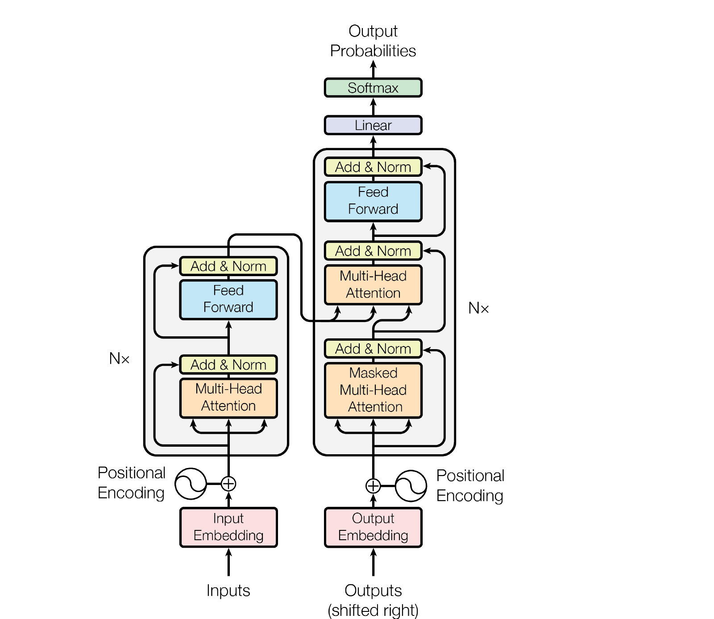
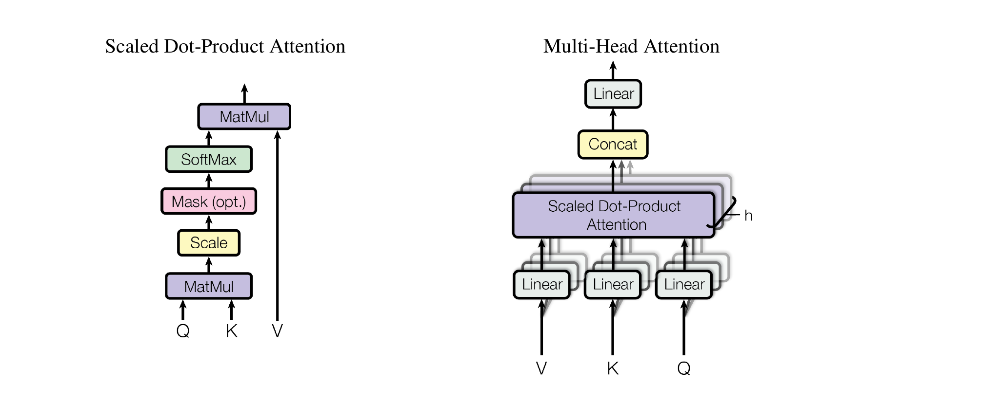

# Transformer

## Paper Info

- **Title**: Attention Is All You Need
- **Authors**: Ashish Vaswani, Noam Shazeer, Niki Parmar, Jakob Uszkoreit, Llion Jones, Aidan N. Gomez, Łukasz Kaiser, Illia Polosukhin
- **Venue**: NeurIPS 2017
- **ArXiv**: [1706.03762](https://arxiv.org/abs/1706.03762)
- **Paper**: [paper.pdf](./paper.pdf)

## Abstract

这篇论文提出 **Transformer**，一个完全基于 attention 的序列到序列架构。
它去掉了 RNN 和 CNN 中的递归或卷积结构，只用 self-attention、cross-attention、
position-wise feed-forward network、residual connection 和 layer normalization 来建模序列。

在 WMT 2014 英德、英法机器翻译任务上，Transformer 达到当时 SOTA，
同时训练更快、并行度更高。

一句话总结：Transformer 证明了序列建模不一定需要递归，attention 本身就足以成为主干架构。

## Motivation

Transformer 之前，主流 sequence transduction 模型大多基于 RNN 或 CNN：

- RNN 的问题是顺序依赖强，训练和推理难以并行，长距离依赖路径长。
- CNN 可以并行，但长距离交互需要堆很多层或扩大卷积核。
- 早期 attention 多作为 RNN encoder-decoder 之间的辅助机制，而不是模型主体。

这篇论文的核心问题是：

> 能不能完全去掉 recurrence 和 convolution，只靠 attention 来完成序列建模？

Transformer 的答案是可以，而且效果更好。

## Method

### 1. 整体架构

Transformer 仍然是 encoder-decoder 架构：



- Encoder 由 `N = 6` 个相同层堆叠。
- Decoder 也由 `N = 6` 个相同层堆叠。
- 每个子层外都有 residual connection 和 layer normalization。
- 所有 embedding 和子层输出维度为 `d_model = 512`。

Encoder 每层包含：

1. Multi-head self-attention。
2. Position-wise feed-forward network。

Decoder 每层包含：

1. Masked multi-head self-attention，防止看到未来 token。
2. Encoder-decoder multi-head attention，用 decoder hidden states 查询 encoder outputs。
3. Position-wise feed-forward network。

### 2. Scaled Dot-Product Attention

Transformer 使用的基础 attention 是：

```text
Attention(Q, K, V) = softmax(QK^T / sqrt(d_k)) V
```



缩放因子 `sqrt(d_k)` 很关键：当 key/query 维度较大时，点积幅度会变大，
softmax 容易进入梯度很小的区域。除以 `sqrt(d_k)` 可以稳定训练。

### 3. Multi-Head Attention

单个 attention head 只能在一个表示子空间里做匹配。
Multi-head attention 会把 `Q/K/V` 投影到多个子空间，在每个 head 上并行做 attention，
最后拼接并线性投影：

```text
head_i = Attention(QW_i^Q, KW_i^K, VW_i^V)
MultiHead(Q,K,V) = Concat(head_1, ..., head_h) W^O
```

论文 base model 使用 `h = 8`，每个 head 的 `d_k = d_v = 64`。
这种设计让模型可以在不同位置、不同语义子空间里同时关注信息。

### 4. Position-wise Feed-Forward Network

每个 encoder/decoder 层还包含一个对每个位置独立应用的两层 MLP：

```text
FFN(x) = max(0, xW_1 + b_1) W_2 + b_2
```

base model 中 `d_model = 512`，中间层 `d_ff = 2048`。

### 5. Positional Encoding

由于 Transformer 没有 recurrence 或 convolution，它本身不知道 token 顺序。
论文给输入 embedding 加上 sinusoidal positional encoding：

```text
PE(pos, 2i)   = sin(pos / 10000^(2i / d_model))
PE(pos, 2i+1) = cos(pos / 10000^(2i / d_model))
```

作者也试过 learned positional embedding，效果几乎相同。
最终选择 sinusoidal 版本，是因为它可能更容易外推到训练时没见过的长度。

## Key Insights

### 关键结果 1：Self-Attention 的路径长度优势

Self-attention 的重要优势不是“看起来优雅”，而是路径长度短：

| Layer Type | Complexity per Layer | Sequential Operations | Maximum Path Length |
|------------|----------------------|-----------------------|---------------------|
| Self-Attention | `O(n^2 d)` | `O(1)` | `O(1)` |
| Recurrent | `O(n d^2)` | `O(n)` | `O(n)` |
| Convolutional | `O(k n d^2)` | `O(1)` | `O(log_k n)` |

在句子长度 `n` 小于表示维度 `d` 的常见机器翻译设定下，
self-attention 不仅并行度更高，而且任意两个位置之间只需要一步就能交互。

### 关键结果 2：机器翻译达到当时 SOTA

| Model | EN-DE BLEU | EN-FR BLEU | EN-DE Training Cost |
|-------|------------|------------|---------------------|
| ConvS2S Ensemble | 26.36 | 41.29 | `7.7e19` |
| Transformer base | 27.3 | 38.1 | `3.3e18` |
| Transformer big | **28.4** | **41.0** | `2.3e19` |

英德任务上，Transformer big 比此前最佳 ensemble 高出 2 BLEU 以上。
base model 训练约 12 小时，big model 在 8 张 P100 上训练约 3.5 天。

### 关键结果 3：多头数量和模型规模都重要

消融实验显示：

- 单头 attention 比 8 头差约 0.9 BLEU。
- head 太多也会下降，说明每个 head 维度过小会损害表达能力。
- 降低 key 维度 `d_k` 会损害性能，说明 compatibility matching 本身并不简单。
- 更大的 `d_model` 和 `d_ff` 带来更好表现。
- dropout 对防止过拟合很关键。
- learned positional embedding 与 sinusoidal positional encoding 表现接近。

### 关键结果 4：Transformer 真正改变了什么

Transformer 的贡献不只是一个机器翻译模型，而是重新定义了序列模型的主干：

- 并行训练：不再像 RNN 那样逐时间步递推。
- 长程依赖：任意位置之间一层 attention 就能建立联系。
- 表示解耦：不同 head 可以学习不同的对齐、句法或语义关系。
- 架构通用：encoder、decoder、encoder-decoder attention 可以组合出后续 BERT、GPT、T5 等模型族。

### 我的结论

如果只用一句话评价这篇论文：

> Transformer 的核心贡献是把 attention 从辅助模块提升为序列建模的主体，并用并行性和长程建模能力取代了递归结构。

这篇论文之所以成为现代大模型的起点，是因为它给出了一个非常适合 scaling 的架构：
计算规则规整、矩阵乘法密集、并行度高、可以稳定堆深和扩宽。

## Limitations & Future Work

- **长序列成本高**：标准 self-attention 是 `O(n^2)`，序列很长时成本迅速上升。
- **自回归解码仍然顺序**：训练可以高度并行，但生成时 decoder 仍需逐 token 输出。
- **位置建模是外加的**：模型本身无序，需要 positional encoding 注入顺序信息。
- **当时主要验证在机器翻译**：论文已经提出要扩展到图像、音频、视频等更大输入输出场景。
- **局部/稀疏 attention 是自然方向**：作者在结论中提到要研究 restricted attention 来处理大规模输入。

从今天看，后续的长上下文 Transformer、稀疏注意力、线性注意力、MoE 和多模态 Transformer，
基本都是沿着这篇论文留下的问题继续推进。
