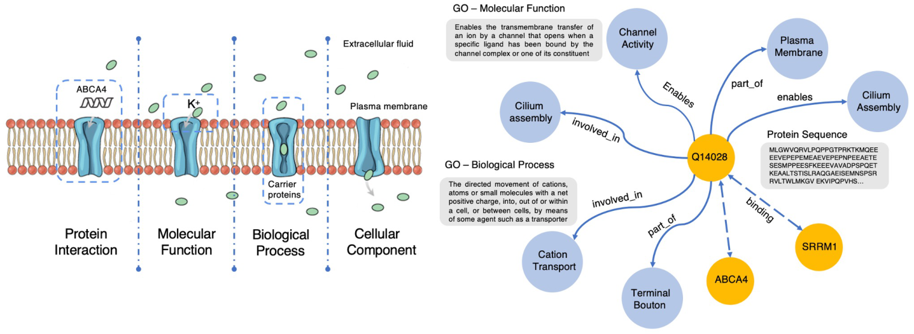
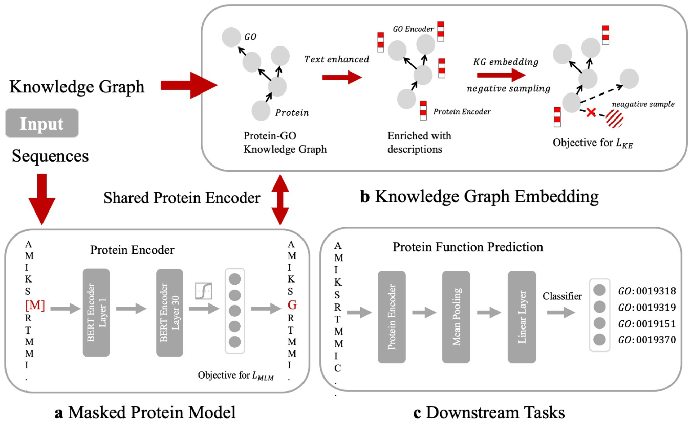
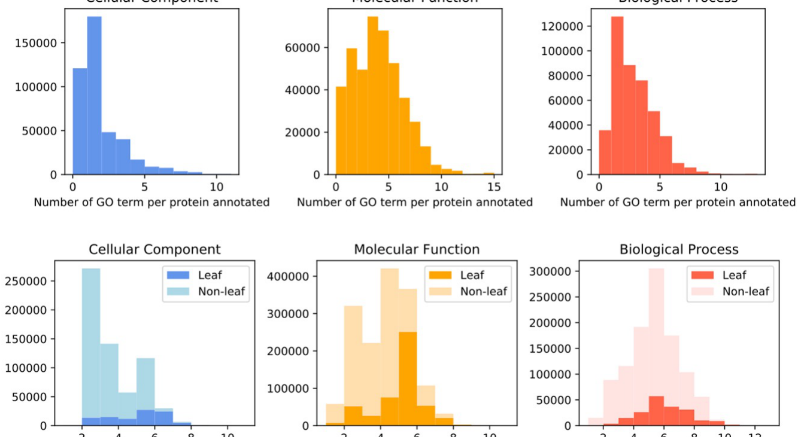
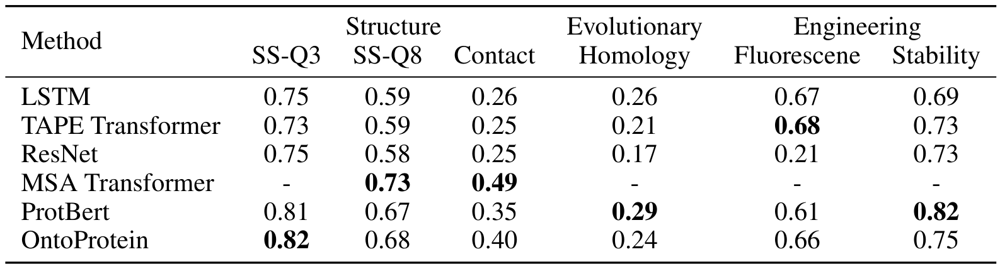
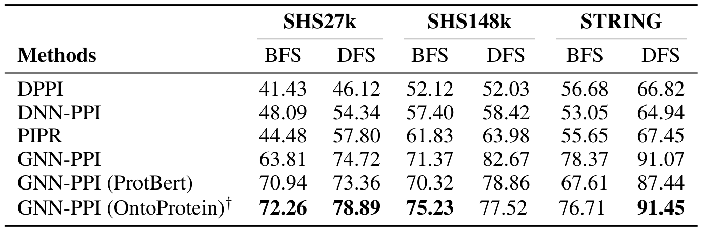
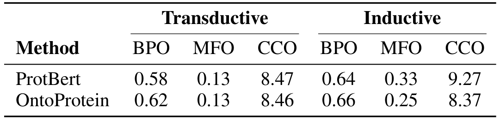
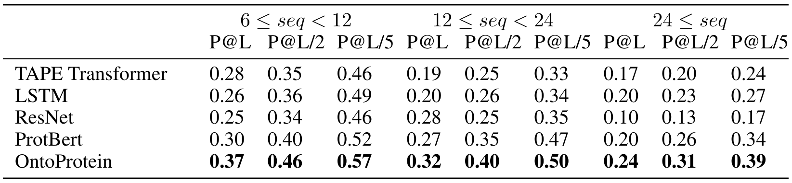
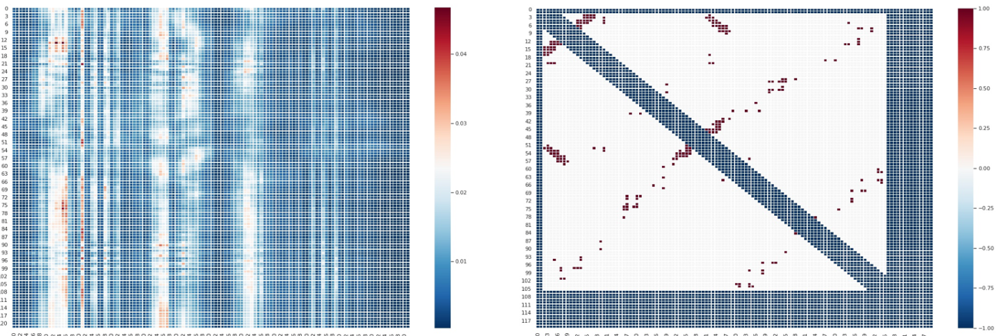

# OntoProtein

## Paper Info

- **Title**: OntoProtein: Protein Pretraining With Gene Ontology Embedding
- **Authors**: Ningyu Zhang, Zhen Bi, Xiaozhuan Liang, Siyuan Cheng, Haosen Hong, Shumin Deng, Qiang Zhang, Jiazhang Lian, Huajun Chen
- **Venue**: ICLR 2022
- **Paper**: [paper.pdf](./paper.pdf)
- **Code**: [zjunlp/OntoProtein](https://github.com/zjunlp/OntoProtein)
- **Dataset**: [ProteinKG25](https://zjunlp.github.io/project/ProteinKG25/)

## Abstract

`OntoProtein` 是一篇把 Gene Ontology 知识图谱显式注入蛋白语言模型预训练的工作。
它认为只靠蛋白序列做 self-supervised pretraining，虽然能学到进化和结构模式，
但很难充分吸收 GO 中关于 molecular function、biological process、cellular component 的结构化生物知识。

一句话总结：
`OntoProtein` 的核心是把蛋白序列编码和 GO 知识图谱嵌入放到同一个预训练框架里，
用 `MLM + knowledge embedding` 联合优化，让蛋白表示同时继承语言模型的序列建模能力和 GO 的功能先验。

## Motivation

蛋白语言模型把氨基酸序列当作一种“生命语言”，通过大规模无监督预训练获得通用表示。
但序列本身并不总能直接暴露蛋白功能，尤其是低同源、注释稀疏或功能关系复杂的蛋白。
相比之下，Gene Ontology 和 Gene Annotation 中已经沉淀了大量人工整理或数据库整理的功能事实，
例如某个蛋白参与什么 biological process、位于什么 cellular component、具有什么 molecular function。

问题在于，蛋白序列和 GO 图谱是两种异质数据：
一个是 amino acid token 序列，一个是带文本描述和关系边的知识图谱。
`OntoProtein` 想解决的问题就是：
如何把 GO 的结构化知识作为外部先验注入蛋白预训练，而不是只在下游任务里被动使用标签。

## Method

方法可以拆成四个部分：

1. **ProteinKG25 构建**
   - 将 Gene Ontology 与公开 Gene Annotation 合并成蛋白知识图谱。
   - 图中包含 GO term 节点和 protein 节点。
   - GO 节点用 name/description 表示，protein 节点用 Swiss-Prot 中的序列表示。
   - 数据规模约为 **612k entities** 和 **4.99M triples**，其中约 **4.88M** 是 protein-GO triples。

2. **Hybrid Encoder**
   - protein encoder 使用 `ProtBert` 表示氨基酸序列。
   - GO encoder 使用生物医学文本 BERT 表示 GO term 描述。
   - relation encoder 学习 GO/annotation 关系嵌入。
   - 通过线性投影把蛋白序列表示和 GO 文本表示映射到同一语义空间。

3. **Knowledge Embedding Objective**
   - 把 GO 和 protein annotation 当作三元组 `(head, relation, tail)` 建模。
   - 使用类似 `TransE` 的打分函数优化实体和关系表示。
   - 引入 knowledge-aware negative sampling：对 GO-GO triples，在同一 GO aspect 内替换实体；对 protein-GO triples，主要替换 GO tail。
   - 这样能生成更难、更符合生物语义的负样本。

4. **Masked Protein Modeling**
   - 保留蛋白语言模型常用的 masked amino acid prediction。
   - 总目标为 `alpha * KE loss + MLM loss`。
   - 论文强调该方法不改变下游模型结构，只是在预训练阶段增加知识目标，因此推理阶段没有额外开销。

## 图表速读

**Figure 1** 说明了论文的核心动机：蛋白功能不是只由线性序列决定，还与 molecular function、biological process、cellular component 等 GO 语义相关。右侧的 ProteinKG25 子图把蛋白序列、GO term 和关系边放在同一张图里，强调本文要注入的是结构化功能知识，而不是普通的分类标签。

**Figure 2** 是 OntoProtein 的方法主图。模型一边用共享 protein encoder 做 masked protein modeling，一边把 protein-GO knowledge graph 输入到知识嵌入目标中；下游任务仍然使用常规 protein embedding，因此知识增强主要发生在预训练阶段。

**Figure 3** 展示 ProteinKG25 的数据分布。GO term 标注数量和层级分布都很不均衡，尤其 biological process 更明显，这解释了为什么功能预测任务中 BPO 的收益和波动都更值得关注。

**Table 1** 对应 TAPE benchmark。OntoProtein 在二级结构和 contact prediction 上优于 ProtBert，说明 GO 知识注入对 residue-level 和结构相关任务更有帮助；但在 remote homology、stability 这类更依赖全局序列性质的任务上并不占优。

**Table 2** 展示 PPI 结果。把 GNN-PPI 的初始蛋白表示换成 OntoProtein 后，多数 split 都有提升，特别是 SHS27k DFS 和 STRING DFS，说明 GO 增强表示能给下游图模型提供更好的功能先验。

**Table 3** 展示 protein function prediction。OntoProtein 在 BPO 上有稳定小幅提升，但 MFO/CCO 结果混合，说明 GO 知识注入并不会自动解决所有 GO aspect 的长尾和噪声问题。

**Table 4** 进一步拆分 contact prediction。不同序列长度区间里 OntoProtein 都保持最高或接近最高的 P@L、P@L/2、P@L/5，支撑了“外部功能知识有助于接触预测”的结论。

**Figure 4** 用 attention head 和 contact label matrix 做可视化对比。它不是严格证明模型学到了真实结构机制，但提供了一个直观证据：知识增强后的表示确实会在残基关联模式上表现出结构相关信号。

## Key Insights

### 关键结果 1：GO 知识对结构相关 token-level 任务最有帮助

在 TAPE benchmark 上，`OntoProtein` 相比 `ProtBert` 在二级结构和接触预测上有稳定提升：

- `SS-Q3`: **0.82** vs `ProtBert` **0.81**
- `SS-Q8`: **0.68** vs `ProtBert` **0.67**
- `Contact`: **0.40** vs `ProtBert` **0.35**

这说明 GO 知识不只是功能标签文本，
它还能通过功能-结构相关性间接改善 residue-level 表示。
尤其是 contact prediction 的提升比较明显，说明外部功能知识可能让模型更容易捕捉远程残基关联。

### 关键结果 2：收益不是全任务通用

`OntoProtein` 在 fluorescence 上优于 `ProtBert`，但在 remote homology 和 stability 上反而不如 `ProtBert`。
论文自己的解释是预训练目标缺少 sequence-level objective，
因此对需要全局序列表征或回归式性质预测的任务不一定占优。

这点很关键：
知识注入不是免费增益，外部知识目标会改变表示空间。
如果下游任务和 GO 功能事实的耦合不强，或者更依赖序列层面的连续性质，收益可能变小甚至转负。

### 关键结果 3：PPI 任务中作为 embedding 初始化有效

在 protein-protein interaction prediction 中，作者把 GNN-PPI 的初始蛋白 embedding 换成 `OntoProtein`。
结果在多个 split 上优于 `GNN-PPI (ProtBert)`，例如：

- `SHS27k BFS`: **72.26** vs **70.94**
- `SHS27k DFS`: **78.89** vs **73.36**
- `SHS148k BFS`: **75.23** vs **70.32**
- `STRING DFS`: **91.45** vs **87.44**

这说明 GO 知识增强后的蛋白表示可以作为下游图模型的更好初始特征。
但在大数据集和部分 split 上提升并不总是最大，说明 PPI 仍然强依赖网络结构和训练数据分布。

### 关键结果 4：功能预测的提升集中在 BPO

在 protein function prediction 中，`OntoProtein` 在 Biological Process Ontology 上有小幅提升，
但 Molecular Function 和 Cellular Component 的结果较混合。
这和 GO 数据本身的长尾、层级、注释不完整有关。

我的理解是：
`OntoProtein` 证明了“把 GO 放进预训练”是可行的，
但它还没有系统解决 GO label imbalance、specific term 召回和 annotation bias。
后续 `GOBoost` 这类工作正是沿着 label-side modeling 继续补这个短板。

### 关键结果 5：ProteinKG25 本身是重要贡献

这篇论文不只是提出模型，也构建了对齐蛋白序列和 GO 知识的大规模数据集 `ProteinKG25`。
它让 protein pretraining 从单纯序列语料走向“序列 + 功能知识图谱”的组合。

这个方向后来被多模态 protein-biotext 工作继续扩展：
`OntoProtein` 主要做 GO KG 注入，
而后来的 `ProtCLIP/ProtST/BioBridge` 更强调蛋白序列和自然语言功能描述之间的跨模态对齐。

### 我的结论

如果只用一句话评价这篇论文：

> OntoProtein 的价值在于第一次系统地把 Gene Ontology 作为知识图谱注入蛋白语言模型预训练，证明功能知识可以改善蛋白表示，但收益强依赖下游任务与 GO 语义的耦合程度。

它更像是 protein foundation model 的知识增强起点，
而不是终点。真正难的问题仍然是：
如何选择有用知识、避免噪声知识、并让长尾功能标签得到充分建模。

## Limitations & Future Work

- **提升幅度有限**：相比大规模 PLM，GO 知识注入带来的增益整体不算大，说明知识覆盖和注入方式仍是瓶颈。
- **ProteinKG25 覆盖有限**：GO/Gene Annotation 只覆盖自然界蛋白的一部分，未覆盖蛋白很难直接受益。
- **长尾功能没有被充分解决**：GO term 频率分布高度不均，本文主要做 representation-side 注入，没有专门处理 label imbalance。
- **对 sequence-level/regression 任务不稳定**：remote homology、stability 等任务上不一定优于 ProtBert。
- **知识可能带来噪声或偏置**：不是所有外部知识都对下游任务有益，annotation bias 可能被模型吸收。

后续值得追的方向是：

1. 在预训练时加入更强的 sequence-level objective，让知识注入不牺牲全局性质预测。
2. 将 GO 知识注入和 `GOBoost` 这类长尾标签建模结合起来。
3. 从 GO 扩展到更多生物知识源，例如 pathway、domain、disease、drug 和 interaction network。
