# ProtCLIP

## Paper Info

- **Title**: ProtCLIP: Function-Informed Protein Multi-Modal Learning
- **Authors**: Hanjing Zhou, Mingze Yin, Wei Wu, Mingyang Li, Kun Fu, Jintai Chen, Jian Wu, Zheng Wang
- **Venue**: AAAI 2025 (Oral)
- **Paper**: [paper.pdf](./paper.pdf)

## Abstract

`ProtCLIP` 是一篇面向蛋白序列和生物文本描述对齐的多模态预训练工作。
它认为早期 protein-biotext 方法虽然借鉴了 CLIP 的全局对齐思想，
但还没有充分利用大规模 protein-text paired data，
也没有显式建模蛋白功能由局部 functional segments 决定这一生物机制。

一句话总结：
`ProtCLIP` 的核心贡献是用大规模 `ProtAnno` 数据集、property-driven sampling，
以及 static/dynamic segment 级别的功能感知目标，
把蛋白-文本对齐从粗粒度 CLIP loss 推进到更细粒度的 function-informed pretraining。

## Motivation

蛋白多模态预训练的目标是让蛋白序列 embedding 和功能文本 embedding 落在可对齐的语义空间里。
这样模型不仅能做传统蛋白预测任务，也能支持 protein-to-text、text-to-protein、protein-to-drug 等跨模态检索和转换。

但这个方向有两个主要瓶颈：

1. **数据质量和数据规模难兼得**
   - 高质量人工审阅注释数量有限。
   - 大规模机器注释覆盖更广，但噪声更大。
   - 直接均匀采样容易被低质量 annotation 带偏。

2. **粗粒度 CLIP 对齐不够贴合蛋白功能机制**
   - 蛋白功能通常由特定 domain、active site、binding site 或离散残基组合决定。
   - 这些功能相关片段在一维序列上可能连续，也可能分散。
   - 只对齐整条 protein embedding 和整段 text embedding，会丢掉细粒度功能信息。

`ProtCLIP` 想解决的就是：
怎样在大规模 noisy protein-biotext 数据中，有效学习功能感知的多模态蛋白表示。

## Method

方法可以拆成五个部分：

1. **ProtAnno 数据集**
   - 数据来自 Swiss-Prot 和 TrEMBL 的蛋白序列及文本属性描述。
   - `ProtAnno-S`：约 **0.5M** 高质量人工审阅 protein-biotext pairs。
   - `ProtAnno-D`：约 **251.5M** 大规模机器分析 protein-biotext pairs。
   - 论文最终用 `ProtAnno-D` 做大规模预训练。

2. **Property-driven Sampling**
   - 采样概率同时考虑 sample confidence、property coverage 和数据规模。
   - confidence 越高、property coverage 越全的样本更容易被选中。
   - 目标是在 noisy large-scale data 中平衡数据质量和数据数量。

3. **双编码器架构**
   - protein encoder 使用 `ESM-2-650M`。
   - biotext encoder 使用 `PubMedBERT`。
   - 两者初始化自已有强表征能力的单模态模型，再通过多模态目标对齐。

4. **粗粒度全局对齐**
   - 使用 CLIP-style global contrastive loss。
   - 让同一 protein-text pair 的表示更接近，不同 pair 的表示更远。
   - 这部分负责学习整体的 protein-biotext 语义对齐。

5. **细粒度功能感知目标**
   - `BSR`：Biotext-guided Static Segment Reconstruction。
     随机 mask 连续 static segments，并利用 protein 和 biotext 的融合表示重构这些片段。
   - `PDA`：Property-grouped Dynamic Segment Alignment。
     用 property prototype 在无监督方式下聚合动态功能片段，并与对应属性描述对齐。
   - 保留 protein MLM loss，避免多模态注入时破坏单模态蛋白知识。
   - 总目标为 `global contrastive + BSR + MLM + PDA`。

## 图表速读

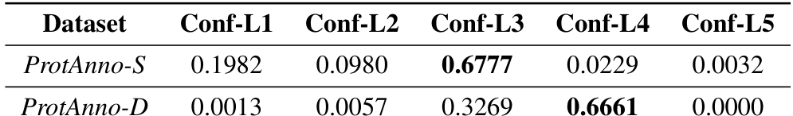

**Table 1** 展示 ProtAnno-S 和 ProtAnno-D 的置信度分布。ProtAnno-S 更集中在高置信度样本，而 ProtAnno-D 虽然规模更大，但机器注释带来的噪声和置信度差异更明显，这正是 property-driven sampling 要处理的问题。

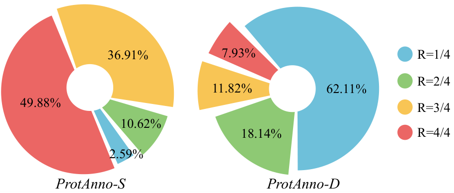

**Figure 1** 展示属性覆盖度分布。ProtAnno-D 的低覆盖样本占比更高，说明大规模数据不能直接等价于高质量数据；采样策略需要同时考虑 confidence 和 property coverage。

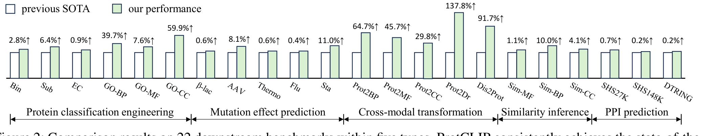

**Figure 2** 是 22 个 benchmark 的总体对比。ProtCLIP 在五类任务上几乎全面超过 previous SOTA，提升最大的区域集中在 GO function classification 和 cross-modal transformation，说明它的优势主要来自功能语义对齐，而不是单一分类头。

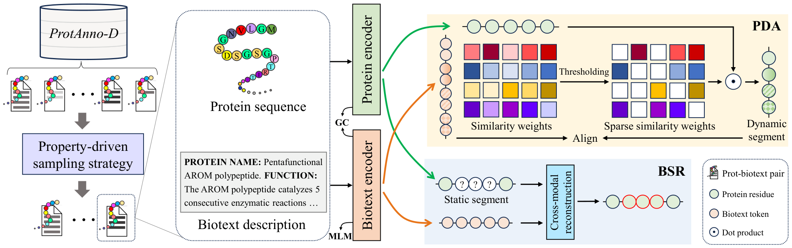

**Figure 3** 是方法主图。ProtCLIP 用 protein encoder 和 biotext encoder 做全局 CLIP 对齐，同时加入 BSR 和 PDA 两个 segment-level 目标，让模型从整条序列对齐进一步细化到功能片段对齐。

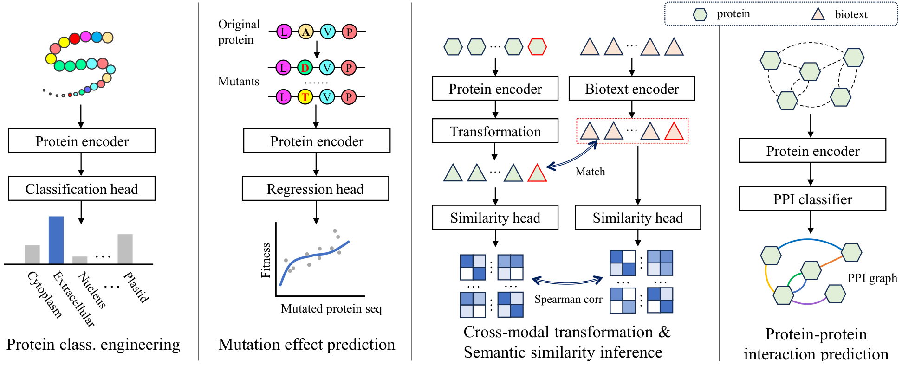

**Figure 4** 总结了下游任务类型：分类、突变效应预测、跨模态转换、语义相似度推断和 PPI。这个任务覆盖面说明 ProtCLIP 不是只针对 GO 分类调参，而是在测试多模态蛋白表示的迁移性。

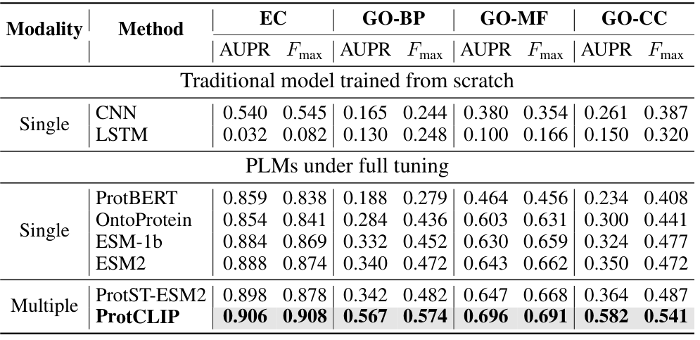

**Table 3** 是 GO/EC function classification 的核心结果。ProtCLIP 在 EC、GO-BP、GO-MF、GO-CC 上都优于 ProtST-ESM2 和单模态 PLM，尤其 GO-BP/GO-CC 的提升说明功能文本对齐能补充序列模型缺失的注释语义。

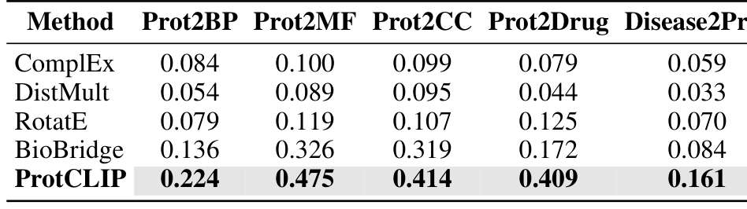

**Table 4** 展示 cross-modal transformation。ProtCLIP 在 Prot2BP、Prot2MF、Prot2CC、Prot2Drug、Disease2Prot 上都明显优于 BioBridge 和传统 KG embedding 方法，这是论文最能体现“蛋白-文本语义空间可迁移”的结果。

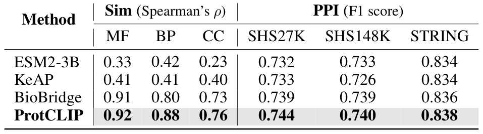

**Table 5** 同时覆盖 semantic similarity inference 和 PPI。ProtCLIP 在 MF/BP/CC 相似度上明显更强，但 PPI 领先幅度较小，说明跨模态功能语义对相似度任务更直接，对图结构强相关任务的增益相对有限。

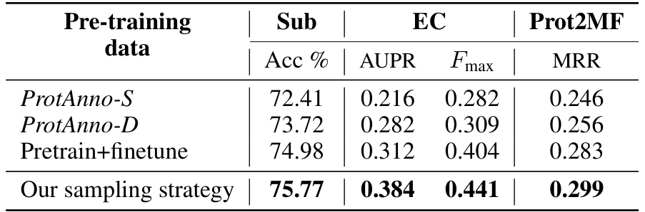

**Table 6** 比较不同预训练数据组织方式。直接用 ProtAnno-D 或先低精度预训练再高精度 finetune 都不如 proposed sampling strategy，说明在 noisy biological annotations 上，采样策略比简单扩大数据量更关键。

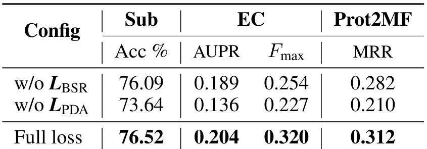

**Table 7** 是预训练目标消融。去掉 `PDA` 的下降比去掉 `BSR` 更明显，支持论文关于动态功能片段对齐的判断：功能相关残基不一定连续，动态 segment 建模比固定连续 mask 更贴近蛋白机制。

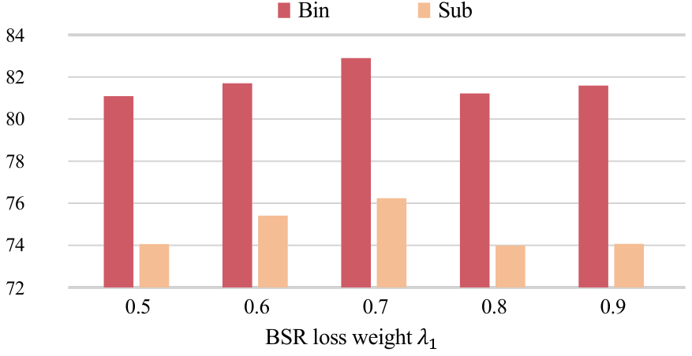

**Figure 5** 展示 BSR loss 权重的消融。`lambda_1 = 0.7` 时 Bin/Sub 两个任务表现最好，说明 segment reconstruction 和 MLM/PDA 之间存在权衡，不能简单把某个辅助目标权重拉满。

## Key Insights

### 关键结果 1：ProtCLIP 在 22 个 benchmark 上整体刷新 SOTA

论文在五类任务上评估：

- protein classification engineering
- mutation effect prediction
- cross-modal transformation
- semantic similarity inference
- protein-protein interaction prediction

`ProtCLIP` 在这 22 个 benchmark 上整体取得最好结果。
这说明它学到的不是单一任务特征，而是更通用的 function-aware protein representation。

### 关键结果 2：GO function classification 提升很明显

在 function classification 中，`ProtCLIP` 对 GO 相关任务提升尤其明显：

- `GO-BP`: AUPR **0.567**, Fmax **0.574**
- `GO-MF`: AUPR **0.696**, Fmax **0.691**
- `GO-CC`: AUPR **0.582**, Fmax **0.541**
- `EC`: AUPR **0.906**, Fmax **0.908**

论文报告相对已有 SOTA，在 `GO-CC` 和 `GO-BP` 上分别有约 **59.9%** 和 **39.7%** 的提升。

我的理解是：
这些任务天然依赖功能文本和属性描述，
因此 protein-biotext 多模态对齐比单纯蛋白序列 PLM 更有优势。

### 关键结果 3：跨模态转换是 ProtCLIP 最突出的场景

在 cross-modal transformation 上，`ProtCLIP` 相比 `BioBridge` 和传统 KG embedding 方法提升很大：

- `Prot2BP`: **0.224** vs `BioBridge` **0.136**
- `Prot2MF`: **0.475** vs **0.326**
- `Prot2CC`: **0.414** vs **0.319**
- `Prot2Drug`: **0.409** vs **0.172**
- `Disease2Prot`: **0.161** vs **0.084**

这说明 `ProtCLIP` 的价值不只是分类器指标更高，
而是把 protein embedding 放进了一个更可迁移的跨模态语义空间。
对后续 protein editing、drug-protein matching、text-guided protein search 这类任务更有想象空间。

### 关键结果 4：功能片段级目标确实必要

消融实验显示：
只做全局对齐不够，`BSR` 和 `PDA` 都能带来增益。
尤其去掉 `PDA` 后下降更明显，说明动态功能片段的 property-level 对齐很重要。

这符合蛋白本身的机制：
功能相关残基不一定连续，很多时候是 3D 空间接近、1D 序列分散。
`PDA` 用 property prototype 聚合动态片段，比固定连续 mask 更贴近这种现实。

### 关键结果 5：大规模 noisy 数据不是不能用，关键是采样策略

论文比较了几种预训练数据组织方式：

- 只用 `ProtAnno-S`
- 只用 `ProtAnno-D`
- 先在低精度数据预训练再在高精度数据 finetune
- 在 `ProtAnno-D` 上使用 property-driven sampling

结果显示 property-driven sampling 最好。
这点很实用：在生物数据库里，机器注释噪声不可避免，
但如果能按置信度和属性覆盖设计采样，大规模弱标注仍然有价值。

### 我的结论

如果只用一句话评价这篇论文：

> ProtCLIP 的价值在于把 protein-biotext pretraining 从“整条序列和整段文本做 CLIP 对齐”推进到“围绕蛋白功能片段做细粒度多模态对齐”。

它是 `OntoProtein` 之后更进一步的多模态蛋白表征路线：
`OntoProtein` 强调 GO 知识图谱注入，
`ProtCLIP` 则强调大规模 protein-text 对齐和功能片段级目标。

## Limitations & Future Work

- **计算成本很高**：论文使用 64 张 Tesla V100，约 10,000 GPU hours，普通实验室复现成本较高。
- **依赖数据库注释质量**：`ProtAnno-D` 主要来自机器分析注释，尽管有采样策略，annotation noise 和 bias 仍可能进入模型。
- **功能片段仍是近似建模**：`BSR/PDA` 不等价于真实 3D active site 或 wet-lab 验证的功能区域。
- **PPI 等任务提升较小**：在 PPI F1 上虽然最好，但领先幅度不大，说明某些任务更依赖图结构或特定监督信号。
- **缺少实验闭环验证**：论文主要是 benchmark 评估，还没有展示用模型指导真实蛋白发现或优化的湿实验验证。

后续值得追的方向是：

1. 把 `PDA` 与真实结构、binding site、domain annotation 结合，减少纯表示相似度带来的片段噪声。
2. 研究更便宜的蒸馏版本，让 protein-biotext foundation model 更容易落地。
3. 将跨模态表示用于 text-guided protein editing 和 protein-drug design，并通过实验反馈闭环验证。
