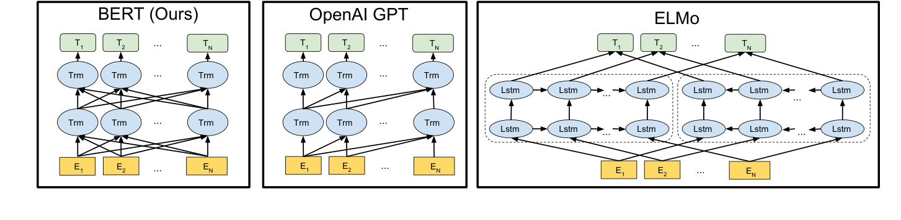
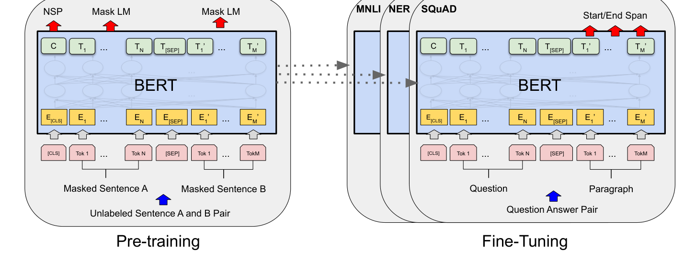
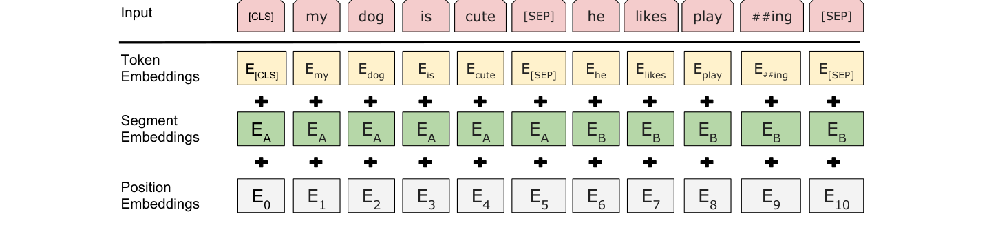
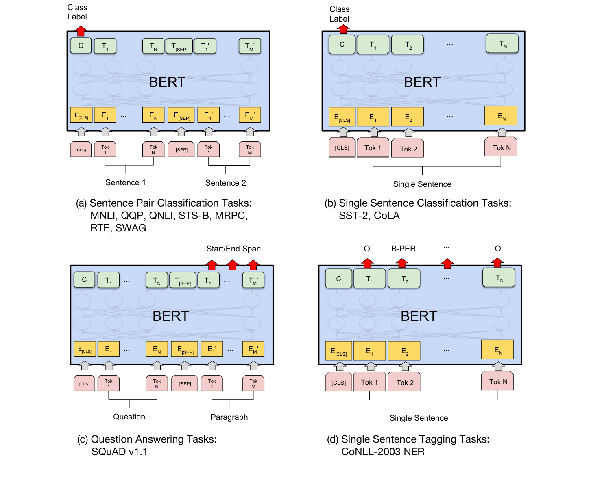
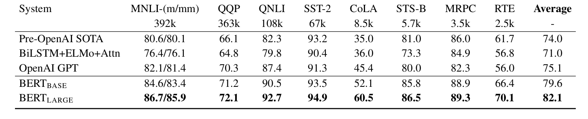
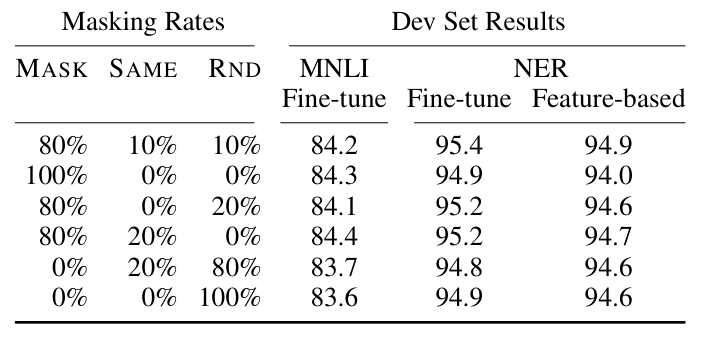
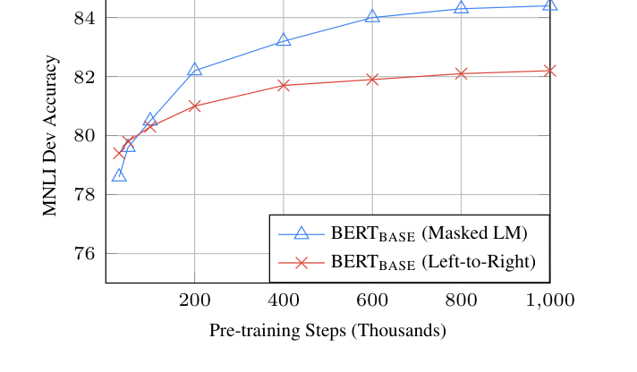

# BERT (2019)

## Paper Info

- **Title**: BERT: Pre-training of Deep Bidirectional Transformers for Language Understanding
- **Authors**: Jacob Devlin, Ming-Wei Chang, Kenton Lee, Kristina Toutanova
- **Venue**: NAACL 2019 (Best Long Paper)
- **ArXiv**: [1810.04805](https://arxiv.org/abs/1810.04805)
- **Paper**: [paper.pdf](./paper.pdf)

## Abstract

这篇论文提出 **BERT (Bidirectional Encoder Representations from Transformers)**，
一个完全基于 Transformer encoder 的预训练语言表征模型。

与 ELMo（双向 LSTM 拼接）和 GPT（单向左到右 Transformer）不同，
BERT 在所有层都使用真正的双向自注意力，
通过 **Masked Language Model (MLM)** 和 **Next Sentence Prediction (NSP)**
两个无监督任务在大规模语料上预训练，
然后只需在末端加一个简单的输出层微调，就能在 11 个 NLP 任务上达到 SOTA。

一句话总结：BERT 把 NLP 范式从“特征抽取 + 任务专属架构”推进成了
“统一预训练 + 轻量微调”。

## Motivation

在 BERT 之前，主流预训练表征大致分两条路：

- **Feature-based**（ELMo）：把预训练语言模型的 hidden state 当作额外特征送给下游任务，
  下游模型架构本身仍然要任务专属设计。
- **Fine-tuning**（GPT-1）：在预训练 Transformer 上加分类头微调，
  但语言模型必须是**单向**的（左到右），否则 token 会“看到自己”。

作者认为这是当时最大瓶颈：

> 单向约束严重限制了表征能力，尤其对那些需要双向上下文的任务（句对任务、SQuAD 这类问答）。

BERT 的核心问题是：

> 能不能设计一个预训练目标，让 Transformer encoder 在所有层都做真正的双向 attention，
> 同时避免 token 看到自己？

答案就是 MLM。

下图是 BERT 与 GPT、ELMo 的预训练架构对比，BERT 的关键差异是
**所有层都使用真正的双向 self-attention**，而不是单向或后期拼接：

## Method

### 1. 整体架构

BERT 就是一个**多层 Transformer encoder**（直接复用 Vaswani 2017 的 encoder 部分），
没有 decoder。论文给出两个规模：

| Model | L (层数) | H (hidden) | A (heads) | 参数量 |
|-------|----------|------------|-----------|--------|
| BERT_BASE | 12 | 768 | 12 | 110M |
| BERT_LARGE | 24 | 1024 | 16 | 340M |

BASE 的规模刻意对齐 GPT-1，方便公平对比。

整体训练流程分为预训练和微调两阶段，**两阶段使用同一个架构**（除最后一层任务头）：

### 2. 输入表示

BERT 的输入设计是后续大量工作的模板：

- 使用 **WordPiece** 词表，30,000 tokens。
- 每个序列以 `[CLS]` 开头，句对之间和末尾用 `[SEP]` 分隔。
- 每个 token 的输入 embedding = **token embedding + segment embedding + position embedding**。
- `[CLS]` 位置在最后一层的 hidden state 用作整句/句对的聚合表示，喂分类头。

### 3. 预训练任务一：Masked Language Model (MLM)

这是 BERT 的灵魂。做法是：

- 随机选 **15%** 的 WordPiece token。
- 在被选中的位置中：
  - **80%** 替换成 `[MASK]`。
  - **10%** 替换成随机 token。
  - **10%** 保留原 token。
- 模型只在这些位置上预测原始 token。

为什么不全部用 `[MASK]`？因为微调阶段不会出现 `[MASK]`，
全部使用会造成 pretrain/finetune 分布不匹配。
随机替换和保留原词强迫模型对每个 token 的表示都保持准确，而不是只在看到 `[MASK]` 时才努力。

MLM 的关键意义：它让 Transformer encoder 可以同时使用**左右两侧**上下文做表征，
而不像 GPT 那样只能看左边。

### 4. 预训练任务二：Next Sentence Prediction (NSP)

为捕捉句子对关系（QA、NLI 这类任务高度依赖），构造二分类任务：

- 输入 `[CLS] A [SEP] B [SEP]`。
- 50% 情况下 B 是 A 在原文中真实的下一句，50% 情况下 B 是语料中随机句。
- 用 `[CLS]` 的最终向量预测“IsNext / NotNext”。

后续工作（RoBERTa、ALBERT）发现 NSP 信号比较弱，但在原 BERT 的实验里它对 QA/NLI 仍有帮助。

### 5. 预训练数据与配置

- 语料：**BooksCorpus (800M words) + 英文 Wikipedia (2,500M words)**，
  使用文档级语料而非句子级语料，是为了能采到长连续片段。
- 序列长度 512，batch size 256，训练 1M steps（约 40 epochs）。
- Adam，learning rate 1e-4，warmup 10k 后线性衰减；GELU 激活；dropout 0.1。
- BASE 在 4 个 Cloud TPU（16 chips）上约 4 天，LARGE 在 16 个 Cloud TPU（64 chips）上约 4 天。

### 6. 微调范式

微调时几乎不需要新结构：

- **句子分类 / 句对分类**：取 `[CLS]` 向量 → 线性层 → softmax。
- **序列标注 (NER)**：每个 token 的最后一层向量 → 线性层 → softmax。
- **抽取式 QA (SQuAD)**：学两个向量 `S, E`，对 passage 每个位置点积得到 start/end 分数。

所有参数都端到端微调，下游学习率小（典型 2e-5 ~ 5e-5），3~4 epoch 就收敛。

下图给出了 BERT 在四类下游任务上的微调输入/输出布局：

## Key Insights

### 关键结果 1：GLUE 上的全面突破

11 个 GLUE 任务平均分：

| Model | GLUE Avg |
|-------|----------|
| Pre-OpenAI SOTA | 74.0 |
| BiLSTM+ELMo+Attn | 71.0 |
| OpenAI GPT | 75.1 |
| **BERT_BASE** | **79.6** |
| **BERT_LARGE** | **82.1** |

BERT_BASE 与 GPT 参数量相当，但平均分高出 4.5 分；
BERT_LARGE 进一步把整体提升到 82.1，相对 GPT **绝对 +7 分**。
当时这个量级的全面提升非常罕见。

完整 GLUE 测试结果：

### 关键结果 2：SQuAD 与 SWAG 上接近/超过人类

- **SQuAD v1.1**：单模型 F1 **93.2**，集成 **93.2**，超过此前所有提交。
- **SQuAD v2.0**：单模型 F1 **83.1**，比此前最好系统 **+5.1 F1**。
- **SWAG**：BERT_LARGE 准确率 **86.3%**，比 ESIM+ELMo 高出 **27.1%**，
  甚至超过该数据集上人类的报告水平。

### 关键结果 3：Masked LM 是真正的关键，不只是“tricks”

消融实验（在 BASE 规模下）：

| Task setup | MNLI-m | QNLI | MRPC | SST-2 | SQuAD F1 |
|------------|--------|------|------|-------|----------|
| BERT_BASE | 84.4 | 88.4 | 86.7 | 92.7 | 88.5 |
| No NSP | 83.9 | 84.9 | 86.5 | 92.6 | 87.9 |
| LTR (单向) & No NSP | 82.1 | 84.3 | 77.5 | 92.1 | 77.8 |
| LTR + BiLSTM 顶层 | 82.1 | 84.1 | 75.7 | 91.6 | 84.9 |

要点：

- 去掉 NSP，QNLI / SQuAD 显著下降，但比单向模型还好得多 → **NSP 有帮助但不是核心**。
- 把模型换成单向 LM（类似 GPT），SQuAD 和 MRPC 这类需要双向上下文的任务断崖式下降 → **MLM 带来的双向性才是真正的核心收益**。
- 在单向模型上加 BiLSTM 也补不回这个差距，说明双向必须发生在**预训练阶段**。

针对 80/10/10 的 mask 比例，作者做了完整消融，结论是默认 80/10/10 在两类下游任务上都接近最优，
其它配置（尤其是 0/0/100 的纯随机替换）会拉低性能：

### 关键结果 4：模型规模的明确收益

作者扫描多个规模：

| #L | #H | #A | LM (PPL) | MNLI-m | MRPC | SST-2 |
|----|----|----|----------|--------|------|-------|
| 3 | 768 | 12 | 5.84 | 77.9 | 79.8 | 88.4 |
| 6 | 768 | 3 | 5.24 | 80.6 | 82.2 | 90.7 |
| 6 | 768 | 12 | 4.68 | 81.9 | 84.8 | 91.3 |
| 12 | 768 | 12 | 3.99 | 84.4 | 86.7 | 92.9 |
| 12 | 1024 | 16 | 3.54 | 85.7 | 86.9 | 93.3 |
| 24 | 1024 | 16 | 3.23 | 86.6 | 87.8 | 93.7 |

这是当时一个比较“反直觉”的结论：**即使下游任务数据集很小**（MRPC 只有几千样本），
更大的预训练模型在微调后依然单调更好。
这等于在 NLP 里实证了 scaling 的可行性，为后续 GPT-2 / GPT-3 / T5 等铺路。

更进一步，作者还扫描了**预训练步数**对微调结果的影响：MLM 即便步数较少也优于单向 LM，
而且更长预训练（直到 1M steps）依然在涨：

### 关键结果 5：Fine-tuning 与 Feature-based 都能受益

把 BERT 当作 ELMo 风格的特征抽取器（冻结参数，只取 hidden states 喂下游 BiLSTM）：
最佳配置（拼接最后 4 层）在 CoNLL-2003 NER 上 F1 **96.1**，
仅比微调版本 (96.4) 低 0.3 F1。

这说明：

- BERT 学到的表征本身就强，离不开微调，但微调不是唯一用法。
- 对于不方便端到端微调的场景（比如计算受限、需要跨任务共享 backbone）也能用。

### 我的结论

如果只用一句话评价这篇论文：

> BERT 用一个看似简单的 Masked LM 解决了 Transformer encoder 的双向预训练难题，
> 把整个 NLP 推进到了“预训练 + 微调”的统一范式。

它的影响远超数字本身：

- 把 Transformer encoder 推上 NLP 主干位置。
- 验证了**预训练任务设计 > 架构小改**：核心创新是目标函数，不是新模块。
- 让 `[CLS]` / `[SEP]` / WordPiece / segment embedding 这套输入约定成为之后几乎所有 encoder 模型的标配。
- 引出后续一整条 encoder 系：RoBERTa、ALBERT、ELECTRA、DeBERTa…

## Limitations & Future Work

从今天回看，BERT 的局限也比较清晰：

- **Pretrain/finetune 不匹配**：`[MASK]` token 只在预训练出现，
  即便用 80/10/10 缓解，依然有分布偏差。后续 ELECTRA 用替换检测任务部分解决了这个问题。
- **MLM 样本效率低**：每步只在 15% 位置上有梯度，预训练计算成本高。
- **NSP 信号弱**：RoBERTa 直接去掉 NSP、用更长片段、更大数据、更长训练，反而更强。
- **不是生成模型**：encoder-only 架构不擅长开放式生成，
  这一条后来由 GPT 系（decoder-only）和 T5（encoder-decoder）从不同方向补齐。
- **长文档受限**：512 token 长度限制对长文档任务（长文 QA、检索增强）是硬瓶颈，
  催生 Longformer / BigBird 等稀疏 attention 工作。
- **领域迁移仍依赖 continued pretraining**：在生物医学、法律等专业领域上，
  通用 BERT 表现明显差于 SciBERT / BioBERT 等领域版本。

我认为这篇工作最自然的几条后续演进，事实上也都发生了：

1. 更好的预训练目标：ELECTRA（替换检测）、SpanBERT（span masking）。
2. 更扎实的训练配方：RoBERTa（去 NSP、更大数据、更长训练）。
3. 参数效率：ALBERT（参数共享）、DistilBERT（蒸馏）。
4. 长上下文：Longformer / BigBird。
5. 统一生成与理解：T5、BART、以及后来 decoder-only LLM 的全面崛起。
